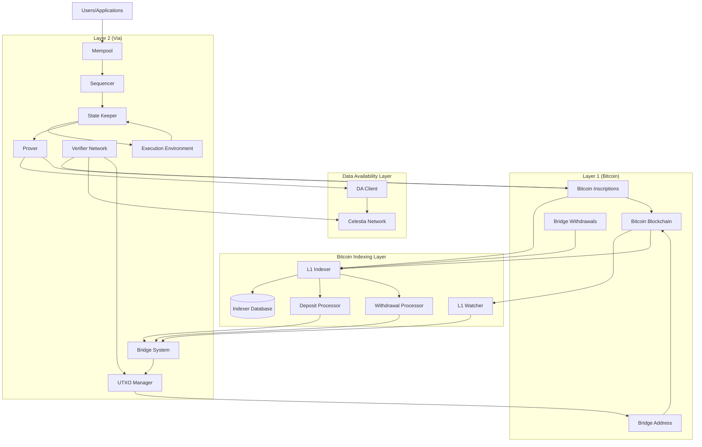
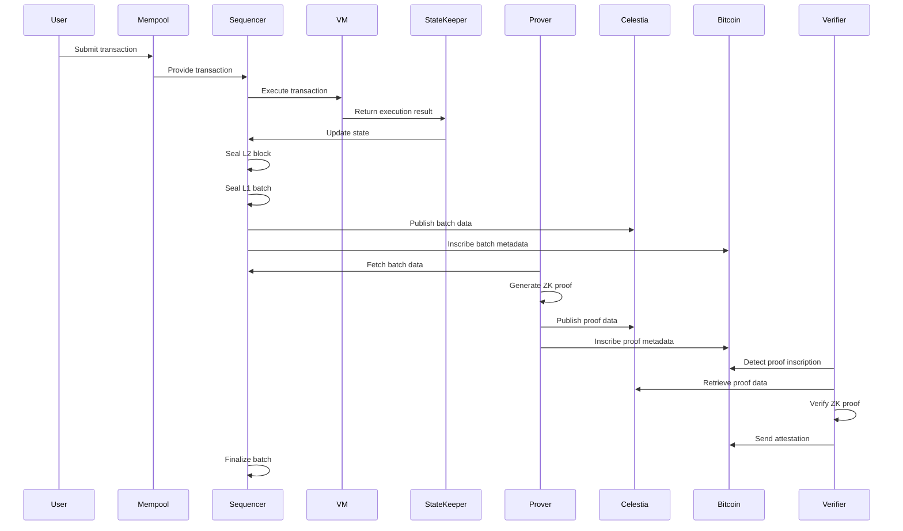
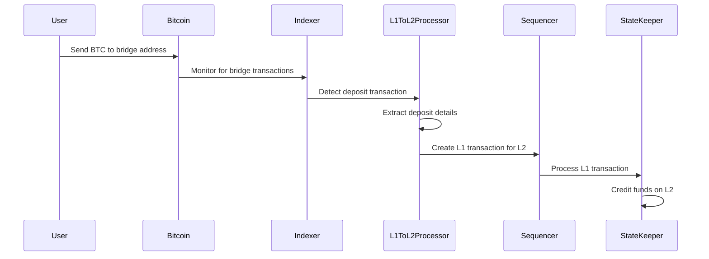
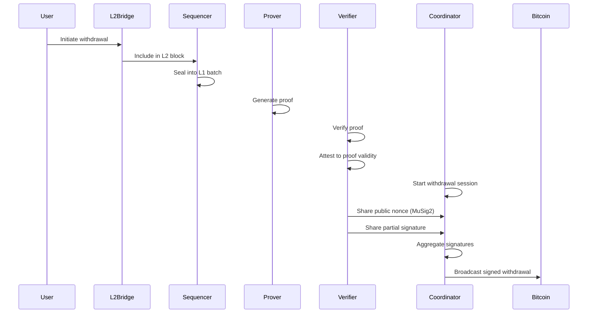

# Via L2 Bitcoin ZK-Rollup: Architecture Overview

## 1. Introduction

The Via L2 Bitcoin ZK-Rollup is a Layer 2 scaling solution built on top of Bitcoin that leverages zero-knowledge proofs to enable high-throughput, low-cost transactions while inheriting the security guarantees of the Bitcoin blockchain. This document provides a comprehensive overview of the system architecture, detailing how the various components interact to create a secure, scalable, and efficient Layer 2 solution.

**Recent Major Updates:**
- **L1 Indexer System**: New dedicated Bitcoin indexing service for enhanced deposit and withdrawal processing
- **Bridge Withdrawal Processing**: Support for bridge withdrawal inscriptions and multi-input transactions
- **UTXO Management**: Advanced UTXO sorting and selection algorithms
- **Configuration Management**: Environment variable-based configuration system

## 2. System Architecture

The Via L2 system employs a multi-layered architecture that spans across three distinct layers:

1. **Layer 1 (Bitcoin)**: The base layer providing security and finality
2. **Data Availability Layer (Celestia)**: A specialized layer for storing transaction data
3. **Layer 2 (Via)**: The execution layer where transactions are processed

## 3. Core Components

### 3.1 Bitcoin Indexing Layer

#### L1 Indexer System

The L1 Indexer is a dedicated Bitcoin blockchain indexing service that provides specialized processing for deposits and withdrawals:

**Key Features:**
- **Dedicated Database Schema**: Optimized tables for deposits, withdrawals, and metadata tracking
- **Message Processing Pipeline**: Structured processing of Bitcoin inscription messages
- **Scalable Architecture**: High-throughput Bitcoin transaction processing capabilities
- **Independent Operation**: Complements L1 Watcher without operational interference

**Components:**
- **Indexer Service**: Main service for Bitcoin blockchain monitoring and transaction parsing
- **Data Access Layer**: Database abstraction layer with connection pooling and transaction management
- **Message Processors**: Specialized processors for deposit and withdrawal transaction types
- **CLI Tools**: [`via-indexer`](cli_reference.md#via-indexer) and [`via-restart-indexer`](cli_reference.md#via-restart-indexer) commands

#### L1 Watcher

The L1 Watcher continues to monitor Bitcoin blockchain for system-critical events:
- System messages and protocol updates
- Verifier attestations and consensus mechanisms
- General Bitcoin transaction monitoring
- Integration with bridge system for non-indexer operations

### 3.2 Sequencer

The Sequencer is responsible for processing transactions, creating L2 blocks, and aggregating them into L1 batches. It ensures transaction ordering, execution, and state transitions are performed correctly and efficiently.

Key responsibilities:
- Transaction ingestion from the mempool
- Transaction execution via the VM
- L2 block creation and sealing
- L1 batch creation and sealing
- Batch submission to Bitcoin through inscriptions

The Sequencer functionality is distributed across several interconnected components:
- **State Keeper**: The central component that processes transactions and manages state transitions
- **Mempool**: Stores pending transactions and provides them to the State Keeper
- **Batch Executor**: Executes transactions within the VM and manages state updates
- **Seal Criteria**: Determines when to seal L2 blocks and L1 batches
- **BTC Sender**: Submits batch data to Bitcoin through inscriptions with environment-based configuration

### 3.2 Prover

The Prover generates zero-knowledge proofs that verify the correctness of state transitions in the L2 system. These proofs cryptographically guarantee that all transactions processed on L2 follow the correct execution rules without requiring validators to re-execute all transactions.

Key responsibilities:
- Proof generation for L1 batches
- Witness generation from transaction execution results
- Proof aggregation through a recursive proving system
- Proof compression for submission to Bitcoin

The Prover subsystem consists of several interconnected components:
- **Prover Gateway**: Interface between core and prover subsystems
- **Witness Generator**: Constructs witness data for proof generation
- **Witness Vector Generator**: Computes witness vectors for circuit provers
- **Circuit Prover**: Generates circuit proofs using GPU acceleration
- **Proof Compressor**: "Wraps" the generated proof for submission to L1

### 3.3 Bridge System

The Bridge System has been enhanced with new withdrawal processing capabilities and advanced transaction management:

**Enhanced Features:**
- **Bridge Withdrawal Inscriptions**: Support for bridge withdrawal inscription processing and validation
- **Multi-Input Transaction Support**: Enhanced coordinator API for multiple inscription inputs per transaction
- **UTXO Management**: Advanced UTXO sorting and selection algorithms with value-based ordering
- **Transaction Validation**: Enhanced validation mechanisms for deposits and withdrawals

**Components:**
- **Deposit Processing**: L1→L2 transaction handling integrated with L1 Indexer system
- **Withdrawal Processing**: L2→L1 transaction processing with inscription support and multi-input capabilities
- **UTXO Manager**: Enhanced UTXO selection with descending value-based sorting for optimal transaction construction
- **Transaction Builder**: Advanced transaction construction supporting multiple inputs and complex withdrawal scenarios

### 3.4 Verifier Network

The Verifier Network consists of multiple Verifier Nodes responsible for validating ZK proofs and ensuring the integrity of off-chain execution. The network has been enhanced with advanced multi-signature coordination capabilities.

Key responsibilities:
- ZK proof verification and validation
- Data availability verification on Celestia
- Bitcoin Merkle proof validation
- Transaction attestation via Bitcoin inscriptions
- **Multi-Input Withdrawal Processing**: Enhanced withdrawal processing supporting multiple inscription inputs using MuSig2
- **Coordinator API Integration**: Advanced partial signature management per input with improved session handling
- **Nonce Management**: Enhanced nonce handling for multiple inputs and complex transaction scenarios

**Enhanced Coordinator API Features:**
- Request timeout handling with 30-second timeout limits
- Enhanced partial signature validation and verification
- Advanced session management with better state tracking
- Comprehensive error handling and diagnostic logging

The Verifier Network follows a distributed architecture with one node acting as a Coordinator, responsible for managing signing sessions and coordinating the MuSig2 process for transaction signing.

### 3.4 State Management

The state management system is responsible for maintaining, updating, and committing the rollup state. It consists of several key components:

- **State Keeper**: Processes transactions, executes them, and updates the state
- **Merkle Tree**: Represents and cryptographically commits to the state
- **Storage Layer**: Persists the state to disk
- **State Updates**: Tracks changes to the state during batch execution

The state in Via L2 is represented as a key-value store, where keys are storage slots and values are 32-byte values. The state is cryptographically committed using a sparse Merkle tree, which allows for efficient verification of state transitions.

### 3.5 Execution Environment (VM)

The Execution Environment, or Virtual Machine (VM), is responsible for executing transactions and calculating state transitions. It provides a deterministic environment for running smart contracts and processing transactions.

Key features:
- Multi-VM architecture allowing different VM versions to coexist
- zkEVM architecture for generating zero-knowledge proofs
- Bootloader for processing transactions
- System contracts for enforcing rules and providing functionality
- Protocol version management for smooth upgrades
- Bitcoin inscription-based upgrade mechanism

### 3.6 Bridge

The Via L2 Bitcoin Bridge enables the secure transfer of assets between the L1 (Bitcoin) blockchain and the L2 (Via) rollup. It implements a two-way mechanism for deposits and withdrawals.

Key components:
- **Bitcoin Client**: Interfaces with the Bitcoin network
- **Inscription Indexer**: Monitors the Bitcoin blockchain for inscriptions
- **Withdrawal Client**: Processes withdrawal requests from L2 to L1
- **Transaction Builder**: Creates and manages Bitcoin transactions for withdrawals

### 3.7 Celestia Integration

Via L2 uses Celestia as a Data Availability (DA) layer to ensure that L2 batch data is publicly available. The integration consists of two main components:

- **Celestia Client**: Interacts directly with the Celestia network
- **DA Dispatcher**: Orchestrates the submission of data to Celestia

This integration is critical for the security of the Via L2 system, as it ensures that all transaction data is publicly available, allowing anyone to reconstruct the state of the L2 chain if needed.

## 4. Component Interactions

### 4.1 Transaction Processing Flow

### 4.2 Deposit Flow (L1→L2)

### 4.3 Withdrawal Flow (L2→L1)

## 5. Security Model

The Via L2 Bitcoin ZK-Rollup employs a multi-layered security model that leverages the security of Bitcoin, cryptographic proofs, and a distributed verifier network.

### 5.1 Bitcoin Security

The system anchors its security to the Bitcoin blockchain through:
- **Inscriptions**: Batch and proof metadata are inscribed on Bitcoin
- **Bridge Address**: A MuSig2 multi-signature address controlled by the verifier network
- **Attestations**: Verifiers attest to proof validity through inscriptions

### 5.2 Cryptographic Security

The system uses advanced cryptographic techniques:
- **Zero-Knowledge Proofs**: Verify the correctness of state transitions
- **Merkle Trees**: Cryptographically commit to the state
- **MuSig2**: Secure multi-signature scheme for withdrawals

### 5.3 Verifier Network Security

The Verifier Network provides additional security:
- **Distributed Verification**: Multiple verifiers validate proofs
- **Threshold Signatures**: Withdrawals require signatures from a threshold of verifiers
- **Attestation Consensus**: Batches are finalized only after a majority of attestations

### 5.4 Data Availability

Data availability is ensured through:
- **Celestia Integration**: All batch data is published to Celestia
- **Inclusion Proofs**: Cryptographic proofs that data has been included in Celestia
- **Verifier Checks**: Verifiers ensure data is available before attesting

## 6. Unique Architectural Features

The Via L2 Bitcoin ZK-Rollup introduces several innovative architectural features:

### 6.1 Bitcoin-Native Integration

Unlike most ZK-rollups that are built on Ethereum, Via L2 is designed specifically for Bitcoin. It leverages Bitcoin's native capabilities:
- **Inscriptions**: Used for publishing metadata and attestations
- **Taproot**: Enables efficient MuSig2 multi-signatures
- **OP_RETURN**: Used for withdrawal references

### 6.2 Separation of Data Availability

The system separates data availability from consensus by:
- Using Celestia for data storage
- Using Bitcoin for consensus and finality
- This separation allows for higher throughput while maintaining security

### 6.3 Distributed Verifier Network

The Verifier Network introduces a unique approach to rollup security:
- Distributed verification of proofs
- Collective signing of withdrawals
- Attestation-based finalization

### 6.4 Multi-VM Architecture and Protocol Upgrades

The system supports multiple VM versions through the multiVM architecture and provides a secure upgrade mechanism:

#### Multi-VM Architecture
- Different VM versions can coexist
- Smooth protocol upgrades without disrupting operation
- Bitcoin-specific VM optimizations

#### Protocol Version Management
- Protocol versions follow semantic versioning (major.minor.patch)
- Each batch is associated with a specific protocol version
- The appropriate VM version is selected based on the protocol version

#### Bitcoin Inscription-Based Upgrades
- System upgrades are initiated through specialized Bitcoin inscriptions
- Upgrade inscriptions contain the new protocol version and contract hashes
- The Verifier Network and Sequencer validate and process upgrade inscriptions
- Upgrades are activated at specific blocks for coordinated transitions

## 7. Comparison to Common ZK-Rollup Patterns

### 7.1 Similarities to Ethereum ZK-Rollups

The Via L2 system shares several characteristics with Ethereum-based ZK-rollups:
- Use of zero-knowledge proofs for state transition verification
- Batch processing of transactions
- Off-chain execution with on-chain verification

### 7.2 Key Differences

However, it differs in several important ways:
- **Base Layer**: Built on Bitcoin instead of Ethereum
- **Data Availability**: Uses Celestia instead of calldata on the base layer
- **Consensus Mechanism**: Uses verifier attestations instead of smart contract verification
- **Withdrawal Mechanism**: Uses MuSig2 multi-signatures instead of smart contract withdrawals
- **Proof Publication**: Uses inscriptions instead of smart contract calls

### 7.3 Innovative Approaches

The Via L2 system introduces several innovations:
- **Bitcoin-Centric Design**: Optimized for Bitcoin's capabilities and limitations
- **Three-Layer Architecture**: Separating execution, data availability, and consensus
- **Attestation-Based Finality**: Using verifier attestations for batch finalization
- **MuSig2 Bridge**: Secure multi-signature scheme for the bridge

## 8. System Limitations and Considerations

### 8.1 Current Limitations

The current system has some limitations:
- **Fixed Coordinator Role**: One of the Verifiers holds the Coordinator role
- **N-of-N Signature Scheme**: If any single Verifier becomes unresponsive, withdrawals may be delayed
- **Static Verifier Set**: The current architecture does not support dynamic addition or removal of Verifiers

### 8.2 Scalability Considerations

The system's scalability is influenced by:
- **Proof Generation Time**: ZK proofs require significant computational resources
- **Bitcoin Block Space**: Limited space for inscriptions
- **Celestia Capacity**: Data availability layer throughput

## 9. Conclusion

The Via L2 Bitcoin ZK-Rollup represents a sophisticated architecture that brings scalability to Bitcoin through a combination of zero-knowledge proofs, data availability solutions, and distributed verification. By leveraging the security of Bitcoin while overcoming its limitations, the system enables high-throughput, low-cost transactions with strong security guarantees.

The architecture's innovative approach to integrating with Bitcoin, separating data availability, and distributing verification responsibilities creates a unique system that addresses the specific challenges of building a ZK-rollup on Bitcoin. As the system evolves, it has the potential to significantly enhance Bitcoin's utility as a platform for a wider range of applications.