# Via L2 Bitcoin ZK-Rollup: Design Patterns

This document identifies and explains the major architectural and design patterns used in the Via L2 Bitcoin ZK-Rollup system. It analyzes how these patterns contribute to the system's security, scalability, and functionality.

## 1. Architectural Patterns

### 1.1 Layered Architecture

The Via L2 system employs a clear layered architecture pattern, separating concerns across different layers:

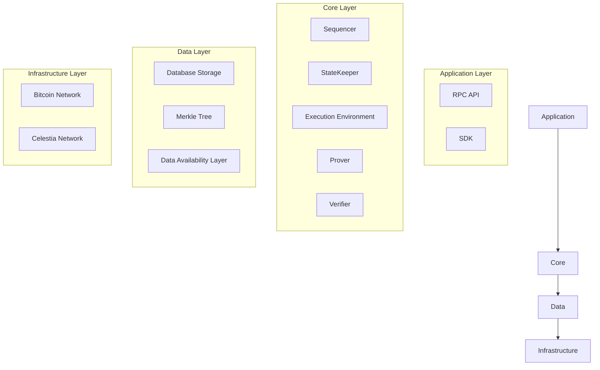

**Implementation**: The system is organized into distinct layers, each with specific responsibilities:
- **Application Layer**: Interfaces with users and applications
- **Core Layer**: Implements the core business logic
- **Data Layer**: Manages data storage and retrieval
- **Infrastructure Layer**: Provides the underlying infrastructure

**Benefits**:
- Clear separation of concerns
- Improved maintainability
- Easier testing and debugging
- Flexibility to change implementations within layers

### 1.2 Microservices Architecture

The Via L2 system follows a microservices architecture pattern, with multiple independent services that communicate through well-defined interfaces:

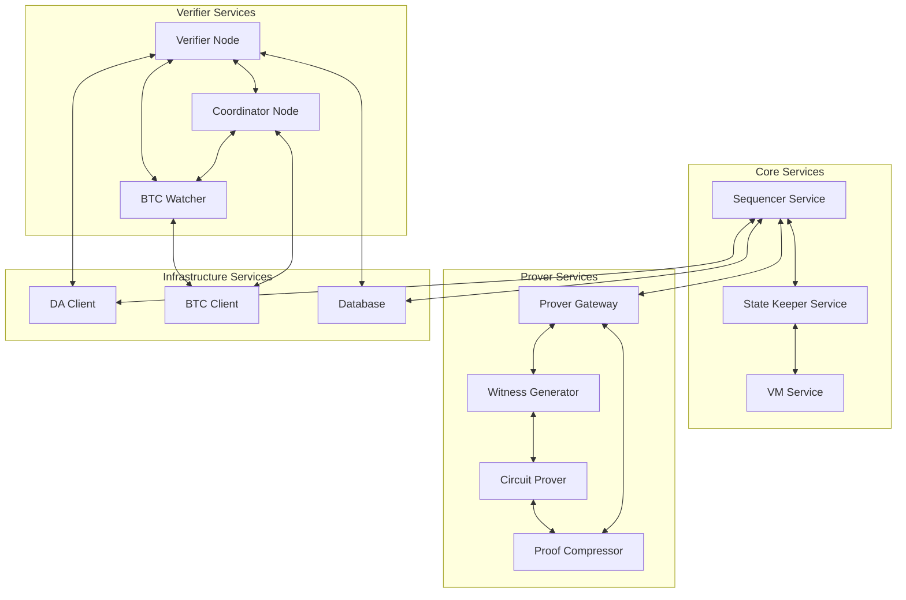

**Implementation**: The system is composed of multiple independent services:
- Each service has a specific responsibility
- Services communicate through well-defined APIs
- Services can be deployed and scaled independently

**Benefits**:
- Independent development and deployment
- Improved fault isolation
- Easier scaling of individual components
- Technology diversity (different services can use different technologies)

### 1.3 Event-Driven Architecture

The Via L2 system incorporates event-driven architecture patterns, particularly in the interaction between components:

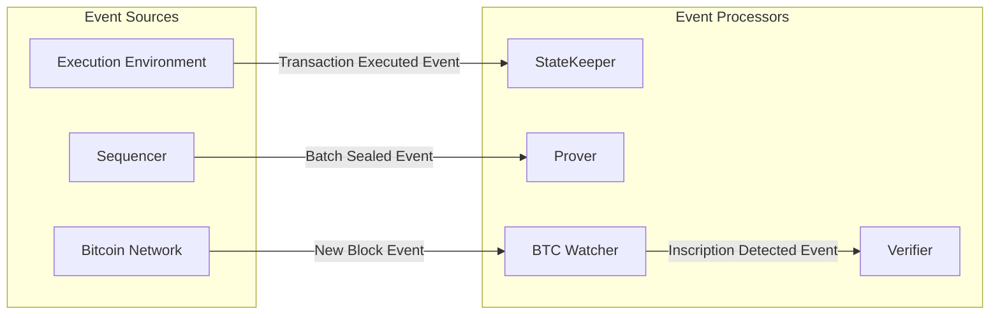

**Implementation**: The system uses events to trigger actions in different components:
- Components emit events when significant state changes occur
- Other components listen for and react to these events
- Events are often stored for later processing or auditing

**Benefits**:
- Loose coupling between components
- Improved scalability through asynchronous processing
- Better resilience to failures
- Easier extension with new event processors

## 2. Cryptographic Patterns

### 2.1 Zero-Knowledge Proof Pattern

The Via L2 system uses zero-knowledge proofs as a core cryptographic pattern to verify computation without revealing the details:

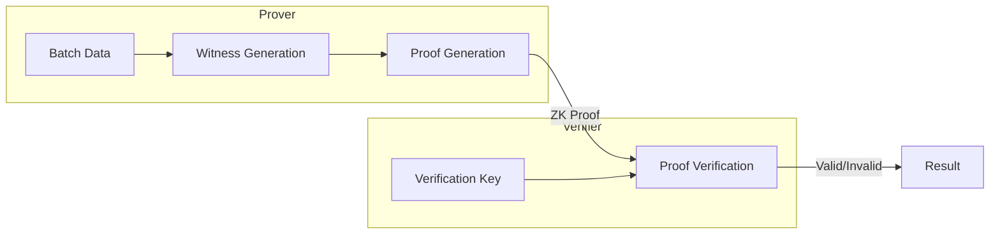

**Implementation**: The system uses a multi-stage proving system:
- Witness generation from transaction execution results
- Basic circuit proofs for different computation types
- Recursive proof aggregation to create a single final proof
- Proof compression for efficient verification

**Benefits**:
- Computational integrity without re-execution
- Privacy preservation (though not the primary goal in this system)
- Significant reduction in verification costs
- Scalability without sacrificing security

### 2.2 Merkle Tree Pattern

The Via L2 system uses Merkle trees as a fundamental cryptographic pattern for state representation and verification:

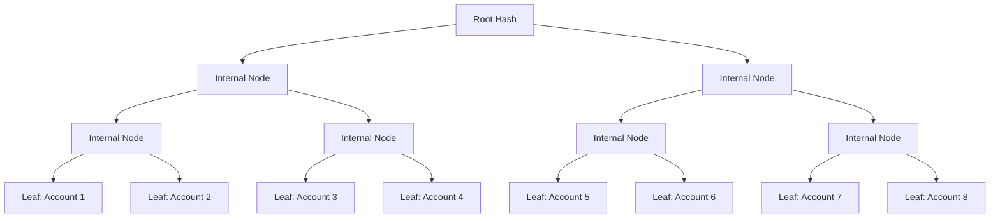

**Implementation**: The system uses a sparse Merkle tree with specific optimizations:
- AR16MT (a variant of the Jellyfish Merkle tree) with radix-16 optimization
- Blake2s-256 for hashing
- Sparse representation to optimize storage
- Versioning by L1 batch number

**Benefits**:
- Efficient cryptographic commitment to the state
- Ability to generate and verify inclusion proofs
- Support for efficient state updates
- Versioning for historical state access

### 2.3 Multi-Signature Pattern (MuSig2)

The Via L2 system uses the MuSig2 multi-signature scheme as a cryptographic pattern for secure withdrawals:

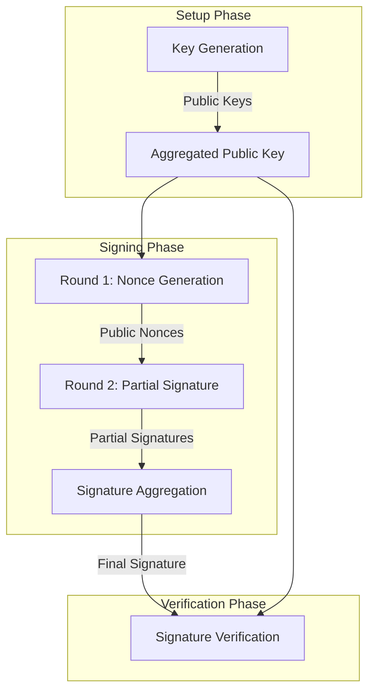

**Implementation**: The system uses MuSig2 for the bridge address and withdrawal transactions:
- Verifiers generate and share key pairs during setup
- An aggregated public key is used for the bridge address
- Withdrawals require a multi-round signing process
- The Coordinator aggregates partial signatures into a final signature

**Benefits**:
- Improved security through distributed signing
- Reduced on-chain footprint (single signature)
- Integration with Bitcoin's Taproot functionality
- Resistance to key compromise (requires multiple keys)

## 3. State Management Patterns

### 3.1 Command-Query Responsibility Segregation (CQRS)

The Via L2 system implements a form of the CQRS pattern, separating state modification from state querying:

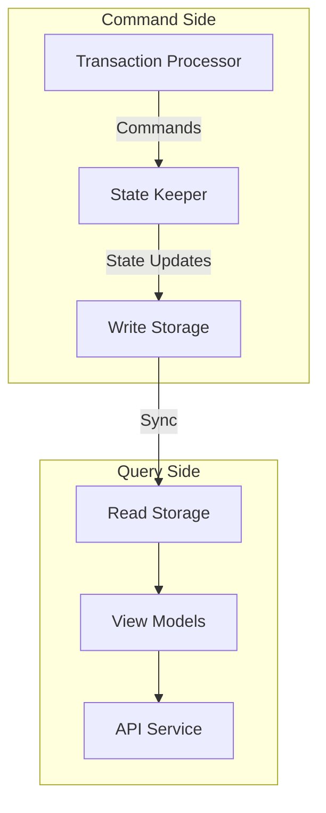

**Implementation**: The system separates write and read operations:
- The State Keeper processes commands (transactions) that modify state
- State changes are persisted to storage
- Read operations use optimized views of the data
- Different storage implementations can be used for different purposes

**Benefits**:
- Improved performance through specialized optimization
- Better scalability by scaling read and write sides independently
- Simplified command-side logic
- Support for different read models for different use cases

### 3.2 Event Sourcing

The Via L2 system incorporates aspects of the Event Sourcing pattern, particularly in state management:

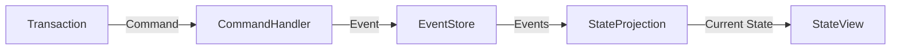

**Implementation**: The system records state changes as events:
- Transactions are processed to generate state changes
- State changes are recorded as storage logs
- The current state can be reconstructed by replaying these logs
- The Merkle tree serves as a projection of the current state

**Benefits**:
- Complete audit trail of all state changes
- Ability to reconstruct the state at any point in time
- Support for event replay for debugging or recovery
- Natural fit for the append-only nature of blockchain systems

### 3.3 Snapshot Pattern

The Via L2 system uses the Snapshot pattern to optimize state access and recovery:

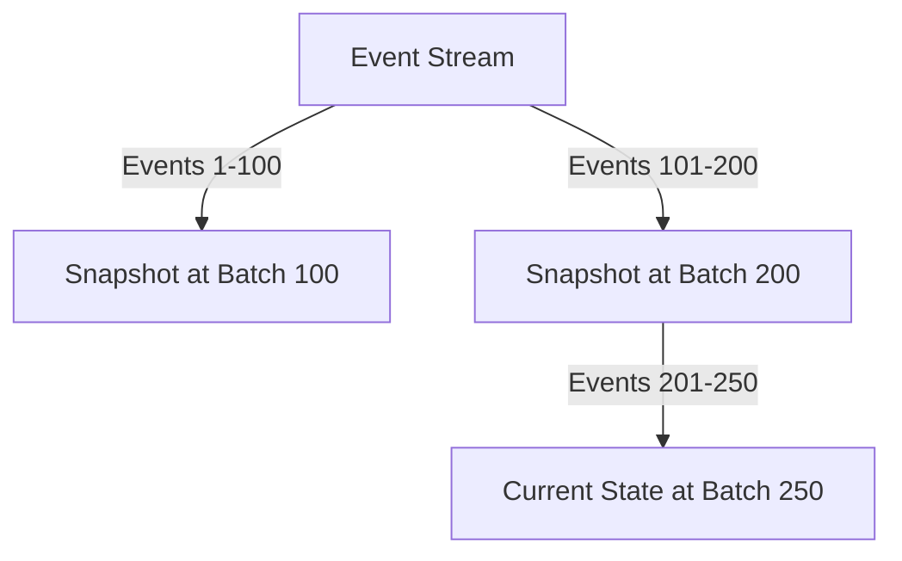

**Implementation**: The system creates state snapshots at regular intervals:
- Each L1 batch creates a new version of the state
- The state can be efficiently accessed at any batch number
- Recovery can start from a snapshot rather than replaying all events
- Pruning can remove old events while maintaining snapshots

**Benefits**:
- Improved performance for state access
- Efficient recovery from failures
- Reduced storage requirements through pruning
- Support for historical state access

## 4. Concurrency Patterns

### 4.1 Actor Model

The Via L2 system incorporates aspects of the Actor Model pattern, particularly in the Prover subsystem:

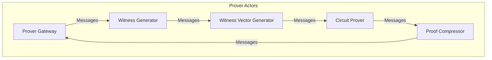

**Implementation**: The system uses actor-like components that communicate through messages:
- Each component has its own state and behavior
- Components communicate through well-defined message interfaces
- Components process messages asynchronously
- Components can be distributed across multiple machines

**Benefits**:
- Simplified concurrency model
- Improved fault isolation
- Natural fit for distributed systems
- Easier scaling across multiple machines

### 4.2 Pipeline Pattern

The Via L2 system uses the Pipeline pattern, particularly in the proof generation process:

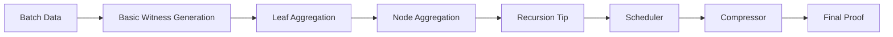

**Implementation**: The system processes data through a series of stages:
- Each stage performs a specific transformation
- The output of one stage becomes the input to the next
- Stages can operate concurrently on different data items
- The pipeline can be distributed across multiple machines

**Benefits**:
- Improved throughput through parallel processing
- Better resource utilization
- Simplified stage implementation
- Natural fit for the proof generation process

## 5. Fault Tolerance Patterns

### 5.1 Circuit Breaker Pattern

The Via L2 system implements the Circuit Breaker pattern to prevent cascading failures:

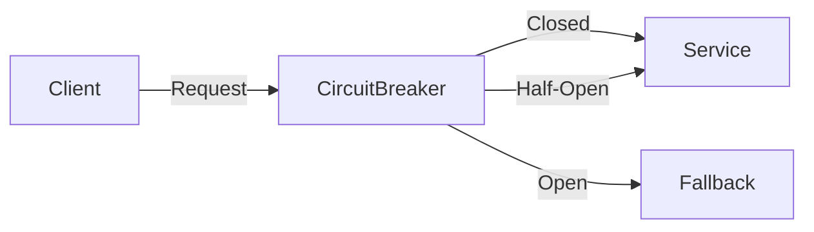

**Implementation**: The system monitors for failures and prevents operations when necessary:
- Circuit breakers monitor the health of dependencies
- When failures exceed a threshold, the circuit "opens"
- Periodic "half-open" attempts test if the dependency has recovered
- The circuit "closes" when the dependency is healthy again

**Benefits**:
- Prevents cascading failures
- Allows for graceful degradation
- Provides time for dependencies to recover
- Improves system resilience

### 5.2 Retry Pattern

The Via L2 system implements the Retry pattern, particularly in interactions with external systems:

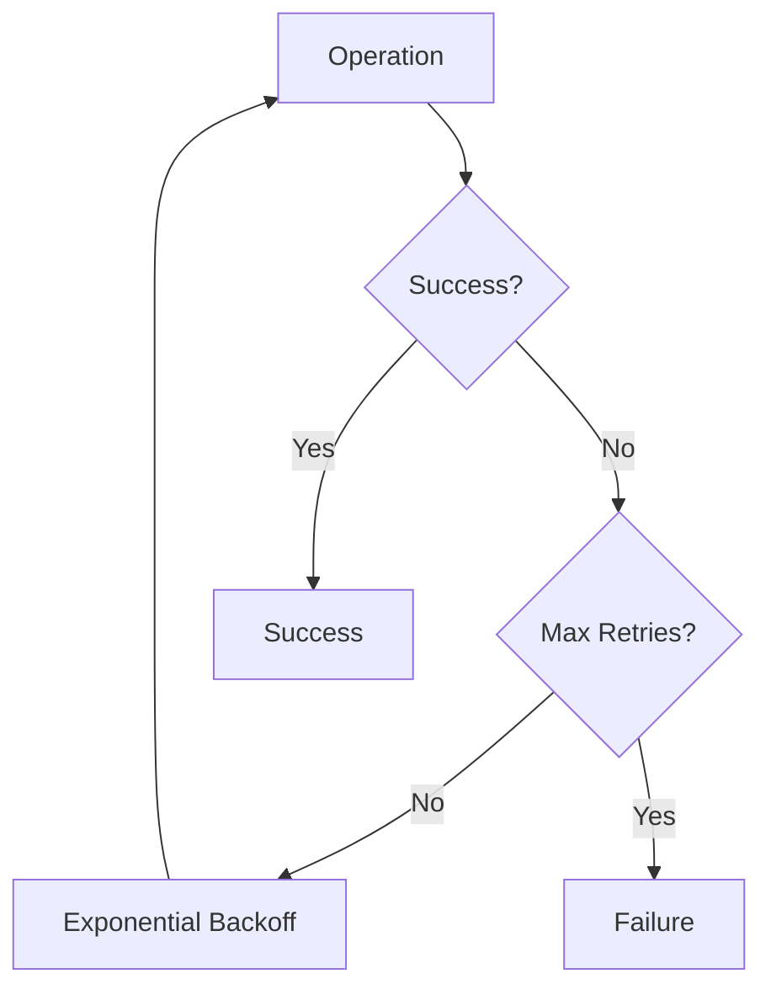

**Implementation**: The system retries failed operations with exponential backoff:
- Operations that fail due to transient errors are retried
- Retries use exponential backoff to avoid overwhelming the system
- A maximum number of retries prevents infinite retry loops
- Errors are classified as retriable or fatal

**Benefits**:
- Improved resilience to transient failures
- Reduced manual intervention
- Better user experience
- Graceful handling of temporary issues

## 6. Communication Patterns

### 6.1 API Gateway Pattern

The Via L2 system implements the API Gateway pattern for external communication:

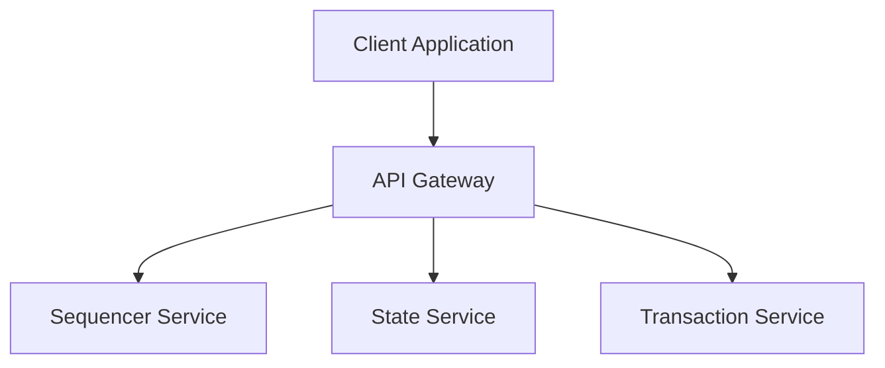

**Implementation**: The system provides a unified API for external clients:
- The RPC API layer serves as an API Gateway
- It routes requests to appropriate internal services
- It handles cross-cutting concerns like authentication and rate limiting
- It provides a consistent interface to clients

**Benefits**:
- Simplified client interface
- Encapsulation of internal system structure
- Centralized handling of cross-cutting concerns
- Improved security through controlled access

### 6.2 Publish-Subscribe Pattern

The Via L2 system uses the Publish-Subscribe pattern for event distribution:

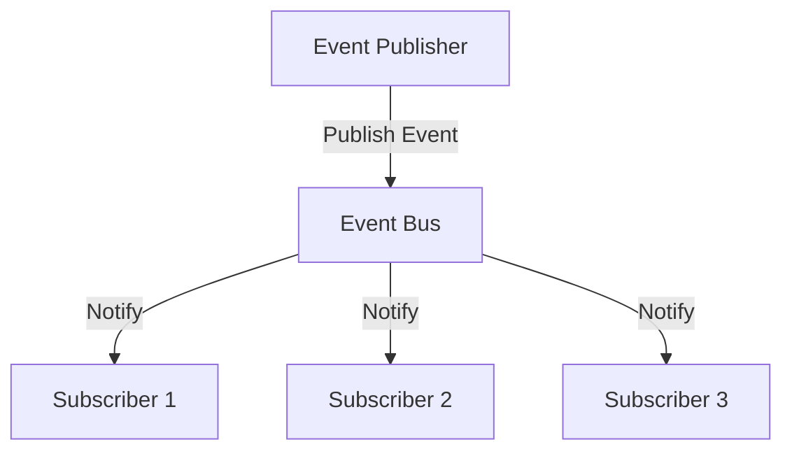

**Implementation**: The system distributes events to interested components:
- Components publish events to an event bus
- Other components subscribe to events of interest
- The event bus handles event distribution
- Subscribers process events asynchronously

**Benefits**:
- Loose coupling between components
- Improved scalability through asynchronous processing
- Support for multiple subscribers
- Easier extension with new subscribers

## 7. Unique and Innovative Patterns

### 7.1 Inscription-Based Consensus

The Via L2 system introduces an innovative pattern using Bitcoin inscriptions for consensus:

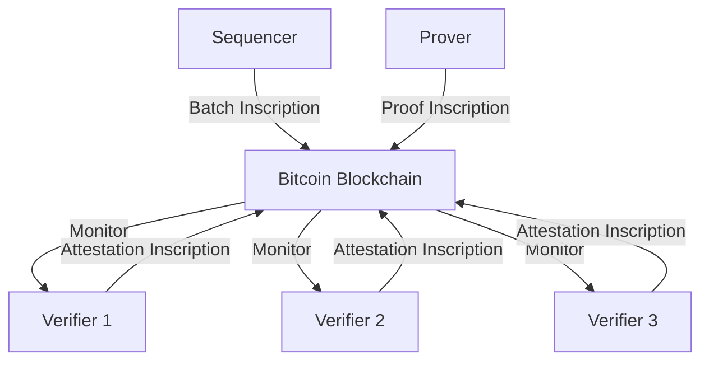

**Implementation**: The system uses Bitcoin inscriptions for consensus:
- Batch and proof metadata are inscribed on Bitcoin
- Verifiers monitor for these inscriptions
- Verifiers attest to proof validity through their own inscriptions
- Consensus is reached when a majority of attestations are positive

**Benefits**:
- Leverages Bitcoin's security for consensus
- Provides a permanent record of system state
- Enables trustless verification
- Innovative use of Bitcoin's inscription capability

### 7.2 Three-Layer Data Architecture

The Via L2 system introduces a unique three-layer data architecture pattern:

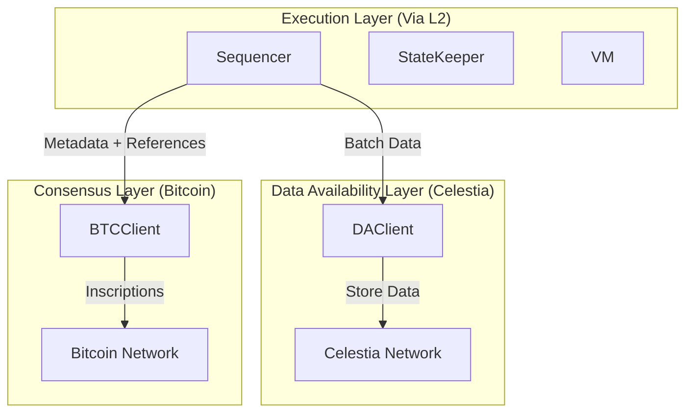

**Implementation**: The system separates concerns across three layers:
- Execution Layer (Via L2): Processes transactions and maintains state
- Data Availability Layer (Celestia): Stores transaction and proof data
- Consensus Layer (Bitcoin): Provides consensus and finality

**Benefits**:
- Leverages the strengths of each layer
- Improves scalability by offloading data storage
- Maintains security through Bitcoin's consensus
- Innovative approach to Layer 2 scaling

### 7.3 Recursive Proof Aggregation

The Via L2 system implements an innovative recursive proof aggregation pattern:

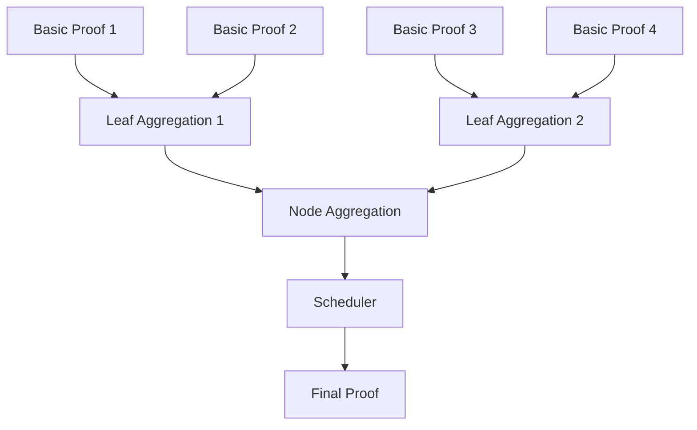

**Implementation**: The system aggregates proofs recursively:
- Basic proofs are generated for individual circuits
- These are aggregated into leaf aggregation proofs
- Leaf proofs are aggregated into node aggregation proofs
- The final scheduler proof aggregates all proofs
- Each level of aggregation reduces verification complexity

**Benefits**:
- Scalable proof generation for complex computations
- Constant-size final proof regardless of computation size
- Efficient verification
- Innovative approach to ZK-rollup scaling

## 8. Conclusion

The Via L2 Bitcoin ZK-Rollup system employs a rich tapestry of architectural and design patterns that collectively create a secure, scalable, and efficient Layer 2 solution. These patterns address the unique challenges of building a ZK-rollup on Bitcoin, leveraging the strengths of different technologies while mitigating their limitations.

The system's innovative patterns, such as inscription-based consensus, three-layer data architecture, and recursive proof aggregation, represent novel approaches to blockchain scaling that could influence future Layer 2 solutions. By carefully combining established patterns with innovative approaches, the Via L2 system achieves a balance of security, scalability, and usability that extends Bitcoin's capabilities while preserving its security guarantees.