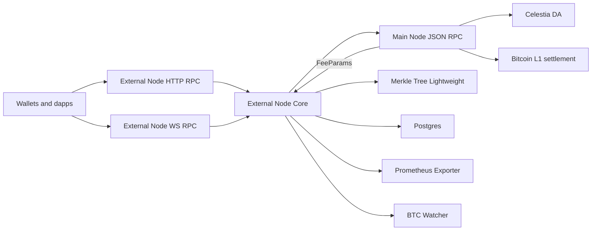

# Via External Node

The Via External Node is a read-replica of the main validator node. It continuously synchronizes state from a designated main node and serves JSON-RPC locally, offloading read traffic and enabling horizontal scaling of RPC without exposing the validator. It can optionally run auxiliary components such as the Merkle tree, consistency checker, BTC watcher, and metrics exporters.

Key artifacts and source references:
- Binary: [core/bin/via_external_node/src/main.rs](https://github.com/vianetwork/via-core/blob/main/core/bin/via_external_node/src/main.rs)
- Builder: [core/bin/via_external_node/src/node_builder.rs](https://github.com/vianetwork/via-core/blob/main/core/bin/via_external_node/src/node_builder.rs)
- Configuration module: [core/bin/via_external_node/src/config/mod.rs](https://github.com/vianetwork/via-core/blob/main/core/bin/via_external_node/src/config/mod.rs)
- Observability configuration: [core/bin/via_external_node/src/config/observability.rs](https://github.com/vianetwork/via-core/blob/main/core/bin/via_external_node/src/config/observability.rs)
- Metrics layer: [core/bin/via_external_node/src/metrics/framework.rs](https://github.com/vianetwork/via-core/blob/main/core/bin/via_external_node/src/metrics/framework.rs)
- Primary config template: [etc/env/configs/ext-node.toml](https://github.com/vianetwork/via-core/blob/main/etc/env/configs/ext-node.toml)
- Setup-generated template (interactive CLI): [etc/env/configs/via_ext_node.toml](https://github.com/vianetwork/via-core/blob/main/etc/env/configs/via_ext_node.toml)
- Interactive setup script: [infrastructure/via/src/setup_en.ts](https://github.com/vianetwork/via-core/blob/main/infrastructure/via/src/setup_en.ts)

Related entry points:
- CLI entry point [rust main()](https://github.com/vianetwork/via-core/blob/main/core/bin/via_external_node/src/main.rs#L118)

1. Overview and purpose

The External Node provides a local, scalable RPC surface for Via L2 by replicating the main node’s state and metadata. It is designed to:
- Reduce load on the validator by handling most read-only JSON-RPC traffic.
- Serve consistent state with optional pruning based on operator policy.
- Offer observability hooks for production operations.
- Integrate with Via-specific components such as the BTC client, BTC watcher, and consistency checker.
- Reduced main node dependency: can run fully from a PostgreSQL dump without a live main node connection.

Docker image (external node)

- A dedicated Dockerfile builds the external node binary and packages required artifacts and migrations.
- Entrypoint performs sqlx database setup and then starts the process.
- Build context: docker/via-external-node/Dockerfile
- The CI workflow supports build and publish with a short git tag or custom suffix.

BTC Watch support (optional)

- The External Node can run the BTC Watch in follower mode to locally index Bitcoin L1 inscriptions for diagnostics and read-side features.
- Configuration blocks required:
  - [via_bridge] bridge parameters (address/keys/thresholds)
  - [via_btc_client] Bitcoin RPC and network
  - [via_btc_watch] polling/confirmations/indexing window
- Follower mode disables governance upgrade processing; deposits (L1ToL2) and votable messages are still parsed.
- Example template keys are provided in etc/env/configs/via_ext_node.toml:
  ```toml
  [via_bridge]
  bridge_address = "bcrt1p..."
  coordinator_pub_key = "<hex>"
  verifiers_pub_keys = ["<hex>", "<hex>"]
  required_signers = 2
  zk_agreement_threshold = 0.5

  [via_btc_client]
  network = "regtest"
  url = "http://0.0.0.0:18443"
  rpc_user = "rpcuser"
  rpc_password = "rpcpassword"
  fee_strategies = ["fastestFee"]
  use_rpc_for_fee_rate = true

  [via_btc_watch]
  poll_interval = 5000
  block_confirmations = 0
  btc_blocks_lag = 1000
  start_l1_block_number = 1
  restart_indexing = false
  ```

API

- The via_getBridgeAddress RPC now returns the bridge address stored in the database (SystemWallets), not a value injected from configuration.

2. Architecture and role in Via L2

The External Node follows a layered service model. On startup it loads local configuration, wires internal components, and optionally contacts the main node. In live-sync mode, it builds a rate-limited client and performs a minimal remote fetch; in dump mode, it skips remote calls entirely and serves from the restored database. API servers expose the same namespaces as the main node, but transactions are proxied to the main node for processing when writes are enabled.

Diagram



Architectural notes:
- The External Node does not perform direct Ethereum L1 queries and does not run a reorg detector by default. Consensus participation is optional and can be enabled; see Consensus configuration.
- The node can operate entirely from a PostgreSQL dump (no live main node required), and the dependency on remote configuration is minimal.
- Component wiring is orchestrated in the builder, see [core/bin/via_external_node/src/node_builder.rs](https://github.com/vianetwork/via-core/blob/main/core/bin/via_external_node/src/node_builder.rs).
- Distributed mode is not fully supported; Tree must run on the same machine as Core.
- Health checks run on a dedicated port and depend on task readiness.
- Fee parameters are fetched from the main node and flow into the External Node; see [core/node/node_framework/src/implementations/layers/via_main_node_fee_params_fetcher.rs](https://github.com/vianetwork/via-core/blob/main/core/node/node_framework/src/implementations/layers/via_main_node_fee_params_fetcher.rs) and [core/lib/web3_decl/src/namespaces/zks.rs](https://github.com/vianetwork/via-core/blob/main/core/lib/web3_decl/src/namespaces/zks.rs).

2.1 PostgreSQL dump mode (no live main node)

- Restore a Postgres dump into the database pointed to by DATABASE_URL; ensure EN_STATE_CACHE_PATH and EN_MERKLE_TREE_PATH directories exist.
- Start the node normally. If EN_MAIN_NODE_URL is unset or unreachable, the node will still boot and serve read-only JSON-RPC from the restored state.
- In dump mode, no remote synchronization occurs; new blocks will not be imported until you re-sync or refresh the database with a newer dump.
- Minimal remote fetch (when available) is limited to critical addresses and parameters; contract addresses are primarily sourced locally/hardcoded.

3. Configuration parameters and environment variables

Primary configuration files and templates
- Baseline template: [etc/env/configs/ext-node.toml](etc/env/configs/ext-node.toml)
- Operator-facing template (produced by setup): [etc/env/configs/via_ext_node.toml](etc/env/configs/via_ext_node.toml)

Defaults from baseline template (ext-node.toml)
- Ports: EN_HTTP_PORT=3060, EN_WS_PORT=3061, EN_HEALTHCHECK_PORT=3081, EN_PROMETHEUS_PORT=3322 (see [etc/env/configs/ext-node.toml](etc/env/configs/ext-node.toml))
- Chain IDs: EN_L2_CHAIN_ID=270, EN_L1_CHAIN_ID=9
- Request entities limit: EN_REQ_ENTITIES_LIMIT=10000
- API namespaces: ["eth", "web3", "net", "pubsub", "zks", "en", "debug"]
- Snapshot recovery default: enabled (snapshots_recovery_enabled=true)
- Threads per server: 128
- State storage paths: EN_STATE_CACHE_PATH, EN_MERKLE_TREE_PATH (derived from template keys state_cache_path and merkle_tree_path)

Required variables (EN_ prefix; compiled from templates or set in env)
- EN_MAIN_NODE_URL: JSON-RPC endpoint of the main node (default http://127.0.0.1:3050)
- EN_L2_CHAIN_ID, EN_L1_CHAIN_ID
- EN_HTTP_PORT, EN_WS_PORT, EN_HEALTHCHECK_PORT, EN_PROMETHEUS_PORT
- DATABASE_URL and DATABASE_POOL_SIZE

Optional tuning (selected)
- EN_FILTERS_LIMIT, EN_SUBSCRIPTIONS_LIMIT
- EN_REQ_ENTITIES_LIMIT (default 10000)
- EN_MAX_TX_SIZE_BYTES, EN_VM_CONCURRENCY_LIMIT
- EN_FEE_HISTORY_LIMIT, EN_MAX_BATCH_REQUEST_SIZE
- EN_MAX_RESPONSE_BODY_SIZE_MB and per-method overrides
- EN_PUBSUB_POLLING_INTERVAL_MS
- EN_MEMPOOL_CACHE_UPDATE_INTERVAL_MS, EN_MEMPOOL_CACHE_SIZE
- EN_EXTENDED_RPC_TRACING
- EN_MAIN_NODE_RATE_LIMIT_RPS

3.1 Consensus configuration

Consensus participation is optional and off by default.
- CLI flags: enable with [rust --enable-consensus](https://github.com/vianetwork/via-core/blob/main/core/bin/via_external_node/src/main.rs#L31).
- File-based config: when using [rust --config-path](https://github.com/vianetwork/via-core/blob/main/core/bin/via_external_node/src/main.rs#L41), [rust --secrets-path](https://github.com/vianetwork/via-core/blob/main/core/bin/via_external_node/src/main.rs#L47), and [rust --external-node-config-path](https://github.com/vianetwork/via-core/blob/main/core/bin/via_external_node/src/main.rs#L50), you must also provide [rust --consensus-path](https://github.com/vianetwork/via-core/blob/main/core/bin/via_external_node/src/main.rs#L53) if consensus is enabled.
- Template keys (compiled by setup or env): en.consensus.config_path and en.consensus.secrets_path in [etc/env/configs/ext-node.toml](https://github.com/vianetwork/via-core/blob/main/etc/env/configs/ext-node.toml)
- Operational note: If consensus is not enabled, the process ignores the consensus config.

3.2 Fee parameter source and defaults

- Fee parameters are fetched from the main node (seeded with safe defaults and updated after the first pull).
- Fetch loop queries [core/lib/web3_decl/src/namespaces/zks.rs](https://github.com/vianetwork/via-core/blob/main/core/lib/web3_decl/src/namespaces/zks.rs) for fee params.
- Wiring is provided by [core/node/node_framework/src/implementations/layers/via_main_node_fee_params_fetcher.rs](https://github.com/vianetwork/via-core/blob/main/core/node/node_framework/src/implementations/layers/via_main_node_fee_params_fetcher.rs); the External Node builder adds this layer.

3.3 Observability and logging

- Observability initialization: [core/bin/via_external_node/src/config/observability.rs](https://github.com/vianetwork/via-core/blob/main/core/bin/via_external_node/src/config/observability.rs)
- Log directives and backtraces can be configured via the [rust] section of [etc/env/configs/ext-node.toml](https://github.com/vianetwork/via-core/blob/main/etc/env/configs/ext-node.toml).

3.4 Pruning and data retention

- Enable background pruning with EN_PRUNING_ENABLED and tune chunk size/delay.
- The baseline template sets pruning_data_retention_hours (default: 1 hour), which the setup compiles to EN_PRUNING_DATA_RETENTION_SEC for the runtime.

Snapshot recovery

- Enable application-level recovery from snapshots with EN_SNAPSHOTS_RECOVERY_ENABLED (default: true).
- Object store configuration can be provided in env or via the baseline template’s object_store section.

4. Setup and deployment

Option A: Guided setup

Updates (commit 070/118):
- The setup now reloads environment variables from file after compiling configs:
  - env.load_from_file() is invoked by the setup script to ensure the active shell/session sees the new values. See [infrastructure/via/src/setup_en.ts](https://github.com/vianetwork/via-core/blob/main/infrastructure/via/src/setup_en.ts).
- Database cleanup scopes core explicitly:
  - Uses via db drop --core instead of a generic drop. See [infrastructure/via/src/setup_en.ts](https://github.com/vianetwork/via-core/blob/main/infrastructure/via/src/setup_en.ts).
- Verifier runner defaults to release profile:
  - The helper now spawns cargo run --bin via_verifier --release. See [infrastructure/via/src/verifier.ts](https://github.com/vianetwork/via-core/blob/main/infrastructure/via/src/verifier.ts).
- Operator prompt clarified when clearing EN data:
  - The cleanup question is simplified (“Do you want to clear the external node database?”).

- Use [infrastructure/via/src/setup_en.ts](https://github.com/vianetwork/via-core/blob/main/infrastructure/via/src/setup_en.ts) to select environment, compile env, set data retention, and optionally launch.

Option B: Manual configuration
- Edit [etc/env/configs/ext-node.toml](https://github.com/vianetwork/via-core/blob/main/etc/env/configs/ext-node.toml) or use the setup-produced [etc/env/configs/via_ext_node.toml](https://github.com/vianetwork/via-core/blob/main/etc/env/configs/via_ext_node.toml).
- Export required EN_* variables and DATABASE_* or run your config compiler.
- Start the node:
  - via external runner: via external-node --components all [--enable-consensus]
  - or run the binary with components: via_external_node --components all [--enable-consensus]

CLI and subcommands
- Secrets generation: run [rust Command::GenerateSecrets](https://github.com/vianetwork/via-core/blob/main/core/bin/via_external_node/src/main.rs#L17) via:
  - via_external_node generate-secrets
  Copy the printed keys into your EN secrets file.

Components

The CLI supports selecting components with --components (default: "all").
- api, http_api, ws_api, tree, tree_api, tree_fetcher, core, all

Notes:
- HTTP binds at EN_HTTP_PORT and WS at EN_WS_PORT.
- Health server binds at EN_HEALTHCHECK_PORT.
- Monolithic mode is recommended; Tree should run with Core.

5. API endpoints and namespaces

- HTTP JSON-RPC: http://host:EN_HTTP_PORT
- WebSocket JSON-RPC: ws://host:EN_WS_PORT
- Health: http://host:EN_HEALTHCHECK_PORT/health
- Enabled JSON-RPC namespaces default to the baseline template: ["eth", "web3", "net", "pubsub", "zks", "en", "debug"].

6. Operational considerations

- Pruning: When EN_PRUNING_ENABLED is true, the pruning layer removes old data in chunks with a soft-to-hard delay window.
- Snapshot recovery: Enabled by default; configure object store parameters as needed.
- Caching: Tune VM concurrency and caches to reduce DB pressure under load.
- Tracing: EN_EXTENDED_RPC_TRACING enables detailed spans but increases overhead at high RPS.
- Mempool cache: In-memory cache reduces DB roundtrips for pending txs.
- Rate limiting to main node: EN_MAIN_NODE_RATE_LIMIT_RPS protects the upstream.
- Metrics and logging: Prometheus pull/push supported; Sentry/structured logs configurable.

6.1 Fee parameter fetching

- The External Node fetches fee parameters periodically using a fee params fetcher layer and the zks JSON-RPC namespace on the main node.
- Dependency: A reliable EN_MAIN_NODE_URL is required for accurate fee estimation; on connectivity loss the node serves with last known parameters or defaults.

6.2 Bitcoin inscription indexer

- A dedicated layer constructs the Bitcoin inscription indexer and exposes it as a resource. The External Node composes the indexer via the BTC watcher wiring rather than directly adding the indexer layer.

Inputs and outputs
- Inputs include a BTC client handle and a system wallets resource.
- Output is a shared indexer handle for downstream consumers.

Configuration relevance for EN
- BTC client, BTC watch, and bridge parameters are provided via VIA sections in the operator templates; EN reuses these.

When to use the standalone indexer service
- For dedicated indexing, use the standalone indexer binary under via_indexer.

7. Integration with other components

- Via Bridge: Configure in the template; loaded at boot.
- BTC Client: Provide credentials, network and RPC URL; a default client is created automatically.
- BTC Watch: Tracks L1 blocks and inscriptions with configurable polling and confirmations.
- Genesis bootstrap: Provide bootstrap txids for test setups.

8. Setup examples

Guided:
- Run [infrastructure/via/src/setup_en.ts](https://github.com/vianetwork/via-core/blob/main/infrastructure/via/src/setup_en.ts) via its setup entry; it will adjust [etc/env/configs/via_ext_node.toml](https://github.com/vianetwork/via-core/blob/main/etc/env/configs/via_ext_node.toml), compile env, and optionally start the node.

Manual:
- Set EN_MAIN_NODE_URL to your validator RPC (default: http://127.0.0.1:3050).
- Set EN_L2_CHAIN_ID to match the main node network.
- Set DATABASE_URL and DATABASE_POOL_SIZE.
- Launch with --components all (optionally --enable-consensus).

9. Troubleshooting

- Resetting state: The setup tool can drop Postgres and clear RocksDB; ensure paths for EN_STATE_CACHE_PATH and EN_MERKLE_TREE_PATH are correct.
- Health checks: Verify EN_HEALTHCHECK_PORT reachability and readiness.
- Namespaces: If debug is disabled, certain tracing and inspection methods are unavailable by design.

10. Security and trust model

Some addresses and parameters can be fetched from the main node for convenience. If stronger assurances are required, supply critical addresses locally and validate origins.