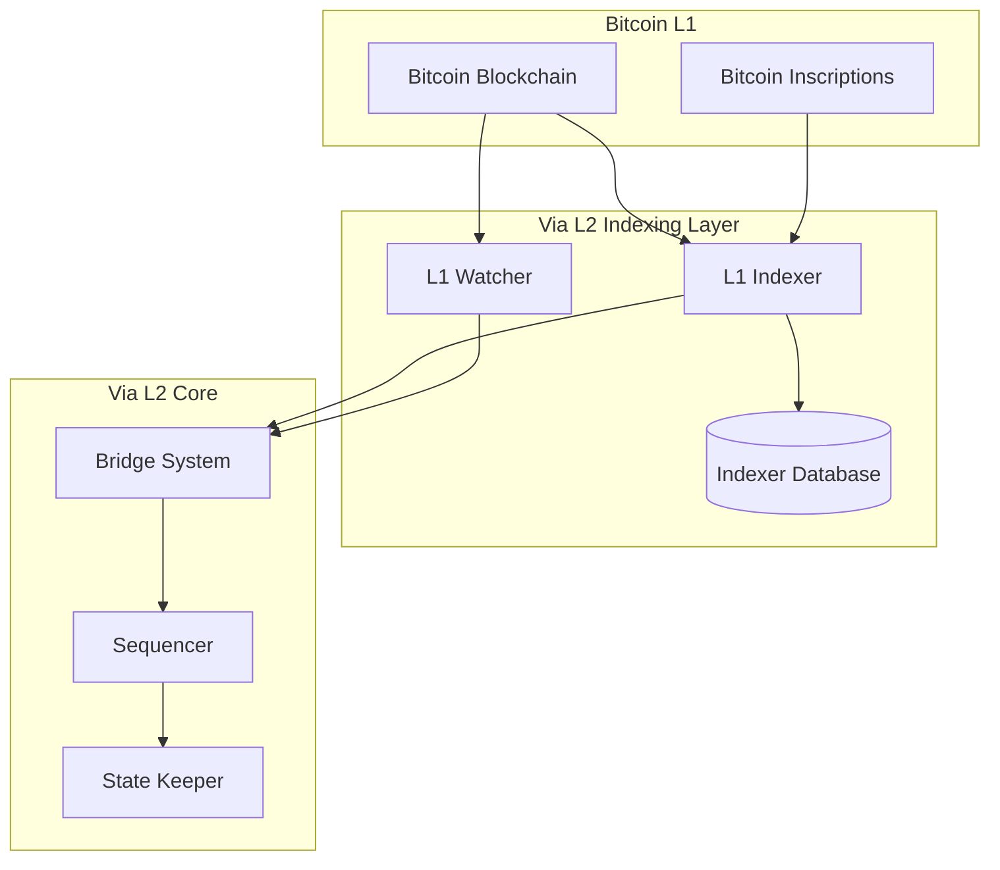
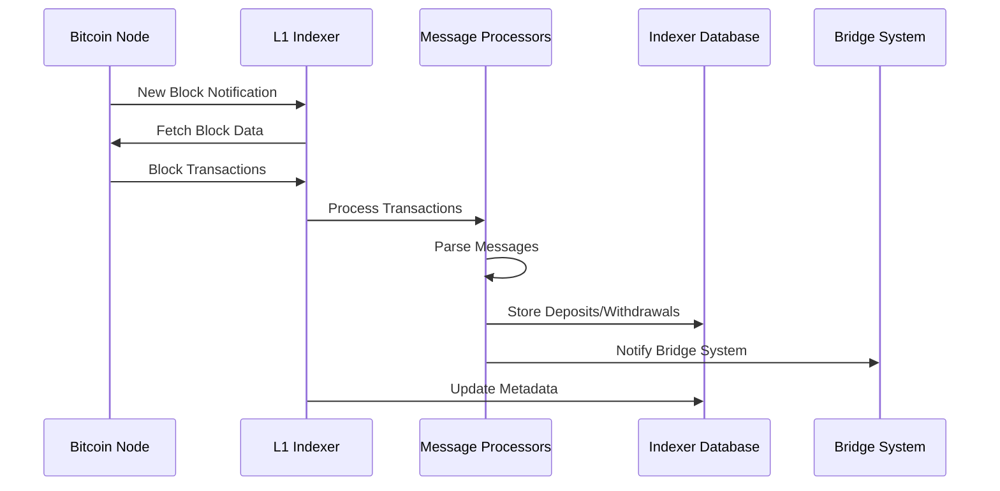

# Via L2 Bitcoin L1 Indexer System

> **Note:** The L1 Indexer is a separate service (its own binary and database) that shares the
> `BitcoinInscriptionIndexer` parsing library with the node watchers. The real schema has four
> tables: `deposits`, `withdrawals`, `indexer_metadata`, and `via_wallets` (added by the wallet
> migration). There is no `bridge_withdrawals` table; withdrawals are stored individually, keyed
> by their L2 withdrawal id.

## Overview

The Via L1 Indexer is a specialized Bitcoin blockchain indexing service that complements the existing L1 Watcher by providing dedicated indexing capabilities for deposits and withdrawals. This system was introduced to enhance the Via L2 architecture with more efficient and scalable Bitcoin transaction processing.

### Key Features

- **Dedicated Bitcoin L1 Indexing**: Specialized service for indexing Bitcoin transactions relevant to Via L2
- **Deposit/Withdrawal Tracking**: Comprehensive tracking of bridge deposits and withdrawals
- **Independent Database Schema**: Dedicated database tables optimized for indexing operations
- **Message Processing Pipeline**: Structured processing of Bitcoin inscription messages
- **Scalable Architecture**: Designed for high-throughput Bitcoin transaction processing

### Integration with Via Architecture

The L1 Indexer integrates seamlessly with the existing Via L2 system:


```mermaid
graph TB
    subgraph "Bitcoin L1"
        BTC[Bitcoin Blockchain]
        Inscriptions[Bitcoin Inscriptions]
    end
    
    subgraph "Via L2 Indexing Layer"
        L1Watcher[L1 Watcher]
        L1Indexer[L1 Indexer]
        IndexerDB[(Indexer Database)]
    end
    
    subgraph "Via L2 Core"
        Bridge[Bridge System]
        Sequencer[Sequencer]
        StateKeeper[State Keeper]
    end
    
    BTC --> L1Watcher
    BTC --> L1Indexer
    Inscriptions --> L1Indexer
    L1Indexer --> IndexerDB
    L1Indexer --> Bridge
    L1Watcher --> Bridge
    Bridge --> Sequencer
    Sequencer --> StateKeeper
```

## Architecture

### System Components

The L1 Indexer consists of several key components working together:

#### 1. Indexer Service (`via_indexer` crate, `via_indexer/node/indexer/`)

The core service struct polls Bitcoin in chunks of 100 blocks and drives the message processors:

```rust
// via_indexer/node/indexer/src/lib.rs
/// Total L1 blocks to process at a time.
pub const L1_BLOCKS_CHUNK: u32 = 100;

#[derive(Debug)]
pub struct L1Indexer {
    config: ViaBtcWatchConfig,
    indexer: BitcoinInscriptionIndexer,
    pool: ConnectionPool<Indexer>,
    system_wallet_processor: Box<dyn MessageProcessor>,
    message_processors: Vec<Box<dyn MessageProcessor>>,
}
```

#### 2. Data Access Layer (`via_indexer_dal`, `via_indexer/lib/via_indexer_dal/`)

Provides database abstraction with:
- **ViaIndexerDal** (`via_indexer_dal.rs`): per-module progress metadata
- **ViaTransactionsDal** (`via_transactions_dal.rs`): deposit and withdrawal rows
- **ViaWalletDal** (`via_wallet_dal.rs`): persisted `SystemWallets`
- sqlx migrations under `migrations/`

#### 3. Message Processors (`src/message_processors/`)

One processor per concern, all implementing the `MessageProcessor` trait:
- **`L1ToL2MessageProcessor`** (`deposit.rs`): L1→L2 deposits
- **`WithdrawalProcessor`** (`withdrawal.rs`): executed bridge withdrawals (`BridgeWithdrawal` messages)
- **`SystemWalletProcessor`** (`system_wallet.rs`): governance wallet rotations; runs before the other two

### Component Interaction


```mermaid
sequenceDiagram
    participant BTC as Bitcoin Node
    participant IDX as L1 Indexer
    participant MP as Message Processors
    participant DB as Indexer Database
    participant BRIDGE as Bridge System

    BTC->>IDX: New Block Notification
    IDX->>BTC: Fetch Block Data
    BTC->>IDX: Block Transactions
    IDX->>MP: Process Transactions
    MP->>MP: Parse Messages
    MP->>DB: Store Deposits/Withdrawals
    MP->>BRIDGE: Notify Bridge System
    IDX->>DB: Update Metadata
```

## Database Schema

The L1 Indexer introduces a dedicated database schema optimized for indexing operations:

### Core Tables

#### 1. Deposits Table

Stores L1→L2 deposit transactions (`migrations/20250604191948_deposit_withdraw.up.sql`):

```sql
CREATE TABLE IF NOT EXISTS deposits (
    "priority_id" BIGINT NOT NULL,
    "tx_id" BYTEA NOT NULL,
    "block_number" BIGINT NOT NULL,
    "sender" VARCHAR NOT NULL,
    "receiver" VARCHAR NOT NULL,
    "value" BIGINT NOT NULL,
    "calldata" BYTEA,
    "canonical_tx_hash" BYTEA NOT NULL UNIQUE,
    "created_at" BIGINT NOT NULL,
    PRIMARY KEY (tx_id)
);
```

The `priority_id` is the deterministic id derived from `(block_number, tx_index, vout)`, not a sequential counter. `sender` and `receiver` are stored as strings (Bitcoin sender address, L2 receiver).

#### 2. Withdrawals Table

Individual executed withdrawals, keyed by their **L2 withdrawal id** (the same id embedded in the bridge transaction's OP_RETURN data):

```sql
CREATE TABLE IF NOT EXISTS withdrawals (
    "id" VARCHAR UNIQUE NOT NULL,
    "tx_id" BYTEA NOT NULL,
    "l2_tx_log_index" BIGINT NOT NULL,
    "receiver" VARCHAR NOT NULL,
    "value" BIGINT NOT NULL,
    "block_number" BIGINT NOT NULL,
    "timestamp" BIGINT NOT NULL,
    "created_at" TIMESTAMP NOT NULL DEFAULT NOW()
);
```

Note there is **no** separate `bridge_withdrawals` table (the earlier design's UNIQUE constraint on block number was dropped precisely because multiple withdrawal bundles per block are allowed); each row records which Bitcoin transaction (`tx_id`) paid which L2 withdrawal (`id`, `l2_tx_log_index`).

#### 3. Indexer Metadata Table

Tracks indexer progress per module:

```sql
CREATE TABLE IF NOT EXISTS indexer_metadata (
    module VARCHAR NOT NULL UNIQUE,
    last_indexer_l1_block BIGINT NOT NULL,
    updated_at TIMESTAMP NOT NULL
);
```

#### 4. Via Wallets Table

Added by `20250731184639_via_wallet_migration`: persists the `SystemWallets` (sequencer, governance, bridge, verifiers) so the indexer parses with the same address set as the node, including runtime wallet rotations.

## API Reference

### ViaIndexerDal

Core indexer metadata operations:

#### Initialize Indexer Metadata

```rust
pub async fn init_indexer_metadata(&mut self, module: &str, l1_block: u32) -> DalResult<()>
```

Initializes metadata for an indexer module. In practice there is a single module: `L1Indexer::module_name()` returns `"l1_indexer"`, and `initialize_indexer` seeds it with `start_l1_block_number - 1`.

**Parameters:**
- `module`: Module name (`"l1_indexer"`)
- `l1_block`: Starting Bitcoin block number

#### Update Last Processed Block

```rust
pub async fn update_last_processed_l1_block(&mut self, module: &str, l1_block: u32) -> DalResult<()>
```

Updates the last processed block for a module.

**Parameters:**
- `module`: Module name
- `l1_block`: Last processed block number

#### Get Last Processed Block

```rust
pub async fn get_last_processed_l1_block(&mut self, module: &str) -> DalResult<u64>
```

Retrieves the last processed block number for a module.

**Returns:** Last processed block number (0 if not found)

### ViaTransactionsDal

Transaction data operations:

#### Insert Deposits

Inserts a batch of deposit records in a single database transaction, with `ON CONFLICT (tx_id) DO NOTHING` making replays harmless (`via_indexer/lib/via_indexer_dal/src/via_transactions_dal.rs`):

```rust
pub async fn insert_deposit_many(&mut self, deposits: Vec<Deposit>) -> DalResult<()> {
    if deposits.is_empty() {
        return Ok(());
    }
    let mut transaction = self.storage.start_transaction().await?;

    for deposit in deposits {
        sqlx::query!(
            r#"
            INSERT INTO
            deposits (
                priority_id,
                tx_id,
                block_number,
                sender,
                receiver,
                value,
                calldata,
                canonical_tx_hash,
                created_at
            )
            VALUES
            ($1, $2, $3, $4, $5, $6, $7, $8, $9)
            ON CONFLICT (tx_id) DO NOTHING
            "#,
            deposit.priority_id,
            deposit.tx_id,
            i64::from(deposit.block_number),
            deposit.sender,
            deposit.receiver,
            deposit.value,
            deposit.calldata,
            deposit.canonical_tx_hash,
            deposit.block_timestamp as i64,
        )
        .instrument("insert_deposit")
        .execute(&mut transaction)
        .await?;
    }

    transaction.commit().await?;

    Ok(())
}
```

The `Deposit` model (`src/models/deposit.rs`):

```rust
#[derive(Debug, Clone)]
pub struct Deposit {
    pub priority_id: i64,
    pub tx_id: Vec<u8>,
    pub block_number: u32,
    pub sender: String,
    pub receiver: String,
    pub value: i64,
    pub calldata: Vec<u8>,
    pub canonical_tx_hash: Vec<u8>,
    pub block_timestamp: u64,
}
```

#### Check Deposit Existence

```rust
pub async fn deposit_exists(&mut self, tx_id: &[u8]) -> DalResult<bool>
```

Checks if a deposit with the given transaction ID exists.

#### Insert Withdrawal

```rust
// via_indexer/lib/via_indexer_dal/src/via_transactions_dal.rs
pub async fn insert_withdraw(&mut self, withdrawal: Withdrawal) -> DalResult<()>
```

Inserts a single executed withdrawal. The model (`src/models/withdraw.rs`):

```rust
#[derive(Debug, Clone)]
pub struct Withdrawal {
    pub id: String,
    pub tx_id: Vec<u8>,
    pub l2_tx_log_index: i64,
    pub block_number: i64,
    pub receiver: String,
    pub value: i64,
    pub timestamp: i64,
}
```

The `id` is the L2 withdrawal id recovered from the bridge transaction's OP_RETURN data; `tx_id` is the Bitcoin transaction that paid it. One `BridgeWithdrawal` message from the parser yields one `insert_withdraw` call per constituent withdrawal.

## Message Processing

### Indexing Loop

The main loop lives in `via_indexer/node/indexer/src/lib.rs`. Each tick it advances at most `L1_BLOCKS_CHUNK` (100) blocks, runs the system-wallet processor first, and re-parses the same block range if wallets changed (a rotation can change how subsequent messages are interpreted):

```rust
async fn loop_iteration(
    &mut self,
    storage: &mut Connection<'_, Indexer>,
) -> anyhow::Result<()> {
    let last_processed_bitcoin_block = storage
        .via_indexer_dal()
        .get_last_processed_l1_block(L1Indexer::module_name())
        .await? as u32;

    let current_l1_block_number = self.indexer.fetch_block_height().await? as u32;
    if current_l1_block_number <= last_processed_bitcoin_block {
        return Ok(());
    }

    let mut to_block = last_processed_bitcoin_block + L1_BLOCKS_CHUNK;
    if to_block > current_l1_block_number {
        to_block = current_l1_block_number;
    }

    let mut messages = self
        .indexer
        .process_blocks(last_processed_bitcoin_block + 1, to_block)
        .await?;

    // Re-process blocks if system wallets were updated, since the new wallet state
    // may change how subsequent messages are interpreted.
    if self
        .system_wallet_processor
        .process_messages(storage, messages.clone(), &mut self.indexer)
        .await?
    {
        messages = self
            .indexer
            .process_blocks(last_processed_bitcoin_block + 1, to_block)
            .await?;
    }

    for processor in self.message_processors.iter_mut() {
        processor
            .process_messages(storage, messages.clone(), &mut self.indexer)
            .await?;
    }

    storage
        .via_indexer_dal()
        .update_last_processed_l1_block(L1Indexer::module_name(), to_block)
        .await?;

    METRICS
        .current_block_number
        .set(current_l1_block_number as usize);
    METRICS.last_indexed_block_number.set(to_block as usize);

    tracing::info!(
        "Blocks from {} to {} processed",
        last_processed_bitcoin_block,
        to_block
    );

    Ok(())
}

fn module_name() -> &'static str {
    "l1_indexer"
}
```

Progress is tracked under the single module name `"l1_indexer"` in `indexer_metadata`. On startup, `initialize_indexer` wipes and re-seeds everything when `restart_indexing` is set or when no progress row exists yet:

```rust
async fn initialize_indexer(
    storage: &mut Connection<'_, Indexer>,
    start_l1_block_number: u32,
    restart_indexing: bool,
) -> anyhow::Result<()> {
    let last_processed_bitcoin_block = storage
        .via_indexer_dal()
        .get_last_processed_l1_block(L1Indexer::module_name())
        .await? as u32;

    if restart_indexing || last_processed_bitcoin_block == 0 {
        let mut transaction = storage.start_transaction().await?;

        transaction
            .via_transactions_dal()
            .delete_transactions(start_l1_block_number as i64)
            .await?;
        transaction.via_indexer_dal().delete_metadata().await?;
        transaction
            .via_indexer_dal()
            .init_indexer_metadata(L1Indexer::module_name(), start_l1_block_number - 1)
            .await?;

        transaction.commit().await?;
    }

    Ok(())
}
```

The polling cadence, start block, and restart flag all come from `ViaBtcWatchConfig` (the same config type the node watchers use): `run()` ticks on `self.config.poll_interval()`.

### Deposit Processing

The deposit processor consumes parsed `L1ToL2Message`s. There is no sequential priority-id counter: each deposit's priority id derives deterministically from `(block_number, tx_index, output_vout)` via `ViaL1Deposit::priority_id()`, so replays and reindexing produce identical ids.

```rust
// via_indexer/node/indexer/src/message_processors/deposit.rs
#[async_trait::async_trait]
impl MessageProcessor for L1ToL2MessageProcessor {
    async fn process_messages(
        &mut self,
        storage: &mut Connection<'_, Indexer>,
        msgs: Vec<FullInscriptionMessage>,
        _: &mut BitcoinInscriptionIndexer,
    ) -> anyhow::Result<bool> {
        let mut deposits = Vec::new();

        for msg in msgs {
            if let FullInscriptionMessage::L1ToL2Message(l1_to_l2_msg) = msg {
                let mut tx_id_bytes = l1_to_l2_msg.common.tx_id.as_raw_hash()[..].to_vec();
                tx_id_bytes.reverse();
                let tx_id = H256::from_slice(&tx_id_bytes);

                if storage
                    .via_transactions_dal()
                    .deposit_exists(&tx_id_bytes)
                    .await?
                {
                    tracing::warn!(
                        "Deposit {} already indexed",
                        l1_to_l2_msg.common.tx_id.to_string()
                    );
                    continue;
                }

                let block = self
                    .client
                    .get_block_stats(u64::from(l1_to_l2_msg.common.block_height))
                    .await?;
                let Some(l1_tx) =
                    self.create_l1_tx_from_message(block.time, tx_id, &l1_to_l2_msg)?
                else {
                    tracing::warn!("Invalid deposit, l1 tx_id {}", &l1_to_l2_msg.common.tx_id);
                    continue;
                };

                deposits.push(l1_tx);
            }
        }

        storage
            .via_transactions_dal()
            .insert_deposit_many(deposits)
            .await?;

        Ok(true)
    }
}
```

Note the details: the Bitcoin txid bytes are reversed for the H256 key (endianness), duplicates are skipped via `deposit_exists`, the block timestamp comes from `get_block_stats`, and invalid deposits (failing `ViaL1Deposit::is_valid_deposit()`) are logged and skipped rather than erroring the batch.

### Withdrawal Processing

The withdrawal processor consumes parsed `BridgeWithdrawal` messages (the parser has already validated the transaction spends from the bridge):

```rust
// via_indexer/node/indexer/src/message_processors/withdrawal.rs
#[async_trait::async_trait]
impl MessageProcessor for WithdrawalProcessor {
    async fn process_messages(
        &mut self,
        storage: &mut Connection<'_, Indexer>,
        msgs: Vec<FullInscriptionMessage>,
        _: &mut BitcoinInscriptionIndexer,
    ) -> anyhow::Result<bool> {
        for msg in msgs {
            if let FullInscriptionMessage::BridgeWithdrawal(withdrawal_msg) = msg {
                let tx_id = withdrawal_msg.common.tx_id.as_byte_array().to_vec();
                let withdrawals = get_withdrawal_requests(withdrawal_msg.input.withdrawals);

                tracing::info!(
                    "New bridge withdrawal found: hash: {}, count: {}",
                    tx_id.to_hex_string(Case::Lower),
                    withdrawals.len()
                );

                let block = self
                    .client
                    .get_block_stats(withdrawal_msg.common.block_height as u64)
                    .await?;

                if !withdrawals.is_empty() {
                    let mut transaction = storage.start_transaction().await?;
                    for w in withdrawals {
                        transaction
                            .via_transactions_dal()
                            .insert_withdraw(Withdrawal {
                                id: w.id,
                                tx_id: tx_id.clone(),
                                l2_tx_log_index: w.l2_tx_log_index as i64,
                                block_number: withdrawal_msg.common.block_height as i64,
                                receiver: w.receiver.to_string(),
                                value: w.amount.to_sat() as i64,
                                timestamp: block.time as i64,
                            })
                            .await?;
                    }

                    transaction.commit().await?;
                }

                tracing::info!(
                    "Bridge withdrawal {} inserted",
                    tx_id.to_hex_string(Case::Lower),
                );
            }
        }

        Ok(true)
    }
}
```

The withdrawal set comes from `get_withdrawal_requests(withdrawal_msg.input.withdrawals)` (the same normalization the verifier uses), all rows for one bridge transaction are inserted in a single database transaction, and a separate `system_wallet.rs` processor keeps the persisted `SystemWallets` current so parsing follows governance rotations.

## Configuration

### Configuration Structure

The indexer has no config keys of its own. `ViaIndexerConfig` is a bundle of the same config types the node uses (`core/lib/config/src/configs/via_l1_indexer.rs`):

```rust
#[derive(Debug, Clone, PartialEq)]
pub struct ViaIndexerConfig {
    pub via_bridge_config: ViaBridgeConfig,
    pub via_genesis_config: ViaGenesisConfig,
    pub via_btc_client_config: ViaBtcClientConfig,
    pub via_btc_watch_config: ViaBtcWatchConfig,
    pub observability_config: ObservabilityConfig,
    pub health_check: HealthCheckConfig,
    pub prometheus_config: PrometheusConfig,
    pub postgres_config: PostgresConfig,
    pub secrets: ViaSecrets,
}
```

The indexer-relevant knobs live inside these bundles: `via_btc_watch_config` supplies `poll_interval()`, `start_l1_block_number`, and `restart_indexing`; `via_bridge_config.bridge_address` tells the Bitcoin client which wallet to watch; `via_genesis_config` carries the bootstrap transaction ids.

### Loading from the Environment

Every field is loaded through the standard `FromEnv` machinery in `via_indexer/bin/indexer/src/main.rs`; there are no `VIA_INDEXER_*` variables:

```rust
fn main() -> anyhow::Result<()> {
    let via_indexer_config = ViaIndexerConfig {
        health_check: HealthCheckConfig::from_env()?,
        postgres_config: PostgresConfig::from_env()?,
        prometheus_config: PrometheusConfig::from_env()?,
        via_btc_client_config: ViaBtcClientConfig::from_env()?,
        via_btc_watch_config: ViaBtcWatchConfig::from_env()?,
        via_genesis_config: ViaGenesisConfig::from_env()?,
        observability_config: ObservabilityConfig::from_env()?,
        secrets: ViaSecrets {
            base_secrets: Secrets {
                consensus: None,
                database: DatabaseSecrets::from_env().ok(),
                l1: None,
                data_availability: None,
            },
            via_l1: ViaL1Secrets::from_env().ok(),
            via_l2: None,
            via_da: None,
        },
        via_bridge_config: ViaBridgeConfig::from_env()?,
    };

    let node_builder = node_builder::ViaNodeBuilder::new(via_indexer_config.clone())?;

    let observability_guard = {
        // Observability initialization should be performed within tokio context.
        let _context_guard = node_builder.runtime_handle().enter();
        via_indexer_config.observability_config.install()?
    };

    // Build the node

    let node = node_builder.build()?;
    node.run(observability_guard)?;

    Ok(())
}
```

### Node Builder

The service is assembled from framework layers, mirroring the main node's builder pattern (`via_indexer/bin/indexer/src/node_builder.rs`):

```rust
pub fn build(mut self) -> anyhow::Result<ZkStackService> {
    self = self
        .add_sigint_handler_layer()?
        .add_healthcheck_layer()?
        .add_prometheus_exporter_layer()?
        .add_pools_layer()?
        .add_btc_client_layer()?
        .add_init_indexer_storage_layer()?
        .add_l1_indexer_layer()?;

    Ok(self.node.build())
}
```

Two layer details worth noting:

```rust
fn add_pools_layer(mut self) -> anyhow::Result<Self> {
    let config = self.via_indexer_config.postgres_config.clone();
    let secrets = self
        .via_indexer_config
        .secrets
        .base_secrets
        .database
        .clone()
        .unwrap();
    let pools_layer = PoolsLayerBuilder::empty(config, secrets)
        .with_indexer(true)
        .build();
    self.node.add_layer(pools_layer);
    Ok(self)
}

fn add_btc_client_layer(mut self) -> anyhow::Result<Self> {
    let secrets = self.via_indexer_config.secrets.clone();
    let via_btc_client_config = self.via_indexer_config.via_btc_client_config.clone();
    let via_bridge_config = self.via_indexer_config.via_bridge_config.clone();
    self.node.add_layer(BtcClientLayer::new(
        via_btc_client_config,
        secrets.via_l1.unwrap(),
        ViaWallets::default(),
        Some(via_bridge_config.bridge_address.clone()),
    ));
    Ok(self)
}
```

`with_indexer(true)` provisions the dedicated indexer connection pool, and `BtcClientLayer` is pointed at the bridge address from `ViaBridgeConfig`.

## Deployment

### Docker Image

The real Dockerfile lives at `docker/via-l1-indexer/Dockerfile`. The binary target is `via_indexer_bin`, installed into the image as `via_indexer`:

```dockerfile
# Will work locally only after prior contracts build
# syntax=docker/dockerfile:experimental
FROM matterlabs/zksync-build-base:latest AS builder

# set of args for use of sccache
ARG SCCACHE_GCS_BUCKET=""
ARG SCCACHE_GCS_SERVICE_ACCOUNT=""
ARG SCCACHE_GCS_RW_MODE=""
ARG RUSTC_WRAPPER=""

ENV SCCACHE_GCS_BUCKET=${SCCACHE_GCS_BUCKET}
ENV SCCACHE_GCS_SERVICE_ACCOUNT=${SCCACHE_GCS_SERVICE_ACCOUNT}
ENV SCCACHE_GCS_RW_MODE=${SCCACHE_GCS_RW_MODE}
ENV RUSTC_WRAPPER=${RUSTC_WRAPPER}

WORKDIR /usr/src/via

COPY . .

RUN apt-get update && apt-get install -y protobuf-compiler && rm -rf /var/lib/apt/lists/*
RUN cargo build --release --bin via_indexer_bin

FROM debian:bookworm-slim

RUN apt-get update && apt-get install -y curl libpq5 liburing-dev ca-certificates && \
    rm -rf /var/lib/apt/lists/*
ENV PATH=$PATH:/usr/local/bin

EXPOSE 6060

COPY --from=builder /usr/src/via/target/release/via_indexer_bin /usr/bin/via_indexer

ENTRYPOINT ["via_indexer"]
```

### CLI (development)

There is no standalone `via-indexer` CLI. Locally the indexer is started through the `via` infrastructure tool, which refreshes the bootstrap txids for the chosen network, loads the env files, and runs the cargo binary (`infrastructure/via/src/indexer.ts`):

```typescript
export async function indexer(network: string) {
    await updateBootstrapTxidsEnv(network);

    console.log(`Starting l1 indexer...`);
    env.load_from_file();

    await utils.spawn(`cargo run --bin via_indexer_bin`);
}

export const indexerCommand = new Command('indexer')
    .description('start via indexer node')
    .option('--network <network>', 'network', 'regtest')
    .action(async (cmd: Command) => {
        cmd.chainName ? env.reload(cmd.chainName) : env.load();
        env.get(true);
        await indexer(cmd.network);
    });
```

So the entry point is `via indexer --network <regtest|testnet|mainnet>`.

### Health Checks

The node builder installs the standard framework endpoints: `HealthCheckLayer` serves the health endpoint on the port from `HealthCheckConfig`, and `PrometheusExporterLayer` serves pull-mode metrics on `prometheus_config.listener_port`. Both ports come from the shared env config, not from indexer-specific settings.

## Monitoring and Metrics

### Prometheus Metrics

The indexer registers exactly two gauges, and (a quirk worth knowing when building dashboards) they reuse the verifier BTC-watch prefix, so they appear as `via_verifier_btc_watch_last_indexed_block_number` and `via_verifier_btc_watch_current_block_number` (`via_indexer/node/indexer/src/metrics.rs`):

```rust
use vise::{Gauge, Metrics};

#[derive(Debug, Metrics)]
#[metrics(prefix = "via_verifier_btc_watch")]
pub struct ViaVerifierBtcWatcherMetrics {
    /// Last indexed l1 batch number.
    pub last_indexed_block_number: Gauge<usize>,

    /// Last indexed l1 batch number.
    pub current_block_number: Gauge<usize>,
}

#[vise::register]
pub static METRICS: vise::Global<ViaVerifierBtcWatcherMetrics> = vise::Global::new();
```

Both are set at the end of every successful `loop_iteration`, so their difference is the indexer's lag behind the Bitcoin tip in blocks. There are no `via_indexer_*` metric names.

### Logging

Standard `tracing` output through `ObservabilityConfig`. The relevant targets are the crate names:

```bash
RUST_LOG="via_indexer=info,via_indexer_dal=debug"
```

Processor activity is logged from the `via_indexer` target (for example "New bridge withdrawal found", "Deposit ... already indexed", "Blocks from x to y processed").

## Troubleshooting

### Common Issues

#### 1. Database Connection Issues

**Symptom:** Indexer fails to start with database connection errors

**Solution:**
```bash
# Check database connectivity
psql $DATABASE_INDEXER_URL -c "SELECT 1;"

# Verify database schema
psql $DATABASE_INDEXER_URL -c "\dt"

# Run migrations if needed
sqlx migrate run --database-url $DATABASE_INDEXER_URL
```

#### 2. Bitcoin RPC Connection Issues

**Symptom:** Cannot connect to Bitcoin node

**Solution:**
```bash
# Test Bitcoin RPC connection
curl -u rpcuser:rpcpassword \
  -d '{"jsonrpc":"1.0","id":"test","method":"getblockchaininfo","params":[]}' \
  -H 'content-type: text/plain;' \
  http://localhost:8332/

# Check Bitcoin node status
bitcoin-cli -rpcuser=rpcuser -rpcpassword=rpcpassword getblockchaininfo
```

#### 3. Indexer Lag Issues

**Symptom:** `via_verifier_btc_watch_current_block_number` keeps growing faster than `via_verifier_btc_watch_last_indexed_block_number`

The chunk size is a compile-time constant (`L1_BLOCKS_CHUNK = 100`), so per-tick throughput is fixed. The available knobs:
- lower `ViaBtcWatchConfig` poll interval so ticks fire more often (each tick indexes up to 100 blocks)
- check Bitcoin RPC latency; `process_blocks` fetches every block in the range from the node
- monitor system resources (CPU, memory, disk I/O)

There is no horizontal scaling story: progress is a single `indexer_metadata` row for module `"l1_indexer"`, so exactly one instance should run against a database.

#### 4. Data Consistency Issues

**Symptom:** Missing or duplicate transactions

**Solutions:**

Duplicates are already prevented at the schema and DAL level (`PRIMARY KEY (tx_id)` plus `ON CONFLICT (tx_id) DO NOTHING` for deposits, `id VARCHAR UNIQUE` for withdrawals, `deposit_exists` dedup in the processor). To rebuild from scratch, set `restart_indexing` in `ViaBtcWatchConfig`: on startup, `initialize_indexer` runs `delete_transactions(start_l1_block_number)` and `delete_metadata()` and re-seeds progress. To inspect manually:

```sql
-- Where is the indexer?
SELECT module, last_indexer_l1_block, updated_at FROM indexer_metadata;

-- Deposits and executed withdrawals per Bitcoin block
SELECT block_number, COUNT(*) FROM deposits GROUP BY block_number ORDER BY block_number DESC LIMIT 20;
SELECT block_number, COUNT(*) FROM withdrawals GROUP BY block_number ORDER BY block_number DESC LIMIT 20;
```

Note that gaps in `block_number` are normal: most Bitcoin blocks contain no Via activity, and only blocks with matching messages produce rows.

## Integration Examples

### Querying Deposit Data

Direct SQL against the indexer database (columns as defined in `20250604191948_deposit_withdraw.up.sql`):

```sql
-- Most recent deposits
SELECT priority_id, encode(tx_id, 'hex') AS tx_id, block_number, sender, receiver, value
FROM deposits
ORDER BY block_number DESC, priority_id DESC
LIMIT 20;

-- Which Bitcoin transaction paid a given L2 withdrawal id
SELECT id, encode(tx_id, 'hex') AS btc_tx_id, l2_tx_log_index, receiver, value, block_number
FROM withdrawals
WHERE id = $1;
```

### Monitoring Indexer Progress

Progress lives under the single module name `"l1_indexer"`:

```rust
let mut connection = pool.connection().await?;
let last_block = connection
    .via_indexer_dal()
    .get_last_processed_l1_block("l1_indexer")
    .await?;
```

`get_last_processed_l1_block` returns 0 when no metadata row exists yet (`fetch_optional` followed by `unwrap_or(0)`), which is also the condition that triggers `initialize_indexer` to seed the metadata on startup.