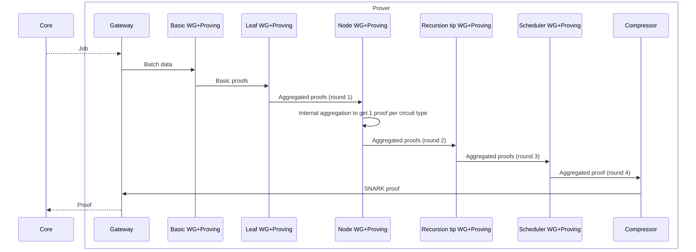

# Via L2 Bitcoin ZK-Rollup: Prover Component Documentation

## 1. Introduction

The Prover is a critical component of the Via L2 Bitcoin ZK-Rollup system, responsible for generating zero-knowledge (ZK) proofs that verify the correctness of state transitions in the L2 system. These proofs are essential for the security and trustlessness of the rollup, as they cryptographically guarantee that all transactions processed on L2 follow the correct execution rules without requiring validators to re-execute all transactions.

## 2. Role and Responsibilities

The Prover's primary responsibilities include:

- **Proof Generation**: Creating cryptographic ZK proofs that verify the correctness of L1 batch execution
- **Witness Generation**: Computing witness data from transaction execution results
- **Proof Aggregation**: Combining multiple proofs through a recursive proving system
- **Proof Compression**: Converting the final proof into a format suitable for submission to Bitcoin

The Prover ensures that all state transitions in the L2 system are valid according to the system's rules, providing cryptographic guarantees that can be efficiently verified on L1 (Bitcoin).

## 3. Architecture Overview

The Prover subsystem consists of several interconnected components that work together to generate proofs for L1 batches:

```
┌─────────────────┐     ┌─────────────────┐     ┌─────────────────┐
│  Prover Gateway │     │ Witness Generator│     │ Circuit Prover  │
│                 │◄───►│                 │◄───►│                 │
└────────┬────────┘     └────────┬────────┘     └────────┬────────┘
         │                       │                       │
         ▼                       ▼                       ▼
┌─────────────────┐     ┌─────────────────┐     ┌─────────────────┐
│ Core System     │     │ Witness Vector  │     │ Proof Compressor│
│ (API)           │     │ Generator       │     │                 │
└─────────────────┘     └─────────────────┘     └─────────────────┘
```

### 3.1 Key Components

The Prover implementation consists of several key components:

1. **Prover Gateway** (`prover/crates/bin/prover_fri_gateway/`): Interface between core and prover subsystems, fetches batch jobs from core, and sends batch proofs back to core.

2. **Witness Generator** (`prover/crates/bin/witness_generator/`): Takes batch information (transaction execution/state diffs/computation results) and constructs witness data for proof generation.

3. **Witness Vector Generator** (`prover/crates/bin/witness_vector_generator/`): Uses witness generator output and computes witness vectors (data to be fed into GPU) for circuit provers.

4. **Circuit Prover** (`prover/crates/bin/prover_fri/`): Generates circuit proofs using GPU acceleration.

5. **Proof Compressor** (`prover/crates/bin/proof_fri_compressor/`): "Wraps" the generated proof so it can be sent to L1 (Bitcoin).

6. **Prover Interface** (`core/lib/prover_interface/`): Defines the API between the core system and the prover subsystem.

## 4. Proof Generation Process

The proof generation is a multi-stage process that involves several components working together:

### 4.1 Proof Generation Flow



The proof generation process consists of the following stages:

1. **Job Acquisition**: The Prover Gateway polls the Core API to get a new batch to prove.
2. **Basic Witness Generation**: Generates basic circuits (up to 2400 circuits) for the batch.
3. **Leaf Aggregation**: Aggregates basic circuits into leaf aggregation circuits (up to 48 circuits).
4. **Node Aggregation**: Aggregates leaf circuits into node aggregation circuits.
5. **Recursion Tip**: Further aggregates proofs.
6. **Scheduler**: Produces the final aggregated proof.
7. **Compression**: Compresses the proof for submission to L1.
8. **Proof Submission**: The Prover Gateway submits the final proof back to the Core.

### 4.2 Witness Generation

The witness generation process is a crucial part of the proving system:

1. **Basic Circuits Witness Generator**:
   - Generates basic circuits (circuits like `Main VM` - up to 50 * 48 = 2400 circuits)
   - Input table: `basic_circuit_witness_jobs`
   - Output table: `leaf_aggregation_jobs`
   - Aggregation round: 0

2. **Leaf Aggregation Witness Generator**:
   - Generates leaf aggregation circuits (up to 48 circuits of type `LeafAggregation`)
   - Input table: `leaf_aggregation_jobs`
   - Output table: `node_aggregation_jobs`
   - Aggregation round: 1

3. **Node Aggregation Witness Generator**:
   - Generates one circuit of type `NodeAggregation`
   - Input table: `leaf_aggregation_jobs`
   - Aggregation round: 2

4. **Scheduler Witness Generator**:
   - Generates one circuit of type `Scheduler`
   - Input table: `scheduler_witness_jobs`
   - Aggregation round: 3

### 4.3 Circuit Proving

For each witness generated, the following steps occur:

1. **Witness Vector Generation**: The witness vector generator builds a witness vector from the witness data.
2. **Circuit Proving**: The circuit prover (GPU-accelerated) generates a proof using the witness vector.
3. **Proof Storage**: The generated proof is stored for the next aggregation round.

### 4.4 Proof Compression

The final step in the proving process is proof compression:

1. The proof compressor takes the final aggregated proof from the scheduler.
2. It compresses the FRI proof to a Bellman proof that can be sent to L1 (Bitcoin).
3. The compressed proof is then sent back to the Core system via the Prover Gateway.

## 5. Implementation Details

### 5.1 Prover Gateway

The Prover Gateway acts as an intermediary between the prover and the server's HTTP API:

```rust
// prover/crates/bin/prover_fri_gateway/src/main.rs
async fn main() -> anyhow::Result<()> {
    // Initialize the gateway
    let gateway = ProverGateway::new(config).await?;
    
    // Start the gateway service
    gateway.run().await?;
    
    Ok(())
}
```

The gateway has two primary functions:

1. **GetProofGenerationData**: Pulls proof generation data from the HTTPS API.
2. **SubmitProof**: Submits the generated proof back to the server.

### 5.2 Witness Generator

The Witness Generator is responsible for generating witness data for proof generation:

```rust
// prover/crates/bin/witness_generator/src/main.rs
async fn main() -> anyhow::Result<()> {
    // Initialize the witness generator
    let witness_generator = WitnessGenerator::new(config).await?;
    
    // Start the witness generator service
    witness_generator.run().await?;
    
    Ok(())
}
```

The witness generator processes jobs from its input table and generates witness data for the next stage of the proving process.

### 5.3 Circuit Prover

The Circuit Prover is responsible for generating proofs using GPU acceleration:

```rust
// prover/crates/bin/prover_fri/src/main.rs
async fn main() -> anyhow::Result<()> {
    // Initialize the prover
    let prover = GpuProver::new(config).await?;
    
    // Start the prover service
    prover.run().await?;
    
    Ok(())
}
```

The prover receives witness vectors from the witness vector generator and generates proofs using GPU acceleration.

### 5.4 Proof Compressor

The Proof Compressor is responsible for compressing the final proof for submission to L1:

```rust
// prover/crates/bin/proof_fri_compressor/src/main.rs
async fn main() -> anyhow::Result<()> {
    // Initialize the compressor
    let compressor = ProofCompressor::new(config).await?;
    
    // Start the compressor service
    compressor.run().await?;
    
    Ok(())
}
```

The compressor takes the final aggregated proof and compresses it to a format suitable for submission to L1.

### 5.5 Prover Interface

The Prover Interface defines the API between the core system and the prover subsystem:

```rust
// core/lib/prover_interface/src/api.rs
#[derive(Debug, Clone, Serialize, Deserialize)]
pub struct ProofGenerationData {
    pub l1_batch_number: L1BatchNumber,
    pub witness_input_data: WitnessInputData,
    pub protocol_version: ProtocolSemanticVersion,
    pub l1_verifier_config: L1VerifierConfig,
}

#[derive(Debug, Serialize, Deserialize)]
pub enum SubmitProofRequest {
    Proof(Box<L1BatchProofForL1>),
    // The proof generation was skipped due to sampling
    SkippedProofGeneration,
}
```

The interface defines the data structures used for communication between the core and prover subsystems.

## 6. Prover Infrastructure

### 6.1 Distributed Architecture

The Prover subsystem is designed to run in a distributed environment:

- **Prover Gateway**: Single instance that interfaces with the core system.
- **Witness Generators**: Multiple instances that process different jobs in parallel.
- **Witness Vector Generators**: Multiple instances that generate witness vectors for different provers.
- **Circuit Provers**: Multiple instances that generate proofs in parallel.
- **Proof Compressors**: One or more instances that compress proofs.

### 6.2 Prover Groups

To optimize resource allocation, provers are organized into groups based on their workload:

- Different `(aggregation_round, circuit_id)` pairs have different computational requirements.
- Provers are spread across multiple groups (up to 15) based on their workload.
- Each group is configured to work with a specific set of `(aggregation_round, circuit_id)` pairs.

### 6.3 Regional Distribution

The Prover infrastructure can be distributed across multiple regions:

- Prover components can run in different GCP regions to optimize resource usage.
- Witness Vector Generators communicate with Circuit Provers in the same zone to reduce network transfer costs.
- Communication between components is primarily through Postgres and GCS, with the exception of WVG-to-Prover communication which uses TCP.

### 6.4 Hardware Requirements

The Prover has significant hardware requirements:

- **CPU**: 16+ physical cores
- **GPU**: CUDA-compatible GPU with at least 24 GB of VRAM
- **RAM**: At least 64 GB
- **Storage**: 200+ GB (400+ GB recommended for development)

## 7. Interactions with Other Components

### 7.1 Interaction with Core System

The Prover interacts with the Core system through the Prover Gateway:

1. **Job Acquisition**: The Prover Gateway polls the Core API to get new batches to prove.
2. **Proof Submission**: The Prover Gateway submits generated proofs back to the Core.

The Core system prepares the inputs for proving, including:

- **Batch Data**: Transaction execution results, state diffs, etc.
- **Merkle Paths**: Merkle paths for storage proofs.
- **Metadata**: Batch metadata, protocol version, etc.

### 7.2 Interaction with Verifier

The Prover does not directly interact with the Verifier. Instead:

1. The Prover generates proofs and submits them to the Core system.
2. The Core system publishes the proofs to Celestia and inscribes metadata on Bitcoin.
3. The Verifier retrieves the proofs from Celestia and verifies them.
4. The Verifier attests to the validity of the proofs by inscribing attestations on Bitcoin.

### 7.3 Interaction with Sequencer

The Prover indirectly interacts with the Sequencer through the Core system:

1. The Sequencer processes transactions and creates L1 batches.
2. The Core system prepares the inputs for proving.
3. The Prover generates proofs for the batches.
4. The Core system publishes the proofs to Celestia and inscribes metadata on Bitcoin.

## 8. Protocol Versioning

The Prover is protocol version aware:

- Each binary that participates in proving is designed to only generate proofs for a single protocol version.
- When a protocol upgrade occurs, "old" provers continue working on "old" unproven batches.
- Simultaneously, "new" provers are spawned for batches generated with the new protocol version.
- Once all "old" batches are proven, no "old" provers are spawned anymore.

This allows for smooth protocol upgrades without disrupting the proving process.

## 9. Conclusion

The Prover is a critical component of the Via L2 Bitcoin ZK-Rollup system, responsible for generating zero-knowledge proofs that verify the correctness of state transitions in the L2 system. Its distributed architecture allows for efficient proof generation at scale, while its protocol version awareness enables smooth upgrades without disrupting the proving process.

The Prover's multi-stage proving process, from basic witness generation to proof compression, ensures that proofs are generated efficiently and can be verified on L1 (Bitcoin) with minimal computational resources. This enables the Via L2 system to achieve high throughput while maintaining the security guarantees of the underlying Bitcoin blockchain.