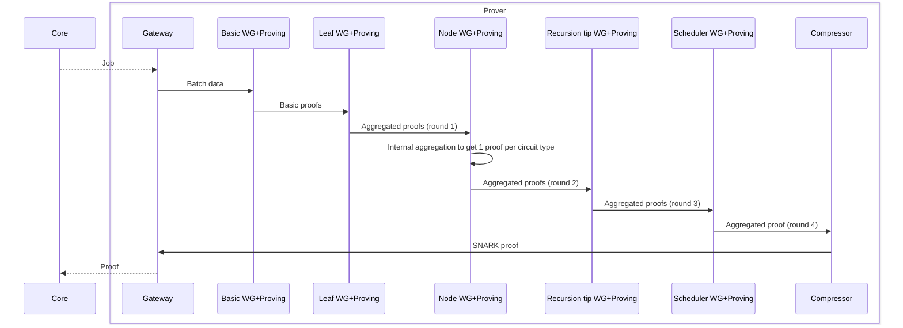

# Via L2 Bitcoin ZK-Rollup: Prover Component Documentation

## 1. Introduction

The Prover is a critical component of the Via L2 Bitcoin ZK-Rollup system, responsible for generating zero-knowledge (ZK) proofs that verify the correctness of state transitions in the L2 system. These proofs are essential for the security and trustlessness of the rollup, as they cryptographically guarantee that all transactions processed on L2 follow the correct execution rules without requiring validators to re-execute all transactions.

The prover workspace (`prover/`) is inherited from zksync-era with minimal modification. The Via-specific parts are on the core side: how the final proof leaves the core system (dispatched to Celestia by `via_da_dispatcher` and referenced on Bitcoin), and how the Verifier Network consumes it (`via_verifier/node/via_zk_verifier` verifying against `via_verifier/lib/via_verification`). Both are covered in sections 6 and 8.

## 2. Role and Responsibilities

The Prover's primary responsibilities include:

- **Proof Generation**: Creating cryptographic ZK proofs that verify the correctness of L1 batch execution
- **Witness Generation**: Computing witness data from transaction execution results
- **Proof Aggregation**: Combining multiple proofs through a recursive proving system
- **Proof Compression**: Converting the final FRI proof into a SNARK ("Bellman" wrapper) suitable for downstream verification

## 3. Architecture Overview

The prover subsystem consists of several interconnected components that work together to generate proofs for L1 batches:

```
┌─────────────────┐     ┌──────────────────┐     ┌─────────────────┐
│  Prover Gateway │     │ Witness Generator│     │ Circuit Prover  │
│                 │◄───►│                  │◄───►│                 │
└────────┬────────┘     └────────┬─────────┘     └────────┬────────┘
         │                       │                        │
         ▼                       ▼                        ▼
┌─────────────────┐     ┌─────────────────┐     ┌─────────────────┐
│ Core System     │     │ Witness Vector  │     │ Proof Compressor│
│ (API)           │     │ Generator       │     │                 │
└─────────────────┘     └─────────────────┘     └─────────────────┘
```

### 3.1 Key Components

The actual crates under `prover/crates/bin/` (inherited from zksync-era) are:

- `prover_fri_gateway/`: interface between core and prover subsystems; fetches batch jobs from core and sends batch proofs back
- `witness_generator/`: constructs witness data for each aggregation round (`src/rounds/` contains `basic_circuits`, `leaf_aggregation`, `node_aggregation`, `recursion_tip`, `scheduler`)
- `witness_vector_generator/`: computes witness vectors (data to be fed into the GPU) from witness generator output
- `prover_fri/`: the circuit prover; can be compiled as CPU or GPU (`gpu` feature) prover
- `circuit_prover/`: newer GPU circuit prover that combines witness vector generation and proving
- `proof_fri_compressor/`: wraps the final FRI proof into a SNARK
- `prover_job_monitor/`: monitors and manages prover jobs (queue reporting, stale job requeueing)
- `prover_cli/`: CLI tooling for inspecting and managing the proving pipeline
- `prover_autoscaler/`: autoscaling logic for prover infrastructure
- `prover_version/`: prints the protocol version the prover binaries are built for
- `vk_setup_data_generator_server_fri/`: verification key and setup data generation

Supporting libraries live under `prover/crates/lib/`: `circuit_prover_service`, `keystore`, `prover_dal`, `prover_fri_types`, `prover_fri_utils`, `prover_job_processor`.

On the core side, `core/lib/prover_interface/` defines the API between the core system and the prover subsystem (section 5.5).

## 4. Proof Generation Process

### 4.1 Proof Generation Flow


```mermaid
sequenceDiagram
  participant C as Core
  box Prover
  participant PG as Gateway
  participant BPG as Basic WG+Proving
  participant LPG as Leaf WG+Proving
  participant NPG as Node WG+Proving
  participant RTPG as Recursion tip WG+Proving
  participant SPG as Scheduler WG+Proving
  participant CP as Compressor
  end
  C-->>PG: Job
  PG->>BPG: Batch data
  BPG->>LPG: Basic proofs
  LPG->>NPG: Aggregated proofs (round 1)
  NPG->>NPG: Internal aggregation to get 1 proof per circuit type
  NPG->>RTPG: Aggregated proofs (round 2)
  RTPG->>SPG: Aggregated proofs (round 3)
  SPG->>CP: Aggregated proof (round 4)
  CP->>PG: SNARK proof
  PG-->>C: Proof
```

The proof generation process consists of the following stages:

1. **Job Acquisition**: The Prover Gateway polls the core API (`POST /proof_generation_data`) to get a new batch to prove.
2. **Basic Witness Generation**: Generates basic circuits for the batch.
3. **Leaf Aggregation**: Aggregates basic proofs into leaf aggregation circuits.
4. **Node Aggregation**: Aggregates leaf proofs into node aggregation circuits.
5. **Recursion Tip**: Aggregates node proofs.
6. **Scheduler**: Produces the final aggregated FRI proof.
7. **Compression**: Compresses the proof into a SNARK.
8. **Proof Submission**: The Prover Gateway submits the final proof back to the core (`POST /submit_proof/:l1_batch_number`).

### 4.2 Aggregation Rounds

The rounds are defined in the core repo as an enum:

```rust
// core/lib/basic_types/src/basic_fri_types.rs
/// Represents the sequential number of the proof aggregation round.
/// Mostly used to be stored in `aggregation_round` column  in `prover_jobs` table
#[derive(Debug, Clone, Copy, PartialEq, Eq, Hash, serde::Serialize, serde::Deserialize)]
pub enum AggregationRound {
    BasicCircuits = 0,
    LeafAggregation = 1,
    NodeAggregation = 2,
    RecursionTip = 3,
    Scheduler = 4,
}
```

The witness generator has one implementation per round under `prover/crates/bin/witness_generator/src/rounds/`: `basic_circuits`, `leaf_aggregation`, `node_aggregation`, `recursion_tip`, `scheduler`.

Each round has its own job table in the prover database. The table names actually used by `prover/crates/lib/prover_dal/` are:

| Round | Job table |
| --- | --- |
| BasicCircuits (0) | `witness_inputs_fri` |
| LeafAggregation (1) | `leaf_aggregation_witness_jobs_fri` |
| NodeAggregation (2) | `node_aggregation_witness_jobs_fri` |
| RecursionTip (3) | `recursion_tip_witness_jobs_fri` |
| Scheduler (4) | `scheduler_witness_jobs_fri` |
| Individual circuit proofs (all rounds) | `prover_jobs_fri` |

Note: `prover/crates/bin/witness_generator/README.md` (inherited from zksync-era) describes the same pipeline with legacy pre-FRI table names (`basic_circuit_witness_jobs`, `leaf_aggregation_jobs`, `node_aggregation_jobs`, `scheduler_witness_jobs`) and only four rounds. The DAL code above is authoritative. The README's circuit count estimates still apply: basic circuits like `Main VM` go "up to 50 \* 48 = 2400 circuits", and leaf aggregation produces "up to 48 circuits of type `LeafAggregation`".

### 4.3 Circuit Proving

For each witness generated, the following steps occur:

1. **Witness Vector Generation**: The witness vector generator builds a witness vector from the witness data.
2. **Circuit Proving**: The circuit prover (CPU or GPU-accelerated) generates a proof using the witness vector. In the GPU setup, the witness vector generator streams the vector to the prover over TCP (`socket_listener` module in `prover_fri`).
3. **Proof Storage**: The generated proof is stored in the object store for the next aggregation round.

### 4.4 Proof Compression

The final step in the proving process is proof compression:

1. The proof compressor takes the final aggregated proof from the scheduler round.
2. It compresses the FRI proof into a SNARK (`FinalProof` from `circuit_sequencer_api`).
3. The compressed proof is then sent back to the core system via the Prover Gateway.

## 5. Implementation Details

All code in this section is inherited zksync-era machinery, shown verbatim from this repo's tree.

### 5.1 Prover Gateway

The gateway runs two periodic tasks: `ProofGenDataFetcher` (module `proof_gen_data_fetcher`) pulls proof generation data from the core API, and `ProofSubmitter` (module `proof_submitter`) submits generated proofs back.

```rust
// prover/crates/bin/prover_fri_gateway/src/main.rs
#[tokio::main]
async fn main() -> anyhow::Result<()> {
    let opt = Cli::parse();

    let general_config = load_general_config(opt.config_path).context("general config")?;
    let database_secrets = load_database_secrets(opt.secrets_path).context("database secrets")?;

    let observability_config = general_config
        .observability
        .context("observability config")?;
    let _observability_guard = observability_config.install()?;

    let config = general_config
        .prover_gateway
        .context("prover gateway config")?;

    let postgres_config = general_config.postgres_config.context("postgres config")?;
    let pool = ConnectionPool::<Prover>::builder(
        database_secrets.prover_url()?,
        postgres_config.max_connections()?,
    )
    .build()
    .await
    .context("failed to build a connection pool")?;
    let object_store_config = ProverObjectStoreConfig(
        general_config
            .prover_config
            .context("prover config")?
            .prover_object_store
            .context("object store")?,
    );
    let store_factory = ObjectStoreFactory::new(object_store_config.0);

    let proof_submitter = ProofSubmitter::new(
        store_factory.create_store().await?,
        config.api_url.clone(),
        pool.clone(),
    );
    let proof_gen_data_fetcher = ProofGenDataFetcher::new(
        store_factory.create_store().await?,
        config.api_url.clone(),
        pool,
    );

    let (stop_sender, stop_receiver) = watch::channel(false);

    let (stop_signal_sender, stop_signal_receiver) = oneshot::channel();
    let mut stop_signal_sender = Some(stop_signal_sender);
    ctrlc::set_handler(move || {
        if let Some(stop_signal_sender) = stop_signal_sender.take() {
            stop_signal_sender.send(()).ok();
        }
    })
    .context("Error setting Ctrl+C handler")?;

    tracing::info!("Starting Fri Prover Gateway");

    let tasks = vec![
        tokio::spawn(
            PrometheusExporterConfig::pull(config.prometheus_listener_port)
                .run(stop_receiver.clone()),
        ),
        tokio::spawn(proof_gen_data_fetcher.run(config.api_poll_duration(), stop_receiver.clone())),
        tokio::spawn(proof_submitter.run(config.api_poll_duration(), stop_receiver)),
    ];

    let mut tasks = ManagedTasks::new(tasks);
    tokio::select! {
        _ = tasks.wait_single() => {},
        _ = stop_signal_receiver => {
            tracing::info!("Stop signal received, shutting down");
        }
    }
    stop_sender.send(true).ok();
    tasks.complete(Duration::from_secs(5)).await;
    Ok(())
}
```

### 5.2 Witness Generator

The witness generator binary can run a single aggregation round (`--round`) or all rounds at once (`--all_rounds`). From its `main`:

```rust
// prover/crates/bin/witness_generator/src/main.rs (excerpt from main)
    let rounds = match (opt.round, opt.all_rounds) {
        (Some(round), false) => vec![round],
        (None, true) => vec![
            AggregationRound::BasicCircuits,
            AggregationRound::LeafAggregation,
            AggregationRound::NodeAggregation,
            AggregationRound::RecursionTip,
            AggregationRound::Scheduler,
        ],
        (Some(_), true) => {
            return Err(anyhow!(
                "Cannot set both the --all_rounds and --round flags. Choose one or the other."
            ));
        }
        (None, false) => {
            return Err(anyhow!(
                "Expected --all_rounds flag with no --round flag present"
            ));
        }
    };
```

For each selected round, a `WitnessGenerator` parameterized by the round type is spawned:

```rust
// prover/crates/bin/witness_generator/src/main.rs (excerpt from main)
        let witness_generator_task = match round {
            AggregationRound::BasicCircuits => {
                let generator = WitnessGenerator::<BasicCircuits>::new(
                    config.clone(),
                    store_factory.create_store().await?,
                    public_blob_store,
                    connection_pool.clone(),
                    protocol_version,
                    keystore.clone(),
                );
                generator.run(stop_receiver.clone(), opt.batch_size)
            }
```

(with identical arms for `LeafAggregation`, `NodeAggregation`, `RecursionTip`, and `Scheduler`). The round types are imported from the library crate:

```rust
// prover/crates/bin/witness_generator/src/main.rs (imports)
use zksync_witness_generator::{
    metrics::SERVER_METRICS,
    rounds::{
        BasicCircuits, LeafAggregation, NodeAggregation, RecursionTip, Scheduler, WitnessGenerator,
    },
};
```

Before starting, the binary verifies that local verification key commitments match the database:

```rust
// prover/crates/bin/witness_generator/src/main.rs
/// Checks if the configuration locally matches the one in the database.
/// This function recalculates the commitment in order to check the exact code that
/// will run, instead of loading `commitments.json` (which also may correct misaligned
/// information).
async fn ensure_protocol_alignment(
    prover_pool: &ConnectionPool<Prover>,
    protocol_version: ProtocolSemanticVersion,
    keystore: &Keystore,
) -> anyhow::Result<()> {
    tracing::info!("Verifying protocol alignment for {:?}", protocol_version);
    let vk_commitments_in_db = match prover_pool
        .connection()
        .await
        .unwrap()
        .fri_protocol_versions_dal()
        .vk_commitments_for(protocol_version)
        .await
    {
        Some(commitments) => commitments,
        None => {
            panic!(
                "No vk commitments available in database for a protocol version {:?}.",
                protocol_version
            );
        }
    };
    let scheduler_vk_hash = vk_commitments_in_db.snark_wrapper_vk_hash;
    keystore
        .verify_scheduler_vk_hash(scheduler_vk_hash)
        .with_context(||
            format!("VK commitments didn't match commitments from DB for protocol version {protocol_version:?}")
        )?;
    Ok(())
}
```

### 5.3 Circuit Prover (`prover_fri`)

The prover is assigned a group of `(circuit_id, aggregation_round)` pairs based on its `specialized_group_id`:

```rust
// prover/crates/bin/prover_fri/src/main.rs (excerpt from main)
    let specialized_group_id = prover_config.specialized_group_id;

    let circuit_ids_for_round_to_be_proven = general_config
        .prover_group_config
        .context("prover group config")?
        .get_circuit_ids_for_group_id(specialized_group_id)
        .unwrap_or_default();
    let circuit_ids_for_round_to_be_proven =
        get_all_circuit_id_round_tuples_for(circuit_ids_for_round_to_be_proven);

    tracing::info!(
        "Starting FRI proof generation for group: {} with circuits: {:?}",
        specialized_group_id,
        circuit_ids_for_round_to_be_proven.clone()
    );
```

The binary has a CPU and a GPU variant of `get_prover_tasks`, selected via the `gpu` cargo feature. The CPU variant:

```rust
// prover/crates/bin/prover_fri/src/main.rs
#[allow(clippy::too_many_arguments)]
#[cfg(not(feature = "gpu"))]
async fn get_prover_tasks(
    prover_config: FriProverConfig,
    _zone: Zone,
    stop_receiver: Receiver<bool>,
    store_factory: ObjectStoreFactory,
    public_blob_store: Option<Arc<dyn ObjectStore>>,
    pool: ConnectionPool<Prover>,
    circuit_ids_for_round_to_be_proven: Vec<CircuitIdRoundTuple>,
    _max_allocation: Option<usize>,
    _init_notifier: Arc<Notify>,
) -> anyhow::Result<Vec<JoinHandle<anyhow::Result<()>>>> {
    use zksync_prover_keystore::keystore::Keystore;

    use crate::prover_job_processor::{load_setup_data_cache, Prover};

    let protocol_version = PROVER_PROTOCOL_SEMANTIC_VERSION;

    tracing::info!(
        "Starting CPU FRI proof generation for with protocol_version: {:?}",
        protocol_version
    );

    let keystore =
        Keystore::locate().with_setup_path(Some(prover_config.setup_data_path.clone().into()));
    let setup_load_mode =
        load_setup_data_cache(&keystore, &prover_config).context("load_setup_data_cache()")?;
    let prover = Prover::new(
        store_factory.create_store().await?,
        public_blob_store,
        prover_config,
        keystore,
        pool,
        setup_load_mode,
        circuit_ids_for_round_to_be_proven,
        protocol_version,
    );
    Ok(vec![tokio::spawn(prover.run(stop_receiver, None))])
}
```

The GPU variant additionally starts a `SocketListener` (`socket_listener::gpu_socket_listener`) that receives witness vectors from witness vector generators over TCP, and an optional availability checker.

### 5.4 Proof Compressor

```rust
// prover/crates/bin/proof_fri_compressor/src/main.rs
#[tokio::main]
async fn main() -> anyhow::Result<()> {
    let opt = Cli::parse();

    let general_config = load_general_config(opt.config_path).context("general config")?;
    let database_secrets = load_database_secrets(opt.secrets_path).context("database secrets")?;

    let observability_config = general_config
        .observability
        .expect("observability config")
        .clone();
    let _observability_guard = observability_config.install()?;

    let config = general_config
        .proof_compressor_config
        .context("FriProofCompressorConfig")?;
    let pool = ConnectionPool::<Prover>::singleton(database_secrets.prover_url()?)
        .build()
        .await
        .context("failed to build a connection pool")?;
    let object_store_config = ProverObjectStoreConfig(
        general_config
            .prover_config
            .clone()
            .expect("ProverConfig")
            .prover_object_store
            .context("ProverObjectStoreConfig")?,
    );
    let blob_store = ObjectStoreFactory::new(object_store_config.0)
        .create_store()
        .await?;

    let protocol_version = PROVER_PROTOCOL_SEMANTIC_VERSION;

    let prover_config = general_config
        .prover_config
        .expect("ProverConfig doesn't exist");
    let keystore =
        Keystore::locate().with_setup_path(Some(prover_config.setup_data_path.clone().into()));
    let proof_compressor = ProofCompressor::new(
        blob_store,
        pool,
        config.compression_mode,
        config.max_attempts,
        protocol_version,
        keystore,
    );

    let (stop_sender, stop_receiver) = watch::channel(false);

    let (stop_signal_sender, stop_signal_receiver) = oneshot::channel();
    let mut stop_signal_sender = Some(stop_signal_sender);
    ctrlc::set_handler(move || {
        if let Some(stop_signal_sender) = stop_signal_sender.take() {
            stop_signal_sender.send(()).ok();
        }
    })
    .expect("Error setting Ctrl+C handler"); // Setting handler should always succeed.

    download_initial_setup_keys_if_not_present(
        &config.universal_setup_path,
        &config.universal_setup_download_url,
    );
    env::set_var("CRS_FILE", config.universal_setup_path.clone());

    tracing::info!("Starting proof compressor");

    let prometheus_config = PrometheusExporterConfig::push(
        config.prometheus_pushgateway_url,
        Duration::from_millis(config.prometheus_push_interval_ms.unwrap_or(100)),
    );
    let tasks = vec![
        tokio::spawn(prometheus_config.run(stop_receiver.clone())),
        tokio::spawn(proof_compressor.run(stop_receiver, opt.number_of_iterations)),
    ];

    let mut tasks = ManagedTasks::new(tasks).allow_tasks_to_finish();
    tokio::select! {
        _ = tasks.wait_single() => {},
        _ = stop_signal_receiver => {
            tracing::info!("Stop signal received, shutting down");
        }
    };
    stop_sender.send_replace(true);
    tasks.complete(Duration::from_secs(5)).await;
    Ok(())
}
```

### 5.5 Prover Interface

The prover interface defines the API between the core system and the prover subsystem:

```rust
// core/lib/prover_interface/src/api.rs
//! Prover and server subsystems communicate via the API.
//! This module defines the types used in the API.

use serde::{Deserialize, Serialize};
use serde_with::{hex::Hex, serde_as};
use zksync_types::{
    protocol_version::{L1VerifierConfig, ProtocolSemanticVersion},
    tee_types::TeeType,
    L1BatchNumber,
};

use crate::{
    inputs::{TeeVerifierInput, WitnessInputData},
    outputs::{L1BatchProofForL1, L1BatchTeeProofForL1},
};

// Structs for holding data returned in HTTP responses

#[derive(Debug, Clone, Serialize, Deserialize)]
pub struct ProofGenerationData {
    pub l1_batch_number: L1BatchNumber,
    pub witness_input_data: WitnessInputData,
    pub protocol_version: ProtocolSemanticVersion,
    pub l1_verifier_config: L1VerifierConfig,
}

#[derive(Debug, Serialize, Deserialize)]
pub enum ProofGenerationDataResponse {
    Success(Option<Box<ProofGenerationData>>),
    Error(String),
}

#[derive(Debug, Serialize, Deserialize)]
pub struct TeeProofGenerationDataResponse(pub Box<TeeVerifierInput>);

#[derive(Debug, Serialize, Deserialize)]
pub enum SubmitProofResponse {
    Success,
    Error(String),
}

#[derive(Debug, Serialize, Deserialize)]
pub enum SubmitTeeProofResponse {
    Success,
}

#[derive(Debug, Serialize, Deserialize)]
pub enum RegisterTeeAttestationResponse {
    Success,
}

// Structs to hold data necessary for making HTTP requests

#[derive(Debug, Serialize, Deserialize)]
pub struct ProofGenerationDataRequest {}

#[derive(Debug, Serialize, Deserialize)]
pub struct TeeProofGenerationDataRequest {
    pub tee_type: TeeType,
}

#[derive(Debug, Serialize, Deserialize)]
pub enum SubmitProofRequest {
    Proof(Box<L1BatchProofForL1>),
    // The proof generation was skipped due to sampling
    SkippedProofGeneration,
}

#[derive(Debug, Serialize, Deserialize)]
pub struct VerifyProofRequest(pub Box<L1BatchProofForL1>);

#[derive(Debug, PartialEq, Serialize, Deserialize)]
pub struct SubmitTeeProofRequest(pub Box<L1BatchTeeProofForL1>);

#[serde_as]
#[derive(Debug, PartialEq, Serialize, Deserialize)]
pub struct RegisterTeeAttestationRequest {
    #[serde_as(as = "Hex")]
    pub attestation: Vec<u8>,
    #[serde_as(as = "Hex")]
    pub pubkey: Vec<u8>,
}
```

The final proof payload is:

```rust
// core/lib/prover_interface/src/outputs.rs
/// A "final" ZK proof that can be sent to the L1 contract.
#[derive(Clone, Serialize, Deserialize)]
pub struct L1BatchProofForL1 {
    pub aggregation_result_coords: [[u8; 32]; 4],
    pub scheduler_proof: FinalProof,
    pub protocol_version: ProtocolSemanticVersion,
}
```

The core side serves these types over HTTP in `core/node/proof_data_handler`:

```rust
// core/node/proof_data_handler/src/lib.rs (excerpt from create_proof_processing_router)
    let get_proof_gen_processor = RequestProcessor::new(
        blob_store.clone(),
        connection_pool.clone(),
        config.clone(),
        commitment_mode,
    );
    let submit_proof_processor = get_proof_gen_processor.clone();
    let mut router = Router::new()
        .route(
            "/proof_generation_data",
            post(
                // we use post method because the returned data is not idempotent,
                // i.e we return different result on each call.
                move |payload: Json<ProofGenerationDataRequest>| async move {
                    get_proof_gen_processor
                        .get_proof_generation_data(payload)
                        .await
                },
            ),
        )
        .route(
            "/submit_proof/:l1_batch_number",
            post(
                move |l1_batch_number: Path<u32>, payload: Json<SubmitProofRequest>| async move {
                    submit_proof_processor
                        .submit_proof(l1_batch_number, payload)
                        .await
                },
            ),
        );
```

## 6. Via-Specific: How the Proof Reaches L1 and the Verifier Network

Everything above is shared zksync-era machinery. What Via does differently is what happens to the proof after it is submitted back to the core system: instead of being sent to an Ethereum contract, it is published to Celestia and referenced on Bitcoin, then verified off-chain by the Verifier Network.

### 6.1 Proof Sending Mode

Whether real proofs are dispatched is controlled by `ProofSendingMode` in the Celestia config:

```rust
// core/lib/config/src/configs/via_celestia.rs
#[derive(Debug, Deserialize, Serialize, Clone, Copy, PartialEq)]
pub enum ProofSendingMode {
    OnlyRealProofs,
    SkipEveryProof,
}

#[derive(Debug, Deserialize, Clone, PartialEq)]
pub struct ViaCelestiaConfig {
    /// DA backend type.
    pub da_backend: DaBackend,

    /// Celestia url.
    pub api_node_url: String,

    /// Celestia blob limit
    pub blob_size_limit: usize,

    /// The mode in which proofs are sent.
    pub proof_sending_mode: ProofSendingMode,

    /// Optional external node URL for fallback when Celestia data is not available
    #[serde(default)]
    pub fallback_external_node_url: Option<String>,

    /// Whether to verify data consistency between Celestia and fallback
    #[serde(default)]
    pub verify_consistency: bool,
}
```

The server wires this flag into the DA dispatcher layer:

```rust
// core/bin/via_server/src/node_builder.rs (excerpt from add_da_dispatcher_layer)
        self.node.add_layer(DataAvailabilityDispatcherLayer::new(
            state_keeper_config,
            da_config,
            via_celestia_config.proof_sending_mode == ProofSendingMode::OnlyRealProofs,
        ));
```

### 6.2 Proof Dispatch to Celestia (`via_da_dispatcher`)

The DA dispatcher runs a `dispatch_proofs` loop alongside pubdata dispatch and inclusion polling:

```rust
// core/node/via_da_dispatcher/src/da_dispatcher.rs
    async fn dispatch_proofs(&self) -> anyhow::Result<()> {
        match self.dispatch_real_proof {
            true => self.dispatch_real_proofs().await?,
            false => self.dispatch_dummy_proofs().await?,
        }
        Ok(())
    }
```

```rust
// core/node/via_da_dispatcher/src/da_dispatcher.rs
    async fn dispatch_real_proofs(&self) -> anyhow::Result<()> {
        let mut conn = self.pool.connection_tagged("da_dispatcher").await?;

        if self.is_rollback_required(&mut conn).await? {
            return Ok(());
        }

        let proofs = conn
            .via_data_availability_dal()
            .get_ready_for_da_dispatch_proofs(self.config.max_rows_to_dispatch() as usize)
            .await?;

        drop(conn);

        for proof in proofs {
            // fetch the proof from object store
            let final_proof = match self.load_real_proof_operation(proof.l1_batch_number).await {
                Some(proof) => proof,
                None => {
                    tracing::error!("Failed to load proof for batch {}", proof.l1_batch_number.0);
                    continue;
                }
            };

            let chunks: Vec<Vec<u8>> = final_proof
                .chunks(BLOB_CHUNK_SIZE)
                .map(|chunk| chunk.to_vec())
                .collect();

            self._dispatch_chunks(proof.l1_batch_number, chunks, true, "real_proof_dispatcher")
                .await?;

            METRICS
                .last_dispatched_proof_batch
                .set(proof.l1_batch_number.0 as usize);
            METRICS.blob_size.observe(final_proof.len());
        }
        Ok(())
    }
```

In `SkipEveryProof` mode, `dispatch_dummy_proofs` publishes a prepared dummy proof blob instead. After the blob is on Celestia, the BTC sender component inscribes a `ProofDAReference` inscription on Bitcoin pointing at the blob (this inscription is what the verifier parses below).

### 6.3 Verification by the Verifier Network (`via_zk_verifier`)

Each verifier node runs `via_zk_verifier` (`via_verifier/node/via_zk_verifier/src/lib.rs`). Its loop takes the next unverified batch from the canonical inscription chain, resolves the `ProofDAReference` and `L1BatchDAReference` inscriptions from Bitcoin, and fetches the proof and pubdata blobs from DA:

```rust
// via_verifier/node/via_zk_verifier/src/lib.rs (excerpt from loop_iteration)
            raw_tx_id.reverse();
            let proof_txid = bytes_to_txid(&raw_tx_id).with_context(|| "Failed to parse tx_id")?;
            tracing::info!("trying to get proof_txid: {}", proof_txid);
            let proof_msgs = self.indexer.parse_transaction(&proof_txid).await?;
            let proof_msg = self.expect_single_msg(&proof_msgs, "ProofDAReference")?;

            let proof_da = match proof_msg {
                FullInscriptionMessage::ProofDAReference(ref a) => a,
                _ => {
                    tracing::error!("Expected ProofDAReference, got something else");
                    return Ok(());
                }
            };

            let (proof_blob, batch_tx_id) = self.process_proof_da_reference(proof_da).await?;
```

It then decodes the proof against the versioned verification logic and verifies it:

```rust
// via_verifier/node/via_zk_verifier/src/lib.rs (excerpt from loop_iteration)
                let mut prover_batch_data =
                    decode_prove_batch_data(protocol_version.minor, &proof_blob.data)
                        .with_context(|| {
                            format!(
                                "Failed to decode prove batch data for l1 batch {l1_batch_number}"
                            )
                        })?;

                // Check if proofs vector is empty
                let should_fetch_proof = match &prover_batch_data {
                    ProveBatchData::V27(data) => data.proofs.is_empty() && data.should_verify,
                    ProveBatchData::V28(data) => data.proofs.is_empty() && data.should_verify,
                };
```

```rust
// via_verifier/node/via_zk_verifier/src/lib.rs (excerpt from loop_iteration)
                is_verified = verify_proof(prover_batch_data).await?;

                tracing::info!(
                    "Proof verification result for l1 batch {}: {}",
                    l1_batch_number,
                    is_verified
                );
            }
            let mut transaction = storage.start_transaction().await?;

            let votable_transaction_id = transaction
                .via_votes_dal()
                .verify_votable_transaction(l1_batch_number, db_raw_tx_id, is_verified)
                .await?;

            transaction
                .via_votes_dal()
                .finalize_transaction_if_needed(
                    votable_transaction_id,
                    BATCH_FINALIZATION_THRESHOLD,
                    self.indexer.get_number_of_verifiers(),
                )
                .await?;
```

The version-aware verification library is small enough to show in full:

```rust
// via_verifier/lib/via_verification/src/lib.rs
use zksync_types::ProtocolVersionId;

use crate::{
    version_27::{types::ProveBatches as ProveBatchesV27, verify_proof as verify_proof_v27},
    version_28::{types::ProveBatches as ProveBatchesV28, verify_proof as verify_proof_v28},
};

pub mod version_27;
pub mod version_28;

#[derive(Clone)]
pub enum ProveBatchData {
    V27(ProveBatchesV27),
    V28(ProveBatchesV28),
}

/// Decodes the proof data into the appropriate version. It's possible that the data serialization format changes even within the same version.
pub fn decode_prove_batch_data(
    protocol_version_id: ProtocolVersionId,
    proof_data: &[u8],
) -> anyhow::Result<ProveBatchData> {
    if protocol_version_id <= ProtocolVersionId::Version27 {
        if let Ok(prove_batch) = bincode::deserialize::<ProveBatchesV27>(proof_data) {
            tracing::info!("Decode proof data with V27");
            return Ok(ProveBatchData::V27(prove_batch));
        }
        tracing::warn!("Failed to decode proof data as V27");
    }

    if let Ok(prove_batch) = bincode::deserialize::<ProveBatchesV28>(proof_data) {
        tracing::info!("Decode proof data with V28");
        return Ok(ProveBatchData::V28(prove_batch));
    }

    // If both fail, return an error
    anyhow::bail!("Failed to decode proof data as either V27 or V28");
}

pub async fn verify_proof(prover_batch_data: ProveBatchData) -> anyhow::Result<bool> {
    match prover_batch_data {
        ProveBatchData::V27(data) => verify_proof_v27(data).await,
        ProveBatchData::V28(data) => verify_proof_v28(data).await,
    }
}
```

## 7. Prover Infrastructure

The statements in this section come from the inherited zksync-era prover book at `prover/docs/src/` (`00_intro.md` and `04_flow.md`) and describe how Matter Labs runs the pipeline in production. They apply to the machinery as inherited, not to a Via-specific deployment.

### 7.1 Distributed Architecture

- **Prover Gateway**: single instance that interfaces with the core system.
- **Witness Generators**: multiple instances that process different jobs in parallel.
- **Witness Vector Generators**: multiple instances that generate witness vectors for different provers.
- **Circuit Provers**: multiple instances that generate proofs in parallel.
- **Proof Compressors**: one or more instances that compress proofs.

### 7.2 Prover Groups

Per `prover/docs/src/04_flow.md`: as of Jul 2024 the pipeline consists of 5 aggregation rounds, split into 35 `(aggregation_round, circuit_id)` pairs, and these 35 pairs are spread across 15 different prover groups according to how busy each group is. Each prover binary is assigned a group via `specialized_group_id` (see section 5.3).

### 7.3 Regional Distribution

Per `prover/docs/src/04_flow.md`: the prover infrastructure is designed to work across multiple clusters in different GCP regions. Communication between components goes through Postgres and GCS, with one exception: the witness vector generator streams data directly to GPU provers via TCP, and it will only look for prover machines registered in the same zone to reduce network transfer costs.

### 7.4 Hardware Requirements

Per `prover/docs/src/00_intro.md`, to run everything on a single machine:

- CPU with 16+ physical cores
- GPU with CUDA support and at least 24 GB of VRAM
- At least 64 GB of RAM
- 200+ GB of disk space (400+ GB recommended for development)

`prover/docs/src/03_launch.md` additionally notes that both the prover and the proof compressor require 24 GB of VRAM and cannot currently use different GPUs.

## 8. Interactions with Other Components

### 8.1 Interaction with Core System

The prover interacts with the core system through the Prover Gateway:

1. **Job Acquisition**: `ProofGenDataFetcher` polls `POST /proof_generation_data` served by `core/node/proof_data_handler` to get new batches to prove. The response is a `ProofGenerationData` (batch number, `WitnessInputData`, protocol version, `L1VerifierConfig`).
2. **Proof Submission**: `ProofSubmitter` posts a `SubmitProofRequest` to `POST /submit_proof/:l1_batch_number`, handled by `RequestProcessor::submit_proof`.

### 8.2 Interaction with the Verifier Network

The prover does not directly interact with the Verifier Network. Instead:

1. The prover generates the proof and submits it to the core system (section 8.1).
2. `via_da_dispatcher` publishes the proof to Celestia (section 6.2), and the BTC sender inscribes a `ProofDAReference` on Bitcoin.
3. Each verifier's `via_zk_verifier` parses the inscription, fetches the proof blob from DA, and verifies it with `via_verification` (section 6.3).
4. The verification result is recorded as a vote (`via_votes_dal().verify_votable_transaction`), and the batch is finalized once the vote threshold among verifiers is reached (`finalize_transaction_if_needed`).

### 8.3 Interaction with the Sequencer

The prover indirectly interacts with the sequencer through the core system:

1. The sequencer processes transactions and seals L1 batches.
2. The core system prepares the proving inputs (witness input data, Merkle paths, metadata) exposed via `proof_data_handler`.
3. The prover generates proofs for the batches.
4. The core system publishes the proofs to Celestia and inscribes references on Bitcoin.

## 9. Protocol Versioning

The prover is protocol version aware (per `prover/docs/src/04_flow.md`, inherited from zksync-era):

- Each binary that participates in proving is designed to only generate proofs for a single protocol version (`PROVER_PROTOCOL_SEMANTIC_VERSION` in `prover/crates/lib/prover_fri_types`).
- When a protocol upgrade occurs, "old" provers continue working on "old" unproven batches, while "new" provers are spawned for batches generated with the new protocol version.
- Once all "old" batches are proven, no "old" provers are spawned anymore.

On the Via verifier side, versioning shows up as the `version_27` / `version_28` modules of `via_verifier/lib/via_verification` and the version dispatch in `decode_prove_batch_data` (section 6.3).

## 10. Conclusion

The prover pipeline itself (gateway, witness generator rounds, witness vector generator, circuit prover, proof compressor) is inherited zksync-era machinery running unchanged in the `prover/` workspace. Via's contribution is the destination of the proof: instead of an Ethereum verifier contract, the final `L1BatchProofForL1` is chunked and published to Celestia by `via_da_dispatcher`, referenced on Bitcoin via a `ProofDAReference` inscription, and verified off-chain by every member of the Verifier Network through `via_zk_verifier` and the versioned `via_verification` library, with the outcome recorded as votes that finalize the batch.
