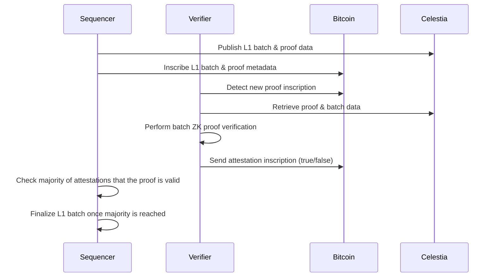
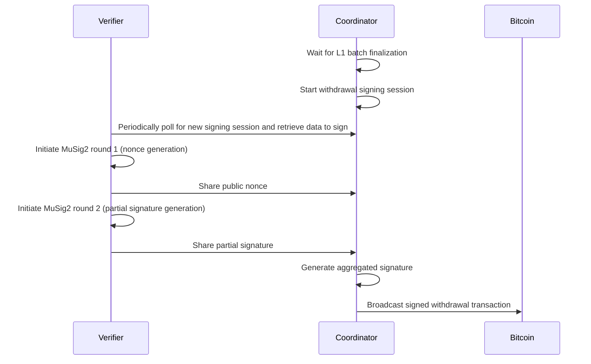

# Via L2 Bitcoin ZK-Rollup: Verifier Component Documentation

## 1. Introduction

The Verifier is a critical component of the Via L2 Bitcoin ZK-Rollup protocol, responsible for validating Zero-Knowledge (ZK) proofs and ensuring the integrity of off-chain execution. This document provides a comprehensive overview of the Verifier's architecture, implementation, and role within the overall system.

## 2. Role and Responsibilities

The Verifier Network consists of multiple Verifier Nodes with the primary goal of verifying ZK (SNARK) proofs for L1 batches generated by the Prover. These nodes attest to the validity of L2 state transitions before batches are finalized and withdrawals are processed.

Key responsibilities include:

- **ZK Proof Verification**: Validating the cryptographic proofs that certify the correctness of L2 state transitions
- **Data Availability Verification**: Ensuring that batch data is available on the Celestia network
- **Bitcoin Merkle Proof Validation**: Verifying the inclusion of transactions in the Bitcoin blockchain
- **Transaction Attestation**: Providing attestations for valid proofs by inscribing them on the Bitcoin network
- **Withdrawal Processing**: Coordinating the signing of withdrawal transactions using MuSig2

## 3. Architecture Overview

The Verifier Network follows a distributed architecture with the following components:

```
┌─────────────────┐     ┌─────────────────┐     ┌─────────────────┐
│   Verifier 1    │     │   Verifier 2    │     │   Verifier n-1  │
└────────┬────────┘     └────────┬────────┘     └────────┬────────┘
         │                       │                       │
         │                       │                       │
         │                       ▼                       │
         │             ┌─────────────────────┐           │
         └────────────►│  Coordinator Node   │◄──────────┘
                       │   (Verifier n)      │
                       └─────────────────────┘
```

One of the Verifier Nodes acts as a Coordinator Node, responsible for managing signing sessions and coordinating the MuSig2 process for transaction signing and broadcasting signed transactions to the Bitcoin network.

### 3.1 Key Components

The Verifier implementation consists of several key components:

1. **Verifier Server (`via_verifier/bin/verifier_server/`)**: The main entry point for the Verifier node
2. **Storage Initialization (`via_verifier/node/via_verifier_storage_init/`)**: Handles the initialization of the verifier storage, including protocol version setup
3. **ZK Verification (`via_verifier/node/via_zk_verifier/`)**: Handles the verification of ZK proofs
4. **Bitcoin Watch (`via_verifier/node/via_btc_watch/`)**: Monitors the Bitcoin blockchain for relevant inscriptions
5. **Data Availability Client (`via_verifier/lib/via_da_client/`)**: Interfaces with the Celestia network to retrieve batch data
6. **Verification Library (`via_verifier/lib/via_verification/`)**: Core cryptographic verification logic
7. **Coordinator (`via_verifier/node/via_verifier_coordinator/`)**: Manages the MuSig2 signing process for withdrawals

## 4. Verification Process

### 4.1 Block Finalization Flow



1. The Sequencer publishes the L1 batch and proof data to the Celestia network
2. The Sequencer inscribes the L1 batch and proof metadata on the Bitcoin network
3. The Verifier detects the new proof inscription on Bitcoin
4. The Verifier retrieves the proof and batch data from Celestia
5. The Verifier performs batch ZK proof verification
6. The Verifier sends an attestation inscription to Bitcoin (true/false)
7. Once a majority of attestations indicate the proof is valid, the L1 batch is considered final

### 4.2 Withdrawal Processing Flow



1. After the L1 batch is final, the Coordinator starts the withdrawal signing session
2. Each Verifier periodically polls the Coordinator API to obtain the new signing session
3. The Coordinator orchestrates the MuSig2 signing process
4. After successful generation of the aggregated signature, the Coordinator broadcasts the withdrawal transaction to the Bitcoin network

## 5. Implementation Details

### 5.1 Verifier Server

The Verifier Server is the main entry point for the Verifier node. It loads configurations from environment variables and builds the node using the `ViaNodeBuilder`.

```rust
// via_verifier/bin/verifier_server/src/main.rs
fn main() -> anyhow::Result<()> {
    // Load configurations
    let configs = /* ... */;
    let secrets = /* ... */;
    
    // Build the node
    let node_builder = node_builder::ViaNodeBuilder::new(configs, secrets)?;
    let node = node_builder.build()?;
    node.run(observability_guard)?;
    
    Ok(())
}
```

The `ViaNodeBuilder` constructs the Verifier node by adding various layers:

```rust
// via_verifier/bin/verifier_server/src/node_builder.rs
pub fn build(mut self) -> anyhow::Result<ZkStackService> {
    self = self
        .add_sigint_handler_layer()?
        .add_healthcheck_layer()?
        .add_circuit_breaker_checker_layer()?
        .add_pools_layer()?
        .add_storage_initialization_layer()?
        .add_btc_sender_layer()?
        .add_verifier_btc_watcher_layer()?
        .add_via_celestia_da_client_layer()?
        .add_zkp_verification_layer()?;

    if self.is_coordinator {
        self = self.add_verifier_coordinator_api_layer()?
    }

    self = self.add_withdrawal_verifier_task_layer()?;

    Ok(self.node.build())
}
```

The `add_storage_initialization_layer` method adds the Verifier Storage Init Layer:

```rust
fn add_storage_initialization_layer(mut self) -> anyhow::Result<Self> {
    let layer = ViaVerifierInitLayer {
        genesis: self.genesis_config.clone(),
    };
    self.node.add_layer(layer);
    Ok(self)
}
```

### 5.2 ZK Proof Verification

The core ZK proof verification is implemented in the `ViaVerifier` class:

```rust
// via_verifier/node/via_zk_verifier/src/lib.rs
async fn verify_proof(
    &self,
    l1_batch_number: i64,
    batch_hash: H256,
    proof_bytes: &[u8],
) -> anyhow::Result<bool> {
    // Deserialize the proof data
    let proof_data: ProveBatches = bincode::deserialize(proof_bytes)?;
    
    // Extract the protocol version
    let protocol_version = proof_data.l1_batches[0]
        .header
        .protocol_version
        .unwrap()
        .to_string();
    
    // Verify the proof
    let (prev_commitment, curr_commitment) = (
        proof_data.prev_l1_batch.metadata.commitment,
        proof_data.l1_batches[0].metadata.commitment,
    );
    let mut proof = proof_data.proofs[0].scheduler_proof.clone();
    
    // Generate inputs for the proof
    proof.inputs = via_verification::public_inputs::generate_inputs(
        &prev_commitment,
        &curr_commitment,
    );
    
    // Verify the proof
    let via_proof = ViaZKProof { proof };
    let vk_inner = via_verification::utils::load_verification_key_without_l1_check(protocol_version).await?;
    let is_valid = via_proof.verify(vk_inner)?;
    
    Ok(is_valid)
}
```

The actual proof verification is performed using the `verify` method of the `ViaZKProof` struct:

```rust
// via_verifier/lib/via_verification/src/proof.rs
fn verify(
    &self,
    vk: VerificationKey<Bn256, ZkSyncSnarkWrapperCircuit>,
) -> Result<bool, VerificationError> {
    // Ensure the proof's 'n' matches the verification key's 'n'
    let mut scheduler_proof = self.proof.clone();
    scheduler_proof.n = vk.n;
    
    // Verify the proof
    verify::<_, _, RollingKeccakTranscript<_>>(&vk, &scheduler_proof, None)
        .map_err(|_| VerificationError::ProofVerificationFailed)
}
```

### 5.3 Bitcoin Watch

The Bitcoin Watch component monitors the Bitcoin blockchain for relevant inscriptions:

```rust
// via_verifier/node/via_btc_watch/src/lib.rs
async fn loop_iteration(
    &mut self,
    storage: &mut Connection<'_, Verifier>,
) -> Result<(), MessageProcessorError> {
    // Get the current Bitcoin block height
    let to_block = self
        .indexer
        .fetch_block_height()
        .await
        .map_err(|e| MessageProcessorError::Internal(anyhow::anyhow!(e.to_string())))?
        .saturating_sub(self.confirmations_for_btc_msg) as u32;
    
    // Process new blocks
    let messages = self
        .indexer
        .process_blocks(self.last_processed_bitcoin_block + 1, to_block)
        .await
        .map_err(|e| MessageProcessorError::Internal(e.into()))?;
    
    // Process messages
    for processor in self.message_processors.iter_mut() {
        processor
            .process_messages(storage, messages.clone(), &mut self.indexer)
            .await
            .map_err(|e| MessageProcessorError::Internal(e.into()))?;
    }
    
    self.last_processed_bitcoin_block = to_block;
    Ok(())
}
```

The Verifier Message Processor handles several types of messages:

1. `ProofDAReference`: References to proof data stored on Celestia
2. `ValidatorAttestation`: Attestations from other verifiers
3. `SystemContractUpgrade`: Protocol upgrade instructions

```rust
// via_verifier/node/via_btc_watch/src/message_processors/verifier.rs
async fn process_messages(
    &mut self,
    storage: &mut Connection<'_, Verifier>,
    msgs: Vec<FullInscriptionMessage>,
    indexer: &mut BitcoinInscriptionIndexer,
) -> Result<(), MessageProcessorError> {
    for msg in msgs {
        match msg {
            ref f @ FullInscriptionMessage::ProofDAReference(ref proof_msg) => {
                // Process proof reference
                // ...
            }
            ref f @ FullInscriptionMessage::ValidatorAttestation(ref attestation_msg) => {
                // Process attestation
                // ...
                
                // Check finalization
                if votes_dal
                    .finalize_transaction_if_needed(
                        votable_transaction_id,
                        self.zk_agreement_threshold,
                        indexer.get_number_of_verifiers(),
                    )
                    .await
                    .map_err(|e| MessageProcessorError::DatabaseError(e.to_string()))?
                {
                    // Transaction finalized
                }
            }
            ref f @ FullInscriptionMessage::SystemContractUpgrade(ref upgrade_msg) => {
                // Process system contract upgrade
                self.process_system_contract_upgrade(storage, upgrade_msg)
                    .await
                    .map_err(|e| MessageProcessorError::Internal(e))?;
            }
            // Other message types...
        }
    }
    Ok(())
}
```

### 5.4 Data Availability Client

The Data Availability Client interfaces with the Celestia network to retrieve batch data:

```rust
// via_verifier/node/via_zk_verifier/src/lib.rs
async fn process_proof_da_reference(
    &mut self,
    proof_msg: &ProofDAReference,
) -> anyhow::Result<(InclusionData, BitcoinTxid)> {
    let blob = self
        .da_client
        .get_inclusion_data(&proof_msg.input.blob_id)
        .await
        .with_context(|| "Failed to fetch the blob")?
        .ok_or_else(|| anyhow::anyhow!("Blob not found"))?;
    let batch_tx_id = proof_msg.input.l1_batch_reveal_txid;
    
    Ok((blob, batch_tx_id))
}

async fn process_batch_da_reference(
    &mut self,
    batch_msg: &L1BatchDAReference,
) -> anyhow::Result<(InclusionData, H256)> {
    let blob = self
        .da_client
        .get_inclusion_data(&batch_msg.input.blob_id)
        .await
        .with_context(|| "Failed to fetch the blob")?
        .ok_or_else(|| anyhow::anyhow!("Blob not found"))?;
    let hash = batch_msg.input.l1_batch_hash;
    
    Ok((blob, hash))
}
```

## 6. Interactions with Other Components

### 6.1 Interaction with Sequencer/Proposer

The Verifier interacts with the Sequencer/Proposer indirectly through:

1. **Bitcoin Inscriptions**: The Sequencer inscribes batch and proof metadata on Bitcoin, which the Verifier detects and processes
2. **Celestia Data**: The Sequencer publishes batch and proof data to Celestia, which the Verifier retrieves and verifies

### 6.2 Interaction with Bitcoin Network

The Verifier interacts with the Bitcoin network through:

1. **Monitoring**: Watching for new inscriptions related to batches and proofs
2. **Attestation**: Inscribing attestations for valid proofs
3. **Withdrawal**: Broadcasting signed withdrawal transactions

### 6.3 Interaction with Celestia (DA Layer)

The Verifier interacts with Celestia through:

1. **Data Retrieval**: Fetching batch and proof data using blob IDs from inscriptions
2. **Inclusion Verification**: Verifying that data is properly included in Celestia

## 7. Storage Initialization

The Verifier includes a dedicated layer for storage initialization, which is responsible for setting up the database before other components start:

### 7.1 Verifier Storage Init Layer

The Verifier Storage Init Layer (`via_verifier_storage_init`) is responsible for initializing the verifier storage, particularly for setting up the protocol version information:

```rust
// via_verifier/node/via_verifier_storage_init/src/lib.rs
pub struct ViaVerifierStorageInitializer {
    genesis: Arc<dyn InitializeStorage>,
}

impl ViaVerifierStorageInitializer {
    pub fn new(genesis_config: GenesisConfig, pool: ConnectionPool<Verifier>) -> Self {
        let genesis = Arc::new(VerifierGenesis {
            genesis_config,
            pool,
        });
        Self { genesis }
    }

    pub async fn run(self, stop_receiver: watch::Receiver<bool>) -> anyhow::Result<()> {
        self.genesis
            .initialize_storage(stop_receiver.clone())
            .await?;
        Ok(())
    }
}
```

The layer operates as both a task and a precondition:
1. **Task**: Initializes the storage with protocol version information from the genesis configuration
2. **Precondition**: Blocks other tasks from starting until the storage is initialized

### 7.2 Genesis Configuration

The storage initialization uses the genesis configuration to set up the initial protocol version:

```rust
// via_verifier/node/via_verifier_storage_init/src/genesis.rs
async fn initialize_storage(
    &self,
    _stop_receiver: watch::Receiver<bool>,
) -> anyhow::Result<()> {
    let mut storage = self.pool.connection_tagged("verifier_genesis").await?;

    if self.is_initialized().await? {
        return Ok(());
    }

    storage
        .via_protocol_versions_dal()
        .save_protocol_version(
            self.genesis_config.protocol_version?,
            self.genesis_config.bootloader_hash?.as_bytes(),
            self.genesis_config.default_aa_hash?.as_bytes(),
            H256::zero().as_bytes(),
            self.genesis_config.recursion_scheduler_level_vk_hash.as_bytes(),
        )
        .await?;

    storage
        .via_protocol_versions_dal()
        .mark_upgrade_as_executed(H256::zero().as_bytes())
        .await?;
    Ok(())
}
```

## 8. Protocol Version Management

The Verifier plays a crucial role in protocol version management and system upgrades:

### 8.1 Protocol Version Tracking

The Verifier maintains a record of protocol versions in the database:

```rust
// via_verifier/node/via_btc_watch/src/message_processors/governance_upgrade.rs
async fn process_system_contract_upgrade(
    &self,
    storage: &mut Connection<'_, Verifier>,
    upgrade_msg: &SystemContractUpgrade,
) -> anyhow::Result<()> {
    let protocol_versions_dal = storage.protocol_versions_dal();
    
    // Check if the protocol version already exists
    let existing_version = protocol_versions_dal
        .get_protocol_version_by_id(upgrade_msg.input.version.clone())
        .await?;
    
    if let Some(existing) = existing_version {
        // Reset executed flag if needed
        if existing.executed {
            protocol_versions_dal
                .save_protocol_version(
                    upgrade_msg.input.version.clone(),
                    upgrade_msg.input.bootloader_code_hash,
                    upgrade_msg.input.default_account_code_hash,
                    upgrade_msg.input.version.clone().pack(),
                    false,
                )
                .await?;
        }
    } else {
        // Save new protocol version
        protocol_versions_dal
            .save_protocol_version(
                upgrade_msg.input.version.clone(),
                upgrade_msg.input.bootloader_code_hash,
                upgrade_msg.input.default_account_code_hash,
                upgrade_msg.input.version.clone().pack(),
                false,
            )
            .await?;
    }
    
    // Save system contracts
    for (address, hash) in &upgrade_msg.input.system_contracts {
        protocol_versions_dal
            .save_protocol_system_contract_hash(
                upgrade_msg.input.version.clone(),
                *address,
                *hash,
            )
            .await?;
    }
    
    Ok(())
}
```

### 8.2 Upgrade Verification

The Verifier verifies system contract upgrades by:

1. Validating the upgrade inscription signature
2. Checking the protocol version semantics
3. Verifying the bootloader and default account code hashes
4. Validating system contract addresses and hashes
5. Storing the upgrade information in the database

### 8.3 Upgrade Application

When processing batches, the Verifier applies protocol upgrades:

```rust
// via_verifier/node/via_zk_verifier/src/lib.rs
async fn verify_batch_with_protocol_version(
    &self,
    storage: &mut Connection<'_, Verifier>,
    l1_batch_number: L1BatchNumber,
) -> anyhow::Result<()> {
    // Get protocol version for the batch
    let protocol_version = storage
        .protocol_versions_dal()
        .get_protocol_version_for_l1_batch(l1_batch_number)
        .await?
        .unwrap_or_else(|| self.current_protocol_version.clone());
    
    // Apply protocol version if needed
    if protocol_version != self.current_protocol_version {
        // Apply upgrade
        // ...
    }
    
    // Verify batch with the appropriate protocol version
    // ...
}
```

## 9. Current Limitations and Future Improvements

As noted in the README, the current Verifier Network has some limitations:

1. **Fixed Coordinator Role**: One of the Verifiers holds the Coordinator role, creating a potential single point of failure
2. **N-of-N Signature Scheme**: If any single Verifier becomes unresponsive, the entire network may face difficulties processing withdrawals
3. **Static Verifier Set**: The current architecture does not support dynamic addition or removal of Verifiers

Future improvements planned:

1. **More Trust-Minimized Approach**: Potentially incorporating solutions like BitVM-based bridges
2. **Open Verifier Network**: Allowing for dynamic participation of Verifiers
3. **Improved Fault Tolerance**: Moving away from the n-of-n signature scheme to a more robust approach

## 10. Conclusion

The Verifier component is a critical part of the Via L2 Bitcoin ZK-Rollup system, ensuring the integrity and security of the L2 state transitions. By verifying ZK proofs, coordinating withdrawals, and managing protocol upgrades, it enables the trustless operation of the rollup on top of Bitcoin. The addition of the Storage Initialization Layer ensures that the verifier starts with the correct protocol version and system contract information, providing a solid foundation for the verification process.