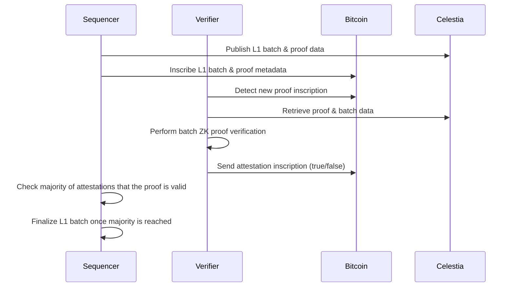
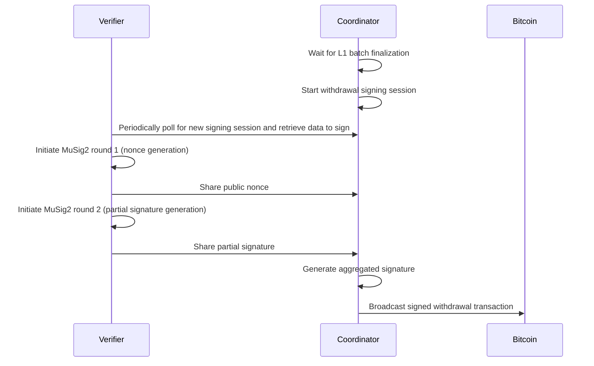

# Via L2 Bitcoin ZK-Rollup: Verifier Component Documentation

## 1. Introduction

The Verifier is a critical component of the Via L2 Bitcoin ZK-Rollup protocol, responsible for validating Zero-Knowledge (ZK) proofs and ensuring the integrity of off-chain execution. This document provides a comprehensive overview of the Verifier's architecture, implementation, and role within the overall system.

## 2. Role and Responsibilities

The Verifier Network consists of multiple Verifier Nodes with the primary goal of verifying ZK (SNARK) proofs for L1 batches generated by the Prover. These nodes attest to the validity of L2 state transitions before batches are finalized and withdrawals are processed.

Key responsibilities include:

- **ZK Proof Verification**: Validating the cryptographic proofs that certify the correctness of L2 state transitions
- **Data Availability Verification**: Ensuring that batch data is available on the Celestia network
- **Bitcoin Merkle Proof Validation**: Verifying the inclusion of transactions in the Bitcoin blockchain
- **Transaction Attestation**: Providing attestations for valid proofs by inscribing them on the Bitcoin network
- **Withdrawal Processing**: Coordinating the signing of withdrawal transactions using MuSig2
- **Synchronization Management**: Ensuring proper synchronization with L1 before processing operations
- **MuSig2 Partial Signature Verification**: Validating partial signatures in multi-signature workflows

## 3. Architecture Overview

The Verifier Network follows a distributed architecture with the following components:

```
┌─────────────────┐     ┌─────────────────┐     ┌─────────────────┐
│   Verifier 1    │     │   Verifier 2    │     │   Verifier n-1  │
└────────┬────────┘     └────────┬────────┘     └────────┬────────┘
         │                       │                       │
         │                       │                       │
         │                       ▼                       │
         │             ┌─────────────────────┐           │
         └────────────►│  Coordinator Node   │◄──────────┘
                       │   (Verifier n)      │
                       └─────────────────────┘
```

One of the Verifier Nodes acts as a Coordinator Node, responsible for managing signing sessions and coordinating the MuSig2 process for transaction signing and broadcasting signed transactions to the Bitcoin network.

### 3.1 Key Components

The Verifier implementation consists of several key components:

1. **Verifier Server (`via_verifier/bin/verifier_server/`)**: The main entry point for the Verifier node
2. **Storage Initialization (`via_verifier/node/via_verifier_storage_init/`)**: Handles the initialization of the verifier storage, including protocol version setup
3. **ZK Verification (`via_verifier/node/via_zk_verifier/`)**: Handles the verification of ZK proofs
4. **Bitcoin Watch (`via_verifier/node/via_btc_watch/`)**: Monitors the Bitcoin blockchain for relevant inscriptions
5. **Data Availability Client (`via_verifier/lib/via_da_client/`)**: Interfaces with the Celestia network to retrieve batch data
6. **Verification Library (`via_verifier/lib/via_verification/`)**: Core cryptographic verification logic
7. **Coordinator (`via_verifier/node/via_verifier_coordinator/`)**: Manages the MuSig2 signing process for withdrawals

## 4. Verification Process

### 4.1 Block Finalization Flow



1. The Sequencer publishes the L1 batch and proof data to the Celestia network
2. The Sequencer inscribes the L1 batch and proof metadata on the Bitcoin network
3. The Verifier detects the new proof inscription on Bitcoin
4. The Verifier retrieves the proof and batch data from Celestia
5. The Verifier performs batch ZK proof verification
6. The Verifier sends an attestation inscription to Bitcoin (true/false)
7. Once a majority of attestations indicate the proof is valid, the L1 batch is considered final

### 4.2 Withdrawal Processing Flow



1. After the L1 batch is final, the Coordinator starts the withdrawal signing session
2. Each Verifier periodically polls the Coordinator API to obtain the new signing session
3. The Coordinator orchestrates the MuSig2 signing process
4. After successful generation of the aggregated signature, the Coordinator broadcasts the withdrawal transaction to the Bitcoin network

#### Sequential gating and idempotency

- Before signing a withdrawal session, the verifier enforces sequential gating by comparing the expected L1 batch number from the active session with the current session’s batch number; it returns early if they don’t match.
- Idempotency check: if the bridge session is already processed (bridge_tx_id present), the verifier skips signing for that batch.
- Reference: [via_verifier/node/via_verifier_coordinator/src/verifier/mod.rs](https://github.com/vianetwork/via-core/blob/main/via_verifier/node/via_verifier_coordinator/src/verifier/mod.rs)

- BridgeWithdrawal OP_RETURN now supports an optional index_withdrawal (i64 LE). When present, it is parsed from OP_RETURN and attached to BridgeWithdrawalInput; when absent it is treated as 0. See [MessageParser.parse_withdrawal()](https://github.com/vianetwork/via-core/blob/main/core/lib/via_btc_client/src/indexer/parser.rs#L800) and [BridgeWithdrawalInput.index_withdrawal](https://github.com/vianetwork/via-core/blob/main/core/lib/via_btc_client/src/types.rs#L57). Canonical OP_RETURN layout is documented in [inscription_interaction.md](inscription_interaction.md).
#### Coordinator API lock scoping

- `RestApi::new_session` now scopes the read lock when reading the current `session_op` to avoid holding the mutex across subsequent logic. See [via_verifier/node/via_verifier_coordinator/src/coordinator/api_impl.rs](https://github.com/vianetwork/via-core/blob/main/via_verifier/node/via_verifier_coordinator/src/coordinator/api_impl.rs#L14).

#### Multiple transactions per batch and session index

- The withdrawal coordinator supports multiple unsigned transactions per batch; `SessionOperation` carries an `index` to select the candidate for signing. See [via_verifier/node/via_verifier_coordinator/src/types.rs](https://github.com/vianetwork/via-core/blob/main/via_verifier/node/via_verifier_coordinator/src/types.rs).
- Idempotency per index: `is_session_in_progress` and `is_bridge_session_already_processed` use `get_vote_transaction_bridge_tx(l1_batch_number, index)` from [`rust ViaVotesDal`](https://github.com/vianetwork/via-core/blob/main/via_verifier/lib/verifier_dal/src/via_votes_dal.rs) to ensure a given candidate isn’t signed twice. Helper entry point: [via_verifier/node/via_verifier_coordinator/src/sessions/session_manager.rs](https://github.com/vianetwork/via-core/blob/main/via_verifier/node/via_verifier_coordinator/src/sessions/session_manager.rs).
- After broadcast, the selected entry is updated via [`rust ViaBridgeDal::update_bridge_tx()`](https://github.com/vianetwork/via-core/blob/main/via_verifier/lib/verifier_dal/src/via_bridge.rs), and the unsigned transaction is recorded in the UTXO manager for accounting.
- The split weight limit is configurable via [`rust ViaVerifierConfig::max_tx_weight()`](https://github.com/vianetwork/via-core/blob/main/core/lib/config/src/configs/via_verifier.rs).

## Canonical chain gating and wallet bootstrap (commits 0087–0090, 0097–0099, 0101–0102)

Verifier BTC watcher and DAL changes enforce stricter ordering and duplicate handling for L1 batches:
- The watcher skips duplicate proof reveal txids using a DB existence check before any insert.
- New gating requires that each new batch number equals the last canonical batch number + 1 and that its prev_l1_batch_hash matches the last canonical chain hash.
- Genesis (batch 1) is allowed once; subsequent duplicates are ignored.
- The DAL exposes helpers:
  - Existence checks for batch number and proof reveal tx id
  - Canonical head retrieval and continuity validation
  - A canonical chain integrity report returning continuity, missing numbers and basic stats for operators
- Finalization remains vote-threshold based; the gating only affects insertion into the votable set.

Storage initialization and system wallets:
- At startup, nodes load SystemWallets either from the DB (via_wallets table) or derive them by scanning bootstrap_txids, then persist them.
- This makes indexer construction deterministic and removes ad‑hoc address plumbing from runtime configs.

System wallet updates:
- Both main-node and verifier watchers include a SystemWalletProcessor that parses wallet update inscriptions (sequencer/governance/bridge), persists the updated SystemWallets, and if wallets changed, re-processes the just-fetched block range so that subsequent parsing uses the new state.
- BTC sender validates that the active inscriber address equals SystemWallets.sequencer before emitting inscriptions; otherwise, it halts with a clear error.

Bridge parameters:
- Bridge address and related thresholds moved to the dedicated bridge configuration. The verifier config additionally supports an optional bridge_address_merkle_root to validate the Taproot tree root of the bridge when applicable.

Operational runbook (insertion path):
- If batch number is not strictly next -> skip
- If prev hash does not match canonical -> skip
- If proof tx id already recorded -> skip
- Otherwise, insert votable transaction and proceed with attestation collection

## 5. Implementation Details

### 5.1 Verifier Server

The Verifier Server is the main entry point for the Verifier node. It loads configurations from environment variables and builds the node using the `ViaNodeBuilder`.

```rust
// via_verifier/bin/verifier_server/src/main.rs
fn main() -> anyhow::Result<()> {
    // Load configurations
    let configs = /* ... */;
    let secrets = /* ... */;
    
    // Build the node
    let node_builder = node_builder::ViaNodeBuilder::new(configs, secrets)?;
    let node = node_builder.build()?;
    node.run(observability_guard)?;
    
    Ok(())
}
```

The `ViaNodeBuilder` constructs the Verifier node by adding various layers:

```rust
// via_verifier/bin/verifier_server/src/node_builder.rs
pub fn build(mut self) -> anyhow::Result<ZkStackService> {
    self = self
        .add_sigint_handler_layer()?
        .add_healthcheck_layer()?
        .add_circuit_breaker_checker_layer()?
        .add_pools_layer()?
        .add_storage_initialization_layer()?
        .add_btc_sender_layer()?
        .add_verifier_btc_watcher_layer()?
        .add_via_celestia_da_client_layer()?
        .add_zkp_verification_layer()?;

    if self.is_coordinator {
        self = self.add_verifier_coordinator_api_layer()?
    }

    self = self.add_withdrawal_verifier_task_layer()?;

    Ok(self.node.build())
}
```

The `add_storage_initialization_layer` method adds the Verifier Storage Init Layer:

```rust
fn add_storage_initialization_layer(mut self) -> anyhow::Result<Self> {
    let layer = ViaVerifierInitLayer {
        genesis: self.genesis_config.clone(),
    };
    self.node.add_layer(layer);
    Ok(self)
}
```

### 5.2 Verifier Configuration

The Verifier now supports enhanced configuration options including wallet address specification:

#### 5.2.1 ViaVerifierConfig Structure

```rust
// Configuration structure with wallet address support
pub struct ViaVerifierConfig {
    pub wallet_address: Option<String>,
    pub sync_timeout: Duration,
    pub verification_timeout: Duration,
    pub bitcoin_client_config: BitcoinClientConfig,
    pub celestia_config: CelestiaConfig,
    // ... other configuration fields
}
```

#### 5.2.2 Environment Variable Configuration

The verifier supports configuration through environment variables:

```bash
# Wallet address for verifier operations
export VIA_VERIFIER_WALLET_ADDRESS="bc1qexample..."

# Synchronization settings
export VIA_VERIFIER_SYNC_TIMEOUT="300s"
export VIA_VERIFIER_VERIFICATION_TIMEOUT="120s"

# Bitcoin client configuration
export VIA_VERIFIER_BITCOIN_RPC_URL="http://localhost:8332"
export VIA_VERIFIER_BITCOIN_RPC_USER="user"
export VIA_VERIFIER_BITCOIN_RPC_PASSWORD="password"
```

#### 5.2.3 Configuration File Example

```toml
# etc/env/configs/via_verifier.toml
[verifier]
wallet_address = "bc1qexample..."
sync_timeout = "300s"
verification_timeout = "120s"

[bitcoin_client]
rpc_url = "http://localhost:8332"
rpc_user = "user"
rpc_password = "password"
confirmations_for_btc_msg = 6

[celestia]
node_url = "http://localhost:26658"
auth_token = "your_auth_token"
namespace_id = "your_namespace"
```

### 5.3 Verifier Synchronization Enhancements

The `ViaWithdrawalVerifier` now includes enhanced synchronization logic to ensure proper L1 synchronization before processing operations:

#### 5.3.1 Synchronization Pause Mechanism

```rust
// Enhanced synchronization with pause mechanism
impl ViaWithdrawalVerifier {
    async fn ensure_l1_sync(&mut self) -> Result<(), SyncError> {
        if !self.is_fully_synced().await? {
            tracing::warn!("Verifier not fully synced with L1, pausing operations");
            self.pause_operations().await?;
            
            // Wait for synchronization
            while !self.is_fully_synced().await? {
                tokio::time::sleep(Duration::from_secs(10)).await;
            }
            
            self.resume_operations().await?;
            tracing::info!("Verifier synchronized with L1, resuming operations");
        }
        Ok(())
    }
    
    async fn is_fully_synced(&self) -> Result<bool, SyncError> {
        let local_height = self.get_local_l1_height().await?;
        let network_height = self.get_network_l1_height().await?;
        
        // Consider synced if within acceptable lag
        Ok(network_height.saturating_sub(local_height) <= self.max_sync_lag)
    }
}
```

#### 5.3.2 State Management During Sync

```rust
// State management during synchronization operations
pub enum VerifierState {
    Syncing,
    Synced,
    Paused,
    Error(String),
}

impl ViaWithdrawalVerifier {
    async fn update_state(&mut self, new_state: VerifierState) {
        self.state = new_state;
        self.emit_state_change_metric().await;
    }
    
    async fn process_withdrawal_request(&mut self, request: WithdrawalRequest) -> Result<(), ProcessingError> {
        // Ensure synchronization before processing
        self.ensure_l1_sync().await?;
        
        match self.state {
            VerifierState::Synced => {
                self.process_withdrawal_internal(request).await
            }
            VerifierState::Syncing | VerifierState::Paused => {
                Err(ProcessingError::NotSynced)
            }
            VerifierState::Error(ref msg) => {
                Err(ProcessingError::VerifierError(msg.clone()))
            }
        }
    }
}
```

### 5.4 ZK Proof Verification

The core ZK proof verification is implemented in the `ViaVerifier` class:

```rust
// via_verifier/node/via_zk_verifier/src/lib.rs
async fn verify_proof(
    &self,
    l1_batch_number: i64,
    batch_hash: H256,
    proof_bytes: &[u8],
) -> anyhow::Result<bool> {
    // Deserialize the proof data
    let proof_data: ProveBatches = bincode::deserialize(proof_bytes)?;
    
    // Extract the protocol version
    let protocol_version = proof_data.l1_batches[0]
        .header
        .protocol_version
        .unwrap()
        .to_string();
    
    // Verify the proof
    let (prev_commitment, curr_commitment) = (
        proof_data.prev_l1_batch.metadata.commitment,
        proof_data.l1_batches[0].metadata.commitment,
    );
    let mut proof = proof_data.proofs[0].scheduler_proof.clone();
    
    // Generate inputs for the proof
    proof.inputs = via_verification::public_inputs::generate_inputs(
        &prev_commitment,
        &curr_commitment,
    );
    
    // Verify the proof
    let via_proof = ViaZKProof { proof };
    let is_valid = via_proof.verify(vk_inner)?;
    
    Ok(is_valid)
}
```

The actual proof verification is performed using the `verify` method of the `ViaZKProof` struct:

```rust
// via_verifier/lib/via_verification/src/proof.rs
fn verify(
    &self,
    vk: VerificationKey<Bn256, ZkSyncSnarkWrapperCircuit>,
) -> Result<bool, VerificationError> {
    // Ensure the proof's 'n' matches the verification key's 'n'
    let mut scheduler_proof = self.proof.clone();
    scheduler_proof.n = vk.n;
    
    // Verify the proof
    verify::<_, _, RollingKeccakTranscript<_>>(&vk, &scheduler_proof, None)
        .map_err(|_| VerificationError::ProofVerificationFailed)
}
```

### 5.5 Bitcoin Watch

The Bitcoin Watch component monitors the Bitcoin blockchain for relevant inscriptions:

```rust
// via_verifier/node/via_btc_watch/src/lib.rs
async fn loop_iteration(
    &mut self,
    storage: &mut Connection<'_, Verifier>,
) -> Result<(), MessageProcessorError> {
    // Get the current Bitcoin block height
    let to_block = self
        .indexer
        .fetch_block_height()
        .await
        .map_err(|e| MessageProcessorError::Internal(anyhow::anyhow!(e.to_string())))?
        .saturating_sub(self.confirmations_for_btc_msg) as u32;
    
    // Process new blocks
    let messages = self
        .indexer
        .process_blocks(self.last_processed_bitcoin_block + 1, to_block)
        .await
        .map_err(|e| MessageProcessorError::Internal(e.into()))?;
    
    // Process messages
    for processor in self.message_processors.iter_mut() {
        processor
            .process_messages(storage, messages.clone(), &mut self.indexer)
            .await
            .map_err(|e| MessageProcessorError::Internal(e.into()))?;
    }
    
    self.last_processed_bitcoin_block = to_block;
    Ok(())
}
```

The Verifier Message Processor handles several types of messages:

1. `ProofDAReference`: References to proof data stored on Celestia
2. `ValidatorAttestation`: Attestations from other verifiers
3. `SystemContractUpgrade`: Protocol upgrade instructions

```rust
// via_verifier/node/via_btc_watch/src/message_processors/verifier.rs
async fn process_messages(
    &mut self,
    storage: &mut Connection<'_, Verifier>,
    msgs: Vec<FullInscriptionMessage>,
    indexer: &mut BitcoinInscriptionIndexer,
) -> Result<(), MessageProcessorError> {
    for msg in msgs {
        match msg {
            ref f @ FullInscriptionMessage::ProofDAReference(ref proof_msg) => {
                // Process proof reference
                // ...
            }
            ref f @ FullInscriptionMessage::ValidatorAttestation(ref attestation_msg) => {
                // Process attestation
                // ...
                
                // Check finalization
                if votes_dal
                    .finalize_transaction_if_needed(
                        votable_transaction_id,
                        self.zk_agreement_threshold,
                        indexer.get_number_of_verifiers(),
                    )
                    .await
                    .map_err(|e| MessageProcessorError::DatabaseError(e.to_string()))?
                {
                    // Transaction finalized
                }
            }
            ref f @ FullInscriptionMessage::SystemContractUpgrade(ref upgrade_msg) => {
                // Process system contract upgrade
                self.process_system_contract_upgrade(storage, upgrade_msg)
                    .await
                    .map_err(|e| MessageProcessorError::Internal(e))?;
            }
            // Other message types...
        }
    }
    Ok(())
}
```

### 5.6 Data Availability Client

The Data Availability Client interfaces with the Celestia network to retrieve batch data:

```rust
// via_verifier/node/via_zk_verifier/src/lib.rs
async fn process_proof_da_reference(
    &mut self,
    proof_msg: &ProofDAReference,
) -> anyhow::Result<(InclusionData, BitcoinTxid)> {
    let blob = self
        .da_client
        .get_inclusion_data(&proof_msg.input.blob_id)
        .await
        .with_context(|| "Failed to fetch the blob")?
        .ok_or_else(|| anyhow::anyhow!("Blob not found"))?;
    let batch_tx_id = proof_msg.input.l1_batch_reveal_txid;
    
    Ok((blob, batch_tx_id))
}

async fn process_batch_da_reference(
    &mut self,
    batch_msg: &L1BatchDAReference,
) -> anyhow::Result<(InclusionData, H256)> {
    let blob = self
        .da_client
        .get_inclusion_data(&batch_msg.input.blob_id)
        .await
        .with_context(|| "Failed to fetch the blob")?
        .ok_or_else(|| anyhow::anyhow!("Blob not found"))?;
    let hash = batch_msg.input.l1_batch_hash;
    
    Ok((blob, hash))
}
```

### 5.7 Governance upgrade processing (commits 0076–0077)

- The Verifier’s BTC Watch includes a dedicated GovernanceUpgradesEventProcessor that:
  - Receives a BitcoinClient to fetch the referenced proposal transaction by txid from the OP_RETURN execution message.
  - Uses MessageParser to parse the proposal transaction into a SystemContractUpgradeProposal (witness-based) message.
  - Builds the L2 ProtocolUpgradeTx via ViaProtocolUpgrade::create_protocol_upgrade_tx() and persists the new protocol version using protocol_versions_dal.save_protocol_version_with_tx(...).
- Two-phase flow:
  - Proposal inscription (witness) defines the new protocol version and system contracts.
  - Governance execution (OP_RETURN) references the proposal txid and authorizes it via the governance UTXO set.
- Implementation references:
  - Indexer extraction and validators: [core/lib/via_btc_client/src/indexer/mod.rs](core/lib/via_btc_client/src/indexer/mod.rs), [core/lib/via_btc_client/src/indexer/parser.rs](core/lib/via_btc_client/src/indexer/parser.rs)
  - Upgrade construction: [core/lib/types/src/via_protocol_upgrade.rs](core/lib/types/src/via_protocol_upgrade.rs)
  - Watch wiring and processor: [via_verifier/node/via_btc_watch/src/lib.rs](via_verifier/node/via_btc_watch/src/lib.rs), [via_verifier/node/via_btc_watch/src/message_processors/governance_upgrade.rs](via_verifier/node/via_btc_watch/src/message_processors/governance_upgrade.rs)

### 5.7 MuSig2 Partial Signature Verification

The verifier now includes enhanced MuSig2 partial signature verification capabilities:

#### 5.7.1 Partial Signature Verification Function

```rust
// New utility function for MuSig2 partial signature verification
pub fn verify_partial_signature(
    partial_sig: &PartialSignature,
    public_nonce: &PublicNonce,
    public_key: &PublicKey,
    message: &[u8],
    agg_nonce: &AggregateNonce,
) -> Result<bool, VerificationError> {
    // Validate partial signature components
    if !partial_sig.is_valid() {
        return Err(VerificationError::InvalidPartialSignature);
    }
    
    // Verify the partial signature against the public key and nonce
    let verification_result = musig2::verify_partial_signature(
        partial_sig,
        public_nonce,
        public_key,
        message,
        agg_nonce,
    )?;
    
    Ok(verification_result)
}
```

#### 5.7.2 Enhanced Cryptographic Validation

```rust
// Enhanced signature verification process
impl MuSig2Verifier {
    pub async fn verify_signing_session(&self, session: &SigningSession) -> Result<bool, VerificationError> {
        // Verify all partial signatures in the session
        for (verifier_id, partial_sig) in &session.partial_signatures {
            let public_key = self.get_verifier_public_key(verifier_id)?;
            let public_nonce = session.public_nonces.get(verifier_id)
                .ok_or(VerificationError::MissingPublicNonce)?;
            
            let is_valid = verify_partial_signature(
                partial_sig,
                public_nonce,
                &public_key,
                &session.message,
                &session.aggregate_nonce,
            )?;
            
            if !is_valid {
                tracing::warn!("Invalid partial signature from verifier {}", verifier_id);
                return Ok(false);
            }
        }
        
        Ok(true)
    }
}
```

### 5.8 Bitcoin Client Resource Layer Integration

The verifier now supports multiple Bitcoin client instances for different operational roles:

#### 5.8.1 Multi-Client Architecture

```rust
// Support for multiple Bitcoin client instances
pub struct BitcoinClientManager {
    sender_client: Arc<BitcoinClient>,
    verifier_client: Arc<BitcoinClient>,
    bridge_client: Arc<BitcoinClient>,
}

impl BitcoinClientManager {
    pub fn new(config: &BitcoinClientConfig) -> Result<Self, ClientError> {
        Ok(Self {
            sender_client: Arc::new(BitcoinClient::new(&config.sender)?),
            verifier_client: Arc::new(BitcoinClient::new(&config.verifier)?),
            bridge_client: Arc::new(BitcoinClient::new(&config.bridge)?),
        })
    }
    
    pub fn get_client_for_role(&self, role: ClientRole) -> Arc<BitcoinClient> {
        match role {
            ClientRole::Sender => self.sender_client.clone(),
            ClientRole::Verifier => self.verifier_client.clone(),
            ClientRole::Bridge => self.bridge_client.clone(),
        }
    }
}
```

#### 5.8.2 Enhanced Resource Management

```rust
// Enhanced resource management for verifier operations
impl VerifierResourceManager {
    pub async fn allocate_resources(&mut self, operation: VerifierOperation) -> Result<ResourceAllocation, ResourceError> {
        match operation {
            VerifierOperation::ProofVerification => {
                self.allocate_verification_resources().await
            }
            VerifierOperation::WithdrawalSigning => {
                self.allocate_signing_resources().await
            }
            VerifierOperation::BitcoinMonitoring => {
                self.allocate_monitoring_resources().await
            }
        }
    }
    
    async fn allocate_verification_resources(&mut self) -> Result<ResourceAllocation, ResourceError> {
        // Allocate dedicated resources for proof verification
        let cpu_allocation = self.cpu_pool.allocate(CpuRequirement::High).await?;
        let memory_allocation = self.memory_pool.allocate(MemoryRequirement::Large).await?;
        
        Ok(ResourceAllocation {
            cpu: cpu_allocation,
            memory: memory_allocation,
            duration: Duration::from_secs(300), // 5 minutes max
        })
    }
}
```

## 6. Enhanced Metrics and Monitoring

The verifier now includes comprehensive metrics and monitoring capabilities:

### 6.1 Verifier Metrics

#### 6.1.1 Error Metrics

```rust
// New metrics for verifier errors and operations
pub struct VerifierMetrics {
    pub verification_errors: Counter,
    pub sync_errors: Counter,
    pub signature_verification_errors: Counter,
    pub bitcoin_client_errors: Counter,
    pub celestia_client_errors: Counter,
}

impl VerifierMetrics {
    pub fn new() -> Self {
        Self {
            verification_errors: Counter::new("verifier_verification_errors_total", "Total verification errors"),
            sync_errors: Counter::new("verifier_sync_errors_total", "Total synchronization errors"),
            signature_verification_errors: Counter::new("verifier_signature_errors_total", "Total signature verification errors"),
            bitcoin_client_errors: Counter::new("verifier_bitcoin_client_errors_total", "Total Bitcoin client errors"),
            celestia_client_errors: Counter::new("verifier_celestia_client_errors_total", "Total Celestia client errors"),
        }
    }
}
```

#### 6.1.2 Performance Metrics

```rust
// Performance and operational metrics
pub struct VerifierPerformanceMetrics {
    pub proof_verification_duration: Histogram,
    pub sync_duration: Histogram,
    pub signature_verification_duration: Histogram,
    pub active_verifiers: Gauge,
    pub pending_verifications: Gauge,
}

impl VerifierPerformanceMetrics {
    pub fn record_verification_time(&self, duration: Duration) {
        self.proof_verification_duration.observe(duration.as_secs_f64());
    }
    
    pub fn record_sync_time(&self, duration: Duration) {
        self.sync_duration.observe(duration.as_secs_f64());
    }
    
    pub fn update_active_verifiers(&self, count: i64) {
        self.active_verifiers.set(count as f64);
    }
}
```

### 6.2 Enhanced Observability

#### 6.2.1 Structured Logging

```rust
// Enhanced logging for verifier operations
impl ViaVerifier {
    async fn verify_proof_with_logging(&self, proof_data: &ProofData) -> Result<bool, VerificationError> {
        let start_time = Instant::now();
        
        tracing::info!(
            batch_number = proof_data.l1_batch_number,
            proof_size = proof_data.proof_bytes.len(),
            "Starting proof verification"
        );
        
        let result = self.verify_proof_internal(proof_data).await;
        let duration = start_time.elapsed();
        
        match &result {
            Ok(is_valid) => {
                tracing::info!(
                    batch_number = proof_data.l1_batch_number,
                    is_valid = *is_valid,
                    duration_ms = duration.as_millis(),
                    "Proof verification completed"
                );
                self.metrics.record_verification_time(duration);
            }
            Err(error) => {
                tracing::error!(
                    batch_number = proof_data.l1_batch_number,
                    error = %error,
                    duration_ms = duration.as_millis(),
                    "Proof verification failed"
                );
                self.metrics.verification_errors.inc();
            }
        }
        
        result
    }
}
```

#### 6.2.2 Health Check Integration

```rust
// Health check integration for verifier components
impl HealthChecker for ViaVerifier {
    async fn check_health(&self) -> HealthStatus {
        let mut checks = Vec::new();
        
        // Check L1 synchronization
        checks.push(self.check_l1_sync().await);
        
        // Check Bitcoin client connectivity
        checks.push(self.check_bitcoin_client().await);
        
        // Check Celestia client connectivity
        checks.push(self.check_celestia_client().await);
        
        // Check resource availability
        checks.push(self.check_resources().await);
        
        if checks.iter().all(|check| check.is_healthy()) {
            HealthStatus::Healthy
        } else {
            HealthStatus::Unhealthy(checks.into_iter().filter(|c| !c.is_healthy()).collect())
        }
    }
}
```

## 7. ZK Proof Verification Examples

### 7.1 ZK Proof Verification from Data Availability

The verifier now includes comprehensive examples for ZK proof verification workflows:

#### 7.1.1 Complete Verification Workflow

```rust
// Example: Complete ZK proof verification from Data Availability
pub async fn verify_proof_from_da_example() -> Result<(), VerificationError> {
    // Initialize verifier components
    let da_client = CelestiaClient::new(&celestia_config).await?;
    let verifier = ViaZKVerifier::new(&verifier_config).await?;
    
    // Step 1: Retrieve proof data from Celestia
    let blob_id = "0x1234567890abcdef...";
    let inclusion_data = da_client.get_inclusion_data(blob_id).await?
        .ok_or(VerificationError::BlobNotFound)?;
    
    // Step 2: Deserialize proof data
    let proof_data: ProveBatches = bincode::deserialize(&inclusion_data.data)?;
    
    // Step 3: Validate proof structure
    if proof_data.l1_batches.is_empty() || proof_data.proofs.is_empty() {
        return Err(VerificationError::InvalidProofStructure);
    }
    
    // Step 4: Extract protocol version
    let protocol_version = proof_data.l1_batches[0]
        .header
        .protocol_version
        .ok_or(VerificationError::MissingProtocolVersion)?;
    
    // Step 5: Load verification key
    let vk = load_verification_key_for_protocol(protocol_version).await?;
    
    // Step 6: Generate public inputs
    let prev_commitment = proof_data.prev_l1_batch.metadata.commitment;
    let curr_commitment = proof_data.l1_batches[0].metadata.commitment;
    let public_inputs = generate_public_inputs(&prev_commitment, &curr_commitment);
    
    // Step 7: Verify the proof
    let mut proof = proof_data.proofs[0].scheduler_proof.clone();
    proof.inputs = public_inputs;
    
    let via_proof = ViaZKProof { proof };
    let is_valid = via_proof.verify(vk)?;
    
    // Step 8: Record verification result
    if is_valid {
        tracing::info!("Proof verification successful");
    } else {
        tracing::warn!("Proof verification failed");
    }
    
    Ok(())
}
```

#### 7.1.2 Batch Verification Example

```rust
// Example: Batch verification with error handling
pub async fn verify_batch_example(
    verifier: &ViaZKVerifier,
    l1_batch_number: L1BatchNumber,
) -> Result<VerificationResult, VerificationError> {
    let start_time = Instant::now();
    
    // Retrieve batch data
    let batch_data = verifier.get_batch_data(l1_batch_number).await?;
    
    // Verify batch integrity
    verifier.verify_batch_integrity(&batch_data).await?;
    
    // Verify associated proof
    let proof_result = verifier.verify_batch_proof(&batch_data).await?;
    
    // Verify state transition
    let state_result = verifier.verify_state_transition(&batch_data).await?;
    
    let verification_time = start_time.elapsed();
    
    Ok(VerificationResult
{
        l1_batch_number,
        proof_valid: proof_result,
        state_valid: state_result,
        verification_time,
        timestamp: Utc::now(),
    })
}
```

### 7.2 Integration with Verification Workflows

#### 7.2.1 Automated Verification Pipeline

```rust
// Automated verification pipeline integration
pub struct VerificationPipeline {
    verifier: ViaZKVerifier,
    da_client: CelestiaClient,
    bitcoin_watcher: BitcoinWatcher,
}

impl VerificationPipeline {
    pub async fn run_verification_cycle(&mut self) -> Result<(), PipelineError> {
        // Step 1: Monitor for new proof inscriptions
        let new_inscriptions = self.bitcoin_watcher.get_new_proof_inscriptions().await?;
        
        for inscription in new_inscriptions {
            // Step 2: Process each proof inscription
            match self.process_proof_inscription(inscription).await {
                Ok(result) => {
                    tracing::info!("Verification completed: {:?}", result);
                    self.submit_attestation(result).await?;
                }
                Err(error) => {
                    tracing::error!("Verification failed: {:?}", error);
                    self.handle_verification_error(error).await?;
                }
            }
        }
        
        Ok(())
    }
    
    async fn process_proof_inscription(&mut self, inscription: ProofInscription) -> Result<VerificationResult, VerificationError> {
        // Retrieve proof data from DA layer
        let proof_data = self.da_client.get_inclusion_data(&inscription.blob_id).await?
            .ok_or(VerificationError::ProofDataNotFound)?;
        
        // Verify the proof
        self.verifier.verify_proof(&proof_data).await
    }
}
```

## 8. Interactions with Other Components

### 8.1 Interaction with Sequencer/Proposer

The Verifier interacts with the Sequencer/Proposer indirectly through:

1. **Bitcoin Inscriptions**: The Sequencer inscribes batch and proof metadata on Bitcoin, which the Verifier detects and processes
2. **Celestia Data**: The Sequencer publishes batch and proof data to Celestia, which the Verifier retrieves and verifies

### 8.2 Interaction with Bitcoin Network

The Verifier interacts with the Bitcoin network through:

1. **Monitoring**: Watching for new inscriptions related to batches and proofs
2. **Attestation**: Inscribing attestations for valid proofs
3. **Withdrawal**: Broadcasting signed withdrawal transactions

### 8.3 Interaction with Celestia (DA Layer)

The Verifier interacts with Celestia through:

1. **Data Retrieval**: Fetching batch and proof data using blob IDs from inscriptions
2. **Inclusion Verification**: Verifying that data is properly included in Celestia

## 9. Storage Initialization

The Verifier includes a dedicated layer for storage initialization, which is responsible for setting up the database before other components start:

### 9.1 Verifier Storage Init Layer

The Verifier Storage Init Layer (`via_verifier_storage_init`) is responsible for initializing the verifier storage, particularly for setting up the protocol version information:

```rust
// via_verifier/node/via_verifier_storage_init/src/lib.rs
pub struct ViaVerifierStorageInitializer {
    genesis: Arc<dyn InitializeStorage>,
}

impl ViaVerifierStorageInitializer {
    pub fn new(genesis_config: GenesisConfig, pool: ConnectionPool<Verifier>) -> Self {
        let genesis = Arc::new(VerifierGenesis {
            genesis_config,
            pool,
        });
        Self { genesis }
    }

    pub async fn run(self, stop_receiver: watch::Receiver<bool>) -> anyhow::Result<()> {
        self.genesis
            .initialize_storage(stop_receiver.clone())
            .await?;
        Ok(())
    }
}
```

The layer operates as both a task and a precondition:
1. **Task**: Initializes the storage with protocol version information from the genesis configuration
2. **Precondition**: Blocks other tasks from starting until the storage is initialized

### 9.2 Genesis Configuration

The storage initialization uses the genesis configuration to set up the initial protocol version:

```rust
// via_verifier/node/via_verifier_storage_init/src/genesis.rs
async fn initialize_storage(
    &self,
    _stop_receiver: watch::Receiver<bool>,
) -> anyhow::Result<()> {
    let mut storage = self.pool.connection_tagged("verifier_genesis").await?;

    if self.is_initialized().await? {
        return Ok(());
    }

    storage
        .via_protocol_versions_dal()
        .save_protocol_version(
            self.genesis_config.protocol_version?,
            self.genesis_config.bootloader_hash?.as_bytes(),
            self.genesis_config.default_aa_hash?.as_bytes(),
            H256::zero().as_bytes(),
            self.genesis_config.recursion_scheduler_level_vk_hash.as_bytes(),
        )
        .await?;

    storage
        .via_protocol_versions_dal()
        .mark_upgrade_as_executed(H256::zero().as_bytes())
        .await?;
    Ok(())
}
```

## 10. Protocol Version Management

The Verifier plays a crucial role in protocol version management and system upgrades:

### 10.1 Protocol Version Tracking

The Verifier maintains a record of protocol versions in the database:

```rust
// via_verifier/node/via_btc_watch/src/message_processors/governance_upgrade.rs
async fn process_system_contract_upgrade(
    &self,
    storage: &mut Connection<'_, Verifier>,
    upgrade_msg: &SystemContractUpgrade,
) -> anyhow::Result<()> {
    let protocol_versions_dal = storage.protocol_versions_dal();
    
    // Check if the protocol version already exists
    let existing_version = protocol_versions_dal
        .get_protocol_version_by_id(upgrade_msg.input.version.clone())
        .await?;
    
    if let Some(existing) = existing_version {
        // Reset executed flag if needed
        if existing.executed {
            protocol_versions_dal
                .save_protocol_version(
                    upgrade_msg.input.version.clone(),
                    upgrade_msg.input.bootloader_code_hash,
                    upgrade_msg.input.default_account_code_hash,
                    upgrade_msg.input.version.clone().pack(),
                    false,
                )
                .await?;
        }
    } else {
        // Save new protocol version
        protocol_versions_dal
            .save_protocol_version(
                upgrade_msg.input.version.clone(),
                upgrade_msg.input.bootloader_code_hash,
                upgrade_msg.input.default_account_code_hash,
                upgrade_msg.input.version.clone().pack(),
                false,
            )
            .await?;
    }
    
    // Save system contracts
    for (address, hash) in &upgrade_msg.input.system_contracts {
        protocol_versions_dal
            .save_protocol_system_contract_hash(
                upgrade_msg.input.version.clone(),
                *address,
                *hash,
            )
            .await?;
    }
    
    Ok(())
}
```

### 10.2 Upgrade Verification

The Verifier verifies system contract upgrades by:

1. Validating the upgrade inscription signature
2. Checking the protocol version semantics
3. Verifying the bootloader and default account code hashes
4. Validating system contract addresses and hashes
5. Storing the upgrade information in the database

### 10.3 Upgrade Application

When processing batches, the Verifier applies protocol upgrades:

```rust
// via_verifier/node/via_zk_verifier/src/lib.rs
async fn verify_batch_with_protocol_version(
    &self,
    storage: &mut Connection<'_, Verifier>,
    l1_batch_number: L1BatchNumber,
) -> anyhow::Result<()> {
    // Get protocol version for the batch
    let protocol_version = storage
        .protocol_versions_dal()
        .get_protocol_version_for_l1_batch(l1_batch_number)
        .await?
        .unwrap_or_else(|| self.current_protocol_version.clone());
    
    // Apply protocol version if needed
    if protocol_version != self.current_protocol_version {
        // Apply upgrade
        // ...
    }
    
    // Verify batch with the appropriate protocol version
    // ...
}
```

## 11. Best Practices and Operational Guidelines

### 11.1 Verifier Deployment Best Practices

#### 11.1.1 Configuration Management

```bash
# Recommended environment setup
export VIA_VERIFIER_WALLET_ADDRESS="bc1qverifier_wallet_address"
export VIA_VERIFIER_SYNC_TIMEOUT="300s"
export VIA_VERIFIER_VERIFICATION_TIMEOUT="120s"
export VIA_VERIFIER_MAX_SYNC_LAG="10"

# Bitcoin client configuration
export VIA_VERIFIER_BITCOIN_RPC_URL="http://bitcoin-node:8332"
export VIA_VERIFIER_BITCOIN_CONFIRMATIONS="6"

# Celestia configuration
export VIA_VERIFIER_CELESTIA_NODE_URL="http://celestia-node:26658"
export VIA_VERIFIER_CELESTIA_AUTH_TOKEN="your_secure_token"
```

#### 11.1.2 Resource Allocation

```yaml
# Recommended Docker resource limits
services:
  via-verifier:
    image: via-verifier:latest
    deploy:
      resources:
        limits:
          cpus: '4.0'
          memory: 8G
        reservations:
          cpus: '2.0'
          memory: 4G
    environment:
      - VIA_VERIFIER_WALLET_ADDRESS=${VERIFIER_WALLET}
      - VIA_VERIFIER_SYNC_TIMEOUT=300s
```

#### 11.1.3 Security Considerations

- **Wallet Security**: Store wallet private keys in secure hardware modules or encrypted storage
- **Network Security**: Use TLS/SSL for all external communications
- **Access Control**: Implement proper authentication for verifier APIs
- **Monitoring**: Set up comprehensive monitoring and alerting

### 11.2 Operational Guidelines

#### 11.2.1 Startup Procedures

1. **Pre-flight Checks**:
   ```bash
   # Verify Bitcoin node connectivity
   curl -X POST http://bitcoin-node:8332 \
     -H "Content-Type: application/json" \
     -d '{"jsonrpc":"1.0","id":"test","method":"getblockchaininfo","params":[]}'
   
   # Verify Celestia node connectivity
   curl http://celestia-node:26658/header/1
   
   # Check wallet address configuration
   echo $VIA_VERIFIER_WALLET_ADDRESS
   ```

2. **Synchronization Verification**:
   ```bash
   # Check L1 synchronization status
   via-verifier check-sync --config /etc/via/verifier.toml
   
   # Verify protocol version compatibility
   via-verifier verify-protocol --version latest
   ```

#### 11.2.2 Monitoring and Alerting

```yaml
# Prometheus alerting rules
groups:
  - name: verifier.rules
    rules:
      - alert: VerifierSyncLag
        expr: verifier_sync_lag_blocks > 10
        for: 5m
        labels:
          severity: warning
        annotations:
          summary: "Verifier sync lag detected"
          
      - alert: VerificationErrors
        expr: rate(verifier_verification_errors_total[5m]) > 0.1
        for: 2m
        labels:
          severity: critical
        annotations:
          summary: "High verification error rate"
```

#### 11.2.3 Maintenance Procedures

- **Regular Health Checks**: Monitor verifier health endpoints
- **Log Rotation**: Implement proper log rotation to prevent disk space issues
- **Backup Procedures**: Regular backup of verifier state and configuration
- **Update Procedures**: Coordinated updates across verifier network

## 12. Troubleshooting Common Issues

### 12.1 Synchronization Issues

#### 12.1.1 L1 Sync Lag

**Symptoms**: Verifier operations paused, sync lag metrics increasing

**Diagnosis**:
```bash
# Check current sync status
curl http://verifier:8080/health/sync

# Check Bitcoin node status
bitcoin-cli getblockchaininfo

# Check network connectivity
ping bitcoin-node
```

**Resolution**:
1. Verify Bitcoin node is fully synced
2. Check network connectivity between verifier and Bitcoin node
3. Increase sync timeout if needed
4. Restart verifier if sync is stuck

#### 12.1.2 Celestia Connectivity Issues

**Symptoms**: Failed to retrieve blob data, DA client errors

**Diagnosis**:
```bash
# Test Celestia node connectivity
curl http://celestia-node:26658/header/1

# Check authentication token
echo $VIA_VERIFIER_CELESTIA_AUTH_TOKEN

# Verify namespace configuration
celestia blob get-all --node.store /celestia/data
```

**Resolution**:
1. Verify Celestia node is running and accessible
2. Check authentication token validity
3. Verify namespace configuration
4. Check firewall rules and network connectivity

### 12.2 Verification Failures

#### 12.2.1 Proof Verification Errors

**Symptoms**: Proof verification returning false, verification error metrics increasing

**Diagnosis**:
```bash
# Check verification key availability
ls -la /verifier/keys/

# Check protocol version compatibility
via-verifier check-protocol --batch-number 12345

# Review verification logs
tail -f /var/log/verifier/verification.log
```

**Resolution**:
1. Verify correct verification keys are loaded
2. Check protocol version compatibility
3. Validate proof data integrity
4. Check for resource constraints (CPU/memory)

#### 12.2.2 MuSig2 Signature Issues

**Symptoms**: Partial signature verification failures, signing session timeouts

**Diagnosis**:
```bash
# Check verifier public keys
via-verifier list-verifiers

# Verify signing session status
curl http://coordinator:8080/api/signing-sessions

# Check MuSig2 implementation logs
grep "musig2" /var/log/verifier/verifier.log
```

**Resolution**:
1. Verify all verifier public keys are correctly configured
2. Check network connectivity between verifiers
3. Validate nonce generation and sharing
4. Ensure proper session coordination

### 12.3 Performance Issues

#### 12.3.1 High Verification Latency

**Symptoms**: Slow proof verification, high verification duration metrics

**Diagnosis**:
```bash
# Check system resources
top
free -h
iostat -x 1

# Check verification queue
curl http://verifier:8080/metrics | grep pending_verifications
```

**Resolution**:
1. Increase CPU allocation for verification tasks
2. Optimize verification key loading
3. Implement verification result caching
4. Scale horizontally with additional verifiers

#### 12.3.2 Memory Issues

**Symptoms**: Out of memory errors, high memory usage metrics

**Diagnosis**:
```bash
# Check memory usage
free -h
ps aux --sort=-%mem | head

# Check for memory leaks
valgrind --tool=memcheck via-verifier
```

**Resolution**:
1. Increase memory allocation
2. Implement proper memory cleanup
3. Optimize proof data handling
4. Use memory-mapped files for large data

## 13. Current Limitations and Future Improvements

As noted in the README, the current Verifier Network has some limitations:

1. **Fixed Coordinator Role**: One of the Verifiers holds the Coordinator role, creating a potential single point of failure
2. **N-of-N Signature Scheme**: If any single Verifier becomes unresponsive, the entire network may face difficulties processing withdrawals
3. **Static Verifier Set**: The current architecture does not support dynamic addition or removal of Verifiers

Future improvements planned:

1. **More Trust-Minimized Approach**: Potentially incorporating solutions like BitVM-based bridges
2. **Open Verifier Network**: Allowing for dynamic participation of Verifiers
3. **Improved Fault Tolerance**: Moving away from the n-of-n signature scheme to a more robust approach
4. **Enhanced Synchronization**: Improved L1 synchronization mechanisms with better fault tolerance
5. **Advanced Metrics**: More granular monitoring and observability features
6. **Automated Recovery**: Self-healing capabilities for common failure scenarios

## 14. Conclusion

The Verifier component is a critical part of the Via L2 Bitcoin ZK-Rollup system, ensuring the integrity and security of the L2 state transitions. With the recent enhancements including:

- **Enhanced Synchronization**: Improved L1 sync management with pause/resume capabilities
- **Wallet Address Configuration**: Flexible wallet configuration for verifier operations
- **MuSig2 Enhancements**: Advanced partial signature verification capabilities
- **Comprehensive Monitoring**: Enhanced metrics and observability features
- **ZK Proof Examples**: Practical implementation guidance and workflows
- **Multi-Client Support**: Better resource management with role-based Bitcoin clients

The verifier now provides a more robust, observable, and maintainable foundation for the Via L2 rollup verification process. By verifying ZK proofs, coordinating withdrawals, and managing protocol upgrades, it enables the trustless operation of the rollup on top of Bitcoin. The addition of the Storage Initialization Layer ensures that the verifier starts with the correct protocol version and system contract information, providing a solid foundation for the verification process.

The enhanced configuration options, synchronization improvements, and comprehensive monitoring capabilities make the verifier more suitable for production deployments while maintaining the security and reliability required for a Bitcoin L2 solution.