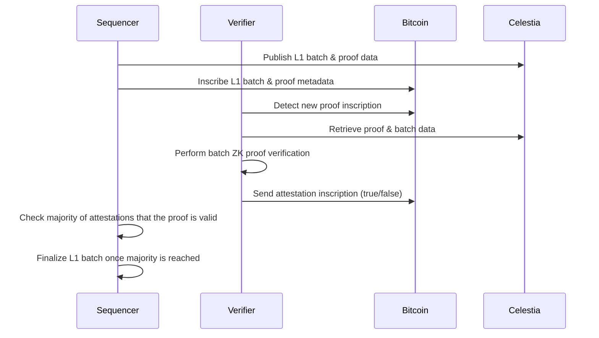
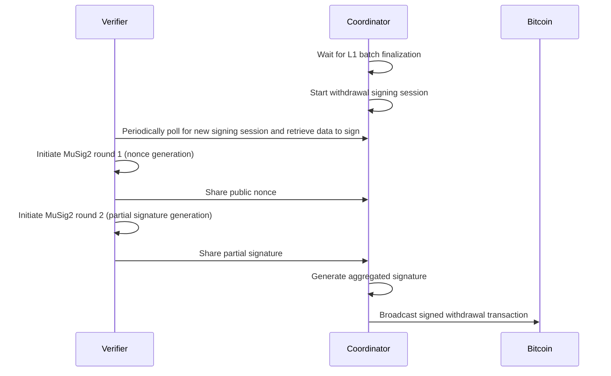

# Via L2 Bitcoin ZK-Rollup: Verifier Component Documentation

## 1. Introduction

The Verifier is a critical component of the Via L2 Bitcoin ZK-Rollup protocol, responsible for validating Zero-Knowledge (ZK) proofs and ensuring the integrity of off-chain execution. This document provides a comprehensive overview of the Verifier's architecture, implementation, and role within the overall system.

## 2. Role and Responsibilities

The Verifier Network consists of multiple Verifier Nodes with the primary goal of verifying ZK (SNARK) proofs for L1 batches generated by the Prover. These nodes attest to the validity of L2 state transitions before batches are finalized and withdrawals are processed.

Key responsibilities include:

- **ZK Proof Verification**: Validating the cryptographic proofs that certify the correctness of L2 state transitions
- **Data Availability Verification**: Ensuring that batch data is available on the Celestia network
- **Bitcoin Merkle Proof Validation**: Verifying the inclusion of transactions in the Bitcoin blockchain
- **Transaction Attestation**: Providing attestations for valid proofs by inscribing them on the Bitcoin network
- **Withdrawal Processing**: Coordinating the signing of withdrawal transactions using MuSig2
- **Synchronization Management**: Ensuring proper synchronization with L1 before processing operations
- **MuSig2 Partial Signature Verification**: Validating partial signatures in multi-signature workflows

## 3. Architecture Overview

The Verifier Network follows a distributed architecture with the following components:

```
┌─────────────────┐     ┌─────────────────┐     ┌─────────────────┐
│   Verifier 1    │     │   Verifier 2    │     │   Verifier n-1  │
└────────┬────────┘     └────────┬────────┘     └────────┬────────┘
         │                       │                       │
         │                       │                       │
         │                       ▼                       │
         │             ┌─────────────────────┐           │
         └────────────►│  Coordinator Node   │◄──────────┘
                       │   (Verifier n)      │
                       └─────────────────────┘
```

One of the Verifier Nodes acts as a Coordinator Node, responsible for managing signing sessions and coordinating the MuSig2 process for transaction signing and broadcasting signed transactions to the Bitcoin network.

### 3.1 Key Components

The Verifier implementation consists of several key components:

1. **Verifier Server (`via_verifier/bin/verifier_server/`)**: The main entry point for the Verifier node
2. **Storage Initialization (`via_verifier/node/via_verifier_storage_init/`)**: Handles the initialization of the verifier storage, including protocol version setup
3. **ZK Verification (`via_verifier/node/via_zk_verifier/`)**: Handles the verification of ZK proofs
4. **Bitcoin Watch (`via_verifier/node/via_btc_watch/`)**: Monitors the Bitcoin blockchain for relevant inscriptions
5. **Data Availability Client (`via_verifier/lib/via_da_client/`)**: Interfaces with the Celestia network to retrieve batch data
6. **Verification Library (`via_verifier/lib/via_verification/`)**: Core cryptographic verification logic
7. **Coordinator (`via_verifier/node/via_verifier_coordinator/`)**: Manages the MuSig2 signing process for withdrawals

## 4. Verification Process

### 4.1 Block Finalization Flow


```mermaid
sequenceDiagram
  participant Sequencer
  participant Verifier
  participant Bitcoin
  participant Celestia

  Sequencer->>Celestia: Publish L1 batch & proof data
  Sequencer->>Bitcoin: Inscribe L1 batch & proof metadata
  Verifier->>Bitcoin: Detect new proof inscription
  Verifier->>Celestia: Retrieve proof & batch data
  Verifier->>Verifier: Perform batch ZK proof verification
  Verifier->>Bitcoin: Send attestation inscription (true/false)
  Sequencer->>Sequencer: Check majority of attestations that the proof is valid
  Sequencer->>Sequencer: Finalize L1 batch once majority is reached
```

1. The Sequencer publishes the L1 batch and proof data to the Celestia network
2. The Sequencer inscribes the L1 batch and proof metadata on the Bitcoin network
3. The Verifier detects the new proof inscription on Bitcoin
4. The Verifier retrieves the proof and batch data from Celestia
5. The Verifier performs batch ZK proof verification
6. The Verifier sends an attestation inscription to Bitcoin (true/false)
7. Once a majority of attestations indicate the proof is valid, the L1 batch is considered final

### 4.2 Withdrawal Processing Flow


```mermaid
sequenceDiagram
  participant Verifier
  participant Coordinator
  participant Bitcoin

  Coordinator->>Coordinator: Wait for L1 batch finalization
  Coordinator->>Coordinator: Start withdrawal signing session
  Verifier->>Coordinator: Periodically poll for new signing session and retrieve data to sign
  Verifier->>Verifier: Initiate MuSig2 round 1 (nonce generation)
  Verifier->>Coordinator: Share public nonce
  Verifier->>Verifier: Initiate MuSig2 round 2 (partial signature generation)
  Verifier->>Coordinator: Share partial signature
  Coordinator->>Coordinator: Generate aggregated signature
  Coordinator->>Bitcoin: Broadcast signed withdrawal transaction
```

1. After the L1 batch is final, the Coordinator starts the withdrawal signing session
2. Each Verifier periodically polls the Coordinator API to obtain the new signing session
3. The Coordinator orchestrates the MuSig2 signing process
4. After successful generation of the aggregated signature, the Coordinator broadcasts the withdrawal transaction to the Bitcoin network

#### Session gating and idempotency

- The verifier refuses to participate while a reorg or sync is in progress (`is_reorg_in_progress` / `is_sync_in_progress` checks at the top of `loop_iteration`), and re-validates the verifier address set every iteration.
- Session hooks (`before_process_session`, `is_session_in_progress`, `is_bridge_session_already_processed`, `before_broadcast_final_transaction`) guard against double-processing: withdrawals already marked processed in `via_withdrawal_dal` are never signed again, and a coordinator restart resumes cleanly.
- The coordinator defers replacing an active session until it either completes or exceeds `session_timeout` (`RestApi::new_session`, which also scopes the session read lock tightly).
- Large withdrawal sets split into multiple weight-limited transactions (`Vec<UnsignedBridgeTx>`); the session signs one transaction at a time and the remaining withdrawals stay unprocessed until a later session pays them. The split limit is `MAX_STANDARD_TX_WEIGHT` (set as `TransactionBuilderConfig::max_tx_weight` in `WithdrawalSession::session()`); the `ViaVerifierConfig::max_tx_weight()` accessor exists but is not wired into this path.
- Post-broadcast reconciliation is idempotent and works for any verifier: the BTC watch's `WithdrawalProcessor` re-derives the paid withdrawal set from the on-chain transaction itself (see `withdrawal_finalization.md`).

The hooks are dispatched through `SessionManager` (`via_verifier/node/via_verifier_coordinator/src/sessions/session_manager.rs`), which looks up the `ISession` implementation for the session type. The real guard logic lives in the per-type session; for withdrawals:

```rust
// via_verifier/node/via_verifier_coordinator/src/sessions/withdrawal.rs
async fn is_session_in_progress(&self, session_op: &SessionOperation) -> anyhow::Result<bool> {
    let exists = self.is_bridge_session_already_processed(session_op).await?;
    Ok(!exists)
}

async fn before_process_session(&self, session_op: &SessionOperation) -> anyhow::Result<bool> {
    let exists = self.is_bridge_session_already_processed(session_op).await?;
    return Ok(!exists);
}

async fn before_broadcast_final_transaction(
    &self,
    session_op: &SessionOperation,
) -> anyhow::Result<bool> {
    let tx_id = session_op
        .get_unsigned_bridge_tx()
        .txid
        .as_byte_array()
        .to_vec();

    let exists = self
        .master_connection_pool
        .connection_tagged("verifier task")
        .await?
        .via_withdrawal_dal()
        .bridge_withdrawal_exists(&tx_id)
        .await?;

    Ok(!exists)
}

async fn after_broadcast_final_transaction(
    &self,
    txid: Txid,
    session_op: &SessionOperation,
) -> anyhow::Result<bool> {
    let mut storage = self
        .master_connection_pool
        .connection_tagged("verifier task")
        .await?;
    let mut transaction = storage.start_transaction().await?;

    let id = transaction
        .via_withdrawal_dal()
        .insert_bridge_withdrawal_tx(&txid.as_byte_array().to_vec())
        .await?;

    let l1_withdrawals = self
        .parse_bridge_withdrawal(session_op.get_unsigned_bridge_tx().tx.clone())
        .await?;

    let withdrawals = get_withdrawal_requests(l1_withdrawals);

    transaction
        .via_withdrawal_dal()
        .mark_withdrawals_as_processed(id, &withdrawals)
        .await?;

    transaction.commit().await?;

    self.transaction_builder
        .utxo_manager_insert_transaction(session_op.get_unsigned_bridge_tx().tx.clone())
        .await;

    tracing::info!("Final withdrawal transaction broadcasted: txid {}", txid);

    Ok(true)
}

async fn is_bridge_session_already_processed(
    &self,
    session_op: &SessionOperation,
) -> anyhow::Result<bool> {
    let tx_id = session_op
        .get_unsigned_bridge_tx()
        .txid
        .as_byte_array()
        .to_vec();

    let exists = self
        .master_connection_pool
        .connection_tagged("withdrawal session")
        .await?
        .via_withdrawal_dal()
        .bridge_withdrawal_exists(&tx_id)
        .await?;

    Ok(exists)
}
```

The coordinator-side session replacement guard:

```rust
// via_verifier/node/via_verifier_coordinator/src/coordinator/api_impl.rs
#[instrument(skip(self_))]
pub async fn new_session(
    State(self_): State<Arc<Self>>,
) -> anyhow::Result<Response<String>, ApiError> {
    let current_session_op_opt = {
        let current_session_op_opt =
            self_.state.signing_session.read().await.session_op.clone();
        current_session_op_opt
    };

    if let Some(current_session) = current_session_op_opt {
        if self_
            .session_manager
            .is_session_in_progress(&current_session)
            .await?
        {
            tracing::debug!("Session in progress {}", current_session.get_session_type());
            return Ok(ok_json(""));
        }

        if !self_.is_session_timeout().await {
            tracing::debug!(
                "Wait for session timeout {}",
                current_session.get_session_type()
            );
            return Ok(ok_json(""));
        }
    }

    if let Some(session_op) = self_.session_manager.get_next_session().await? {
        tracing::info!(
            "Create new {} signing session",
            &session_op.get_session_type()
        );

        let new_session = SigningSession {
            session_op: Some(session_op),
            received_nonces: BTreeMap::new(),
            received_sigs: BTreeMap::new(),
            created_at: seconds_since_epoch(),
        };

        let mut signing_session = self_.state.signing_session.write().await;
        *signing_session = new_session;
    } else {
        self_.reset_session().await;
    }

    return Ok(ok_json(""));
}
```

with the timeout check:

```rust
// via_verifier/node/via_verifier_coordinator/src/coordinator/api_decl.rs
pub async fn is_session_timeout(&self) -> bool {
    let created_at = self.state.signing_session.read().await.created_at.clone();
    created_at + self.state.session_timeout < seconds_since_epoch()
}
```

## Canonical chain gating and wallet bootstrap (commits 0087–0090, 0097–0099, 0101–0102)

Verifier BTC watcher and DAL changes enforce stricter ordering and duplicate handling for L1 batches:
- The watcher skips duplicate proof reveal txids using a DB existence check before any insert.
- Batch number 0 is always skipped. Genesis (batch 1) is allowed once; subsequent duplicates are ignored.
- For batch numbers above 1, the new batch must extend the canonical head: its number must equal the last canonical batch number + 1 and its prev_l1_batch_hash must match the canonical head hash. A batch that is not strictly next is accepted only if it forks from a previously recorded parent (`get_parent_batch_exists_for_l1_batch`); in that case the watcher treats it as a revert, deletes the votable transactions above the fork point, and resets the affected deposit transactions. Otherwise the message is skipped.
- Finalization remains vote-threshold based; the gating only affects insertion into the votable set.

The enforcement site is `VerifierMessageProcessor::process_messages` (`via_verifier/node/via_btc_watch/src/message_processors/verifier.rs`, shown in full in section 5.5). The DAL helpers it relies on live in `via_verifier/lib/verifier_dal/src/via_votes_dal.rs`.

Existence checks for batch number and proof reveal tx id:

```rust
// via_verifier/lib/verifier_dal/src/via_votes_dal.rs
/// Check if a batch with the given number already exists
pub async fn batch_exists(&mut self, l1_batch_number: u32) -> DalResult<bool> {
    let exists = sqlx::query_scalar!(
        r#"
        SELECT EXISTS(
            SELECT 1 
            FROM via_votable_transactions 
            WHERE l1_batch_number = $1
        )
        "#,
        l1_batch_number as i64
    )
    .instrument("batch_exists")
    .fetch_one(&mut self.storage)
    .await?;

    Ok(exists.unwrap_or(false))
}

pub async fn proof_reveal_tx_exists(&mut self, proof_reveal_tx_id: &[u8]) -> DalResult<bool> {
    let exists = sqlx::query_scalar!(
        r#"
        SELECT EXISTS(
            SELECT 1 
            FROM via_votable_transactions 
            WHERE proof_reveal_tx_id = $1
        )
        "#,
        proof_reveal_tx_id
    )
    .instrument("proof_reveal_tx_exists")
    .fetch_one(&mut self.storage)
    .await?;

    Ok(exists.unwrap_or(false))
}
```

Canonical head retrieval (a recursive walk from the newest finalized-or-pending batch, following `prev_l1_batch_hash` links):

```rust
// via_verifier/lib/verifier_dal/src/via_votes_dal.rs
pub async fn get_last_batch_in_canonical_chain(&mut self) -> DalResult<Option<(u32, Vec<u8>)>> {
    let row = sqlx::query!(
        r#"
        WITH RECURSIVE
        canonical_chain AS (
            (
                SELECT
                    *
                FROM
                    via_votable_transactions
                WHERE
                    is_finalized = TRUE
                    OR is_finalized IS NULL
                ORDER BY
                    l1_batch_number DESC
                LIMIT
                    1
            )
            UNION ALL
            SELECT
                vt.*
            FROM
                via_votable_transactions vt
            JOIN canonical_chain cc ON
                vt.prev_l1_batch_hash = cc.l1_batch_hash
                AND vt.l1_batch_number = cc.l1_batch_number + 1
                AND (
                    vt.l1_batch_status IS NULL
                    OR vt.l1_batch_status = TRUE
                )
        )
        
        SELECT
            l1_batch_number,
            l1_batch_hash
        FROM
            canonical_chain
        ORDER BY
            l1_batch_number DESC
        LIMIT
            1
        "#
    )
    .instrument("get_last_batch_in_canonical_chain")
    .fetch_optional(&mut self.storage)
    .await?;

    Ok(row.and_then(|r| Some((r.l1_batch_number? as u32, r.l1_batch_hash?))))
}
```

Fork-parent lookup used on the revert path:

```rust
// via_verifier/lib/verifier_dal/src/via_votes_dal.rs
pub async fn get_parent_batch_exists_for_l1_batch(
    &mut self,
    l1_batch_number: i64,
    parent_hash: &[u8],
) -> DalResult<bool> {
    let exists = sqlx::query_scalar!(
        r#"
        SELECT EXISTS (
            SELECT 1
            FROM via_votable_transactions
            WHERE l1_batch_number = $1
            AND prev_l1_batch_hash = $2
        )
        "#,
        l1_batch_number,
        parent_hash
    )
    .instrument("get_parent_batch_exists_for_l1_batch")
    .fetch_one(self.storage)
    .await?;

    Ok(exists.unwrap_or(false))
}
```

The canonical chain integrity report for operators returns continuity, missing numbers, and basic stats:

```rust
// via_verifier/lib/verifier_dal/src/models/storage_vote.rs
#[derive(Debug, Clone)]
pub struct CanonicalChainStatus {
    pub is_valid: bool,
    pub total_canonical_batches: i64,
    pub max_batch_number: Option<u32>,
    pub min_batch_number: Option<u32>,
    pub missing_batches: Vec<u32>,
    pub batch_sequence: Vec<u32>,
    pub total_transactions_in_db: i64,
    pub has_genesis: bool,
}
```

```rust
// via_verifier/lib/verifier_dal/src/via_votes_dal.rs
/// Verify that the canonical chain is valid and continuous
pub async fn verify_canonical_chain(&mut self) -> DalResult<CanonicalChainStatus> {
    let result = sqlx::query!(
        r#"
        WITH RECURSIVE
        canonical_chain AS (
            (
                SELECT
                    *,
                    1::BIGINT AS chain_position,
                    TRUE AS is_valid_link
                FROM
                    via_votable_transactions
                WHERE
                    l1_batch_number = 1
                ORDER BY
                    created_at ASC -- Take the first one if multiple exist
                LIMIT
                    1
            )
            UNION ALL
            SELECT
                vt.*,
                cc.chain_position + 1 AS chain_position,
                (
                    vt.prev_l1_batch_hash = cc.l1_batch_hash
                    AND vt.l1_batch_number = cc.l1_batch_number + 1
                ) AS is_valid_link
            FROM
                via_votable_transactions vt
            JOIN canonical_chain cc
                ON
                    vt.prev_l1_batch_hash = cc.l1_batch_hash
                    AND vt.l1_batch_number = cc.l1_batch_number + 1
                    AND (
                        vt.l1_batch_status IS NULL
                        OR vt.l1_batch_status = TRUE
                    )
            WHERE
                cc.is_valid_link = TRUE -- Only continue if previous link was valid
        ),
        
        chain_stats AS (
            SELECT
                COUNT(*) AS total_batches,
                MAX(l1_batch_number) AS max_batch_number,
                MIN(l1_batch_number) AS min_batch_number,
                BOOL_AND(is_valid_link) AS all_links_valid,
                ARRAY_AGG(
                    l1_batch_number
                    ORDER BY
                        l1_batch_number
                ) AS batch_numbers
            FROM
                canonical_chain
        ),
        
        expected_sequence AS (
            SELECT
                GENERATE_SERIES(
                    (
                        SELECT
                            min_batch_number
                        FROM
                            chain_stats
                    ),
                    (
                        SELECT
                            max_batch_number
                        FROM
                            chain_stats
                    )
                ) AS expected_batch
        ),
        
        missing_batches AS (
            SELECT
                ARRAY_AGG(expected_batch) AS missing
            FROM
                expected_sequence es
            WHERE
                NOT EXISTS (
                    SELECT
                        1
                    FROM
                        canonical_chain cc
                    WHERE
                        cc.l1_batch_number = es.expected_batch
                )
        )
        
        SELECT
            cs.total_batches,
            cs.max_batch_number,
            cs.min_batch_number,
            cs.all_links_valid,
            cs.batch_numbers,
            mb.missing,
            (
                cs.total_batches = cs.max_batch_number - cs.min_batch_number + 1
            ) AS is_continuous,
            (
                SELECT
                    COUNT(*)
                FROM
                    via_votable_transactions
            ) AS total_transactions_in_db
        FROM
            chain_stats cs,
            missing_batches mb
        "#
    )
    .instrument("verify_canonical_chain")
    .fetch_optional(&mut self.storage)
    .await?;

    match result {
        Some(row) => {
            let status = CanonicalChainStatus {
                is_valid: row.all_links_valid.unwrap_or(false)
                    && row.is_continuous.unwrap_or(false)
                    && row.missing.is_none(),
                total_canonical_batches: row.total_batches.unwrap_or(0),
                max_batch_number: row.max_batch_number.map(|n| n as u32),
                min_batch_number: row.min_batch_number.map(|n| n as u32),
                missing_batches: row
                    .missing
                    .unwrap_or_default()
                    .into_iter()
                    .map(|n| n as u32)
                    .collect(),
                batch_sequence: row
                    .batch_numbers
                    .unwrap_or_default()
                    .into_iter()
                    .map(|n| n as u32)
                    .collect(),
                total_transactions_in_db: row.total_transactions_in_db.unwrap_or(0),
                has_genesis: row.min_batch_number == Some(1),
            };
            Ok(status)
        }
        None => {
            // No canonical chain found (no batch 1)
            Ok(CanonicalChainStatus {
                is_valid: false,
                total_canonical_batches: 0,
                max_batch_number: None,
                min_batch_number: None,
                missing_batches: vec![],
                batch_sequence: vec![],
                total_transactions_in_db: 0,
                has_genesis: false,
            })
        }
    }
}
```

Storage initialization and system wallets:
- At startup, nodes load SystemWallets either from the DB (via_wallets table) or derive them by scanning bootstrap_txids, then persist them.
- This makes indexer construction deterministic and removes ad‑hoc address plumbing from runtime configs.

System wallet updates:
- Both main-node and verifier watchers include a SystemWalletProcessor that parses wallet update inscriptions (sequencer/governance/bridge), persists the updated SystemWallets, and if wallets changed, re-processes the just-fetched block range so that subsequent parsing uses the new state.
- BTC sender validates that the active inscriber address equals SystemWallets.sequencer before emitting inscriptions; otherwise, it halts with a clear error.

Bridge parameters:
- Bridge address and related thresholds moved to the dedicated bridge configuration. The verifier config additionally supports an optional bridge_address_merkle_root to validate the Taproot tree root of the bridge when applicable.

Operational runbook (insertion path):
- If proof reveal tx id already recorded -> skip
- If batch number is 0 -> skip; if batch number is 1 and batch 1 already exists -> skip
- If batch number is not strictly next -> accept only as a fork of a previously recorded parent (revert path: delete votable transactions above the fork point and reset the affected deposits); otherwise skip
- If batch number is strictly next but prev hash does not match the canonical head -> skip
- Otherwise, insert votable transaction and proceed with attestation collection

## 5. Implementation Details

### 5.1 Verifier Server

The Verifier Server is the main entry point for the Verifier node. It loads configurations from environment variables (or YAML files passed via `--config-path`, `--secrets-path`, `--wallets-path`), assembles them into a single `ViaGeneralVerifierConfig`, and builds the node using the `ViaNodeBuilder`:

```rust
// via_verifier/bin/verifier_server/src/main.rs
#[derive(Debug, Parser)]
#[command(author = "Via verifer", version, about = "Via verifer node", long_about = None)]
struct Cli {
    /// Path to the YAML config. If set, it will be used instead of env vars.
    #[arg(long)]
    config_path: Option<std::path::PathBuf>,

    /// Path to the YAML with secrets. If set, it will be used instead of env vars.
    #[arg(long)]
    secrets_path: Option<std::path::PathBuf>,

    /// Path to the wallets config. If set, it will be used instead of env vars.
    #[arg(long)]
    wallets_path: Option<std::path::PathBuf>,
}

fn main() -> anyhow::Result<()> {
    let opt = Cli::parse();

    let wallets = match opt.wallets_path {
        None => ViaWallets::from_env()?,
        Some(path) => {
            read_yaml_repr::<zksync_protobuf_config::proto::via_wallets::ViaWallets>(&path)
                .context("failed decoding wallets YAML config")?
        }
    };

    let secrets: ViaSecrets = match opt.secrets_path {
        Some(path) => {
            read_yaml_repr::<zksync_protobuf_config::proto::via_secrets::ViaSecrets>(&path)
                .context("failed decoding secrets YAML config")?
        }
        None => ViaSecrets {
            base_secrets: Secrets {
                consensus: None,
                database: DatabaseSecrets::from_env().ok(),
                l1: L1Secrets::from_env().ok(),
                data_availability: None,
            },
            via_l1: ViaL1Secrets::from_env().ok(),
            via_l2: ViaL2Secrets::from_env().ok(),
            via_da: ViaDASecrets::from_env().ok(),
        },
    };

    let via_general_verifier_config = ViaGeneralVerifierConfig {
        health_check: HealthCheckConfig::from_env()?,
        postgres_config: PostgresConfig::from_env()?,
        prometheus_config: PrometheusConfig::from_env()?,
        via_btc_client_config: ViaBtcClientConfig::from_env()?,
        via_btc_watch_config: ViaBtcWatchConfig::from_env()?,
        via_genesis_config: ViaGenesisConfig::from_env()?,
        via_bridge_config: ViaBridgeConfig::from_env()?,
        via_btc_sender_config: ViaBtcSenderConfig::from_env()?,
        via_celestia_config: ViaCelestiaConfig::from_env()?,
        via_verifier_config: ViaVerifierConfig::from_env()?,
        via_reorg_detector_config: ViaReorgDetectorConfig::from_env()?,
        observability_config: ObservabilityConfig::from_env()?,
        circuit_breaker_config: CircuitBreakerConfig::from_env()?,
        core_object_store: ObjectStoreConfig::from_env()?,
        secrets,
        wallets,
    };

    let node_builder = node_builder::ViaNodeBuilder::new(via_general_verifier_config.clone())?;

    let observability_guard = {
        // Observability initialization should be performed within tokio context.
        let _context_guard = node_builder.runtime_handle().enter();
        via_general_verifier_config.observability_config.install()?
    };

    // Build the node

    let node = node_builder.build()?;
    node.run(observability_guard)?;

    Ok(())
}
```

The `ViaNodeBuilder` constructs the Verifier node by adding various layers:

The current layer set and order (`node_builder.rs`) is:

```rust
// via_verifier/bin/verifier_server/src/node_builder.rs
pub fn build(mut self) -> anyhow::Result<ZkStackService> {
    self = self
        .add_sigint_handler_layer()?
        .add_healthcheck_layer()?
        .add_circuit_breaker_checker_layer()?
        .add_prometheus_exporter_layer()?
        .add_pools_layer()?
        .add_block_reverter_layer()?
        .add_btc_client_layer()?
        .add_reorg_detector_layer()?
        .add_storage_initialization_layer()?
        .add_btc_sender_layer()?
        .add_btc_watcher_layer()?
        .add_query_eth_client_layer()?
        .add_via_da_client_layer()?
        .add_object_store_layer()?
        .add_zkp_verification_layer()?;

    if self.is_coordinator {
        self = self.add_verifier_coordinator_api_layer()?
    }

    self = self.add_withdrawal_verifier_task_layer()?;

    Ok(self.node.build())
}
```

The coordinator gate is a single role check:

```rust
// via_verifier/bin/verifier_server/src/node_builder.rs
is_coordinator: configs.via_verifier_config.role == ViaNodeRole::Coordinator,
```

The Bitcoin client layer wires the shared client with the node's wallets and the bridge address:

```rust
fn add_btc_client_layer(mut self) -> anyhow::Result<Self> {
    self.node.add_layer(BtcClientLayer::new(
        self.configs.via_btc_client_config.clone(),
        self.configs.secrets.via_l1.clone().unwrap(),
        self.configs.wallets.clone(),
        Some(self.configs.via_bridge_config.bridge_address.clone()),
    ));
    Ok(self)
}
```

The `add_storage_initialization_layer` method adds the Verifier Storage Init Layer:

```rust
// via_verifier/bin/verifier_server/src/node_builder.rs
fn add_storage_initialization_layer(mut self) -> anyhow::Result<Self> {
    let layer = ViaVerifierInitLayer {
        via_genesis_config: self.configs.via_genesis_config.clone(),
        via_btc_watch_config: self.configs.via_btc_watch_config.clone(),
    };
    self.node.add_layer(layer);
    Ok(self)
}
```

### 5.2 Verifier Configuration

The verifier's own configuration is `ViaVerifierConfig`; Bitcoin client, Celestia, and BTC watch settings live in their own dedicated configs (`via_btc_client`, `via_celestia`, `via_btc_watch`, `via_bridge`):

#### 5.2.1 ViaVerifierConfig Structure

```rust
// core/lib/config/src/configs/via_verifier.rs
#[derive(Debug, Clone, Serialize, Deserialize, PartialEq)]
pub struct ViaVerifierConfig {
    /// The verifier role.
    pub role: ViaNodeRole,

    /// Service interval in milliseconds.
    pub poll_interval: u64,

    /// Port to which the coordinator server is listening.
    pub coordinator_port: u16,

    /// The coordinator url.
    pub coordinator_http_url: String,

    /// Verifier Request Timeout (in seconds)
    pub verifier_request_timeout: u8,

    /// The verifier btc wallet address.
    pub wallet_address: String,

    /// The bridge address merkle root.
    pub bridge_address_merkle_root: Option<String>,

    /// The session timeout.
    pub session_timeout: u64,

    /// Transaction weight limit.
    pub max_tx_weight: Option<u64>,
}
```

Notable accessors: `polling_interval()`, `wallet_address()`, and `max_tx_weight()` (defaulting to `MAX_STANDARD_TX_WEIGHT - 20000` as a safety buffer). The `bridge_address_merkle_root` is used to validate the Taproot script-tree root of the bridge address when a governance script path is present.

#### 5.2.2 Base Configuration File

```toml
# etc/env/base/via_verifier.toml
[via_verifier]
# Interval between polling db for verification requests (in ms).
poll_interval = 10000
# Coordinator server port.
coordinator_port = 6060
# Coordinator server url.
coordinator_http_url = "http://0.0.0.0:6060"
# Verifier Request Timeout (in seconds)
verifier_request_timeout = 10
# The verifier_mode can be simple verifier or coordinator.
role = "Coordinator"
# The session timeout (seconds).
session_timeout = 30
# The transaction weight limit
max_tx_weight = 380000
# The bridge address merkle root.
bridge_address_merkle_root = "0e45879bc42970c9b60ddeafa369472405ab87293380e79c4af3dad99623c5ad"
```

The private key is provided through secrets, not this config file.

### 5.3 Verifier Synchronization Enhancements

The withdrawal verifier gates every loop iteration on the node's sync and reorg state; there is no separate pause/resume state machine. The checks sit at the top of `loop_iteration`:

```rust
// via_verifier/node/via_verifier_coordinator/src/verifier/mod.rs
async fn loop_iteration(&mut self) -> Result<(), anyhow::Error> {
    self.session_manager.prepare_session().await?;

    if self.state.is_reorg_in_progress().await? {
        return Ok(());
    }

    if self.state.is_sync_in_progress().await? {
        return Ok(());
    }

    self.validate_verifier_addresses().await?;

    let mut session_info = self.get_session().await?;

    if self.is_coordinator() {
        self.create_new_session().await?;
        session_info = self.get_session().await?;

        if session_info.session_op.is_empty() {
            tracing::debug!("Empty session, nothing to process");
            return Ok(());
        }

        let session_op = SessionOperation::from_bytes(&session_info.session_op);

        if !self
            .session_manager
            .before_process_session(&session_op)
            .await?
        {
            tracing::debug!("Session already processed");
            return Ok(());
        }
    }

    if session_info.session_op.is_empty() {
        tracing::debug!("Empty session, nothing to process");
        return Ok(());
    }
    let session_op = SessionOperation::from_bytes(&session_info.session_op);

    if self
        .build_and_broadcast_final_transaction(&session_info, &session_op)
        .await?
    {
        return Ok(());
    }

    let messages = session_op.get_message_to_sign();

    if self
        .session_manager
        .is_bridge_session_already_processed(&session_op)
        .await?
    {
        tracing::info!(
            "Session already processed, txid: {}",
            session_op.get_unsigned_bridge_tx().txid.to_string()
        );
        return Ok(());
    }

    if self.signer_per_utxo_input.len() < messages.len() {
        self.init_signers(messages.len())?;
    }

    let input_index = 0;

    let session_signatures = self.get_session_signatures().await?;
    let session_nonces = self.get_session_nonces().await?;

    let signer = match self.signer_per_utxo_input.get_mut(&input_index) {
        Some(signer) => signer,
        None => {
            tracing::warn!("No signer found for input index {input_index}");
            return Ok(());
        }
    };

    let already_signed = session_signatures
        .get(&input_index)
        .map_or(false, |map| map.contains_key(&signer.signer_index()));

    let already_sent_nonce = session_nonces
        .get(&input_index)
        .map_or(false, |map| map.contains_key(&signer.signer_index()));

    if already_signed && already_sent_nonce {
        return Ok(());
    }

    if !already_signed
        && !already_sent_nonce
        && (signer.has_created_partial_sig() || signer.has_submitted_nonce())
    {
        self.clear_signers();
        return Ok(());
    }

    let received_nonces = session_nonces.get(&input_index).map_or(0, |map| map.len());
    if received_nonces < session_info.required_signers {
        if !self.session_manager.verify_message(&session_op).await? {
            anyhow::bail!("Invalid session message");
        }

        if !already_sent_nonce {
            self.submit_nonce(messages).await?;
        }
    } else if received_nonces >= session_info.required_signers {
        if signer.has_created_partial_sig() {
            return Ok(());
        }

        self.submit_partial_signature(session_nonces).await?;
    }

    Ok(())
}
```

Both checks are database-backed (the reorg marker and indexer sync state persist across restarts), so a verifier that comes up mid-reorg or mid-sync simply refuses to sign until the state clears. The BTC watch loop has the equivalent guard (`via_l1_block_dal().has_reorg_in_progress()`).

### 5.4 ZK Proof Verification

The core ZK proof verification lives in the `via_zk_verifier` task, built on the `via_verification` library. The library is organized by protocol version, so verification keys and circuits can evolve with upgrades:

```
via_verifier/lib/via_verification/
├── src/
│   ├── lib.rs
│   ├── version_27/                  # verification for protocol v27
│   └── version_28/                  # verification for protocol v28
├── keys/
│   └── protocol_version/            # verification keys per protocol version
└── examples/
    ├── zk_v27.rs
    ├── zk_v28.rs
    ├── data/                        # sample batch proof payloads
    └── zksync-era-verification-cli/ # standalone verification CLI
```

The verification flow per batch (driven by `via_zk_verifier/src/lib.rs`):

1. Resolve the proof inscription to its Celestia blob and fetch it (`process_proof_da_reference`, shown in 5.6)
2. Resolve and fetch the referenced batch data (`process_batch_da_reference`)
3. Deserialize the `ProveBatches` payload, select the verification path for the batch's protocol version, regenerate the public inputs from the previous and current batch commitments, and run the SNARK verifier
4. Cross-check batch contents against Bitcoin state, including the upgrade transaction hash and priority-op ordering:

```rust
// via_verifier/node/via_zk_verifier/src/lib.rs
/// Check whether the first user_log corresponds to an upgrade transaction.
pub async fn verify_upgrade_tx_hash(
    &mut self,
    storage: &mut Connection<'_, Verifier>,
    pubdata: &Pubdata,
) -> anyhow::Result<Option<H256>> {
    if let Some(upgrade_tx_hash) = storage
        .via_protocol_versions_dal()
        .get_in_progress_upgrade_tx_hash()
        .await?
    {
        if let Some(log) = pubdata.user_logs.first() {
            if log.sender == H160::from_str(L2_BOOTLOADER_CONTRACT_ADDR)?
                && log.key == upgrade_tx_hash
            {
                tracing::info!("Found upgrade transaction in pubdata: {}", upgrade_tx_hash);
                return Ok(Some(upgrade_tx_hash));
            }
        }
        return Ok(None);
    }
    Ok(None)
}

pub async fn verify_op_priority_id(
    &mut self,
    storage: &mut Connection<'_, Verifier>,
    l1_batch_number: i64,
    pubdata: &Pubdata,
) -> anyhow::Result<(bool, Vec<(H256, bool)>)> {
    let mut deposit_logs = Vec::new();

    for log in &pubdata.user_logs {
        if log.sender == H160::from_str(L2_BOOTLOADER_CONTRACT_ADDR)? {
            deposit_logs.push(log);
        }
    }

    let txs = storage
        .via_transactions_dal()
        .list_transactions_not_processed(deposit_logs.len() as i64)
        .await?;

    if txs.len() != deposit_logs.len() {
        tracing::error!(
            "Verifier did not index all the deposits, expected {} found {}",
            txs.len(),
            deposit_logs.len(),
        );
        return Ok((false, vec![]));
    }

    if txs.is_empty() {
        tracing::info!("There is no transactions to validate the op priority id",);
        return Ok((true, vec![]));
    }

    let mut deposits: Vec<(H256, bool)> = Vec::new();

    for (raw_tx_id, deposit_log) in txs.iter().zip(deposit_logs.iter()) {
        let db_raw_tx_id = H256::from_slice(raw_tx_id);
        if db_raw_tx_id != deposit_log.key {
            tracing::error!(
                "Sequencer did not process the deposit transactions in series for l1 batch {}, \
                invalid priority id for transaction hash {}", 
                l1_batch_number,
                db_raw_tx_id
            );
            return Ok((false, vec![]));
        }

        let status = !deposit_log.value.is_zero();
        deposits.push((deposit_log.key, status));
    }

    tracing::info!(
        "Priority_id verified successfully for l1 batch {}",
        l1_batch_number
    );

    Ok((true, deposits))
}
```

5. Inscribe the resulting `ValidatorAttestation` (Ok / NotOk)

The runnable examples (`zk_v27.rs`, `zk_v28.rs`) and the bundled verification CLI let anyone reproduce step 3 outside the node.

### 5.5 Bitcoin Watch

The Bitcoin Watch component monitors the Bitcoin blockchain for relevant inscriptions:

```rust
// via_verifier/node/via_btc_watch/src/lib.rs
async fn loop_iteration(
    &mut self,
    storage: &mut Connection<'_, Verifier>,
) -> Result<(), MessageProcessorError> {
    if storage
        .via_l1_block_dal()
        .has_reorg_in_progress()
        .await?
        .is_some()
    {
        return Ok(());
    }

    let last_processed_bitcoin_block = storage
        .via_indexer_dal()
        .get_last_processed_l1_block(VerifierBtcWatch::module_name())
        .await? as u32;

    if last_processed_bitcoin_block == 0 {
        return Err(MessageProcessorError::Internal(anyhow::anyhow!(
            "The indexer was not initialized".to_string()
        )));
    }

    if let Some(last_protocol_version) = storage
        .via_protocol_versions_dal()
        .latest_protocol_semantic_version()
        .await
        .expect("Error load the protocol version")
    {
        check_if_supported_sequencer_version(last_protocol_version)
            .map_err(|e| MessageProcessorError::Internal(anyhow::anyhow!(e.to_string())))?;
    }

    let current_l1_block_number =
        self.indexer
            .fetch_block_height()
            .await
            .map_err(|e| MessageProcessorError::Internal(anyhow::anyhow!(e.to_string())))?
            .saturating_sub(self.config.block_confirmations) as u32;
    if current_l1_block_number <= last_processed_bitcoin_block {
        return Ok(());
    }

    let Some((last_l1_block_number, _)) =
        storage.via_l1_block_dal().get_last_l1_block().await?
    else {
        tracing::warn!("Reorg did not start yet");
        return Ok(());
    };

    let mut to_block = last_processed_bitcoin_block + L1_BLOCKS_CHUNK;
    if to_block > current_l1_block_number {
        to_block = current_l1_block_number;
    }

    // Clamp the to_batch to the last valid block number validated by the reorg detector
    if to_block > last_l1_block_number as u32 {
        to_block = last_l1_block_number as u32;
    }

    let from_block = last_processed_bitcoin_block + 1;

    if to_block < from_block {
        return Ok(());
    }

    let system_wallets_map = match storage
        .via_wallet_dal()
        .get_system_wallets_raw(last_processed_bitcoin_block as i64)
        .await?
    {
        Some(map) => map,
        None => {
            tracing::info!("Wait for storage init, block number {}", from_block);
            return Ok(());
        }
    };

    let system_wallets = SystemWallets::try_from(system_wallets_map)?;

    self.indexer.update_system_wallets(
        Some(system_wallets.sequencer),
        Some(system_wallets.bridge),
        Some(system_wallets.verifiers),
        Some(system_wallets.governance),
    );

    let mut messages = self
        .indexer
        .process_blocks(from_block, to_block)
        .await
        .map_err(|e| MessageProcessorError::Internal(e.into()))?;

    // Re-process blocks if system wallets were updated, since the new wallet state
    // may change how subsequent messages are interpreted.
    if let Some(block_number) = self
        .system_wallet_processor
        .process_messages(storage, messages.clone(), &mut self.indexer)
        .await
        .map_err(|e| MessageProcessorError::Internal(e.into()))?
    {
        // Process the blocks until where the update wallets block.
        to_block = block_number;

        messages = self
            .indexer
            .process_blocks(from_block, to_block)
            .await
            .map_err(|e| MessageProcessorError::Internal(e.into()))?;
    }

    for processor in self.message_processors.iter_mut() {
        processor
            .process_messages(storage, messages.clone(), &mut self.indexer)
            .await
            .map_err(|e| MessageProcessorError::Internal(e.into()))?;
    }

    // Check if the last processed block was updated by another thread. This could happen when a reorg is detected.
    let current_last_processed_bitcoin_block = storage
        .via_indexer_dal()
        .get_last_processed_l1_block(VerifierBtcWatch::module_name())
        .await? as u32;

    if current_last_processed_bitcoin_block != last_processed_bitcoin_block {
        tracing::info!(
            "The btc_watch last processed block was updated by another thread, skipping the block processing"
        );
        return Ok(());
    }

    storage
        .via_indexer_dal()
        .update_last_processed_l1_block(VerifierBtcWatch::module_name(), to_block)
        .await
        .map_err(|e| MessageProcessorError::DatabaseError(e.to_string()))?;

    tracing::info!(
        "The btc_watch processed blocks, from {} to {}",
        from_block,
        to_block,
    );

    Ok(())
}
```

Progress is persisted per module in the database (`via_indexer_dal`), the loop pauses entirely while a reorg marker is present, and a dedicated `SystemWalletProcessor` runs before the regular processors so wallet rotations take effect for the same block range. The processor set is registered in the constructor:

```rust
// via_verifier/node/via_btc_watch/src/lib.rs
pub async fn new(
    config: ViaBtcWatchConfig,
    indexer: BitcoinInscriptionIndexer,
    btc_client: Arc<BitcoinClient>,
    pool: ConnectionPool<Verifier>,
) -> anyhow::Result<Self> {
    let system_wallet_processor = Box::new(SystemWalletProcessor::new(btc_client.clone()));

    let message_processors: Vec<Box<dyn MessageProcessor>> = vec![
        Box::new(GovernanceUpgradesEventProcessor::new(btc_client)),
        Box::new(L1ToL2MessageProcessor::default()),
        Box::new(VerifierMessageProcessor::default()),
        Box::new(WithdrawalProcessor::default()),
    ];

    Ok(Self {
        config,
        indexer,
        pool,
        system_wallet_processor,
        message_processors,
    })
}
```

The `VerifierMessageProcessor` handles two message types:

1. `ProofDAReference`: References to proof data stored on Celestia (the canonical chain gating described earlier lives here)
2. `ValidatorAttestation`: Attestations from other verifiers, with finalization at `BATCH_FINALIZATION_THRESHOLD` (from `via_consensus`)

Protocol upgrades (`SystemContractUpgrade`) are handled by the separate `GovernanceUpgradesEventProcessor` (section 5.7), deposits by `L1ToL2MessageProcessor`, and bridge withdrawal confirmations by `WithdrawalProcessor`.

```rust
// via_verifier/node/via_btc_watch/src/message_processors/verifier.rs
#[derive(Default, Debug)]
pub struct VerifierMessageProcessor {}

#[async_trait::async_trait]
impl MessageProcessor for VerifierMessageProcessor {
    async fn process_messages(
        &mut self,
        storage: &mut Connection<'_, Verifier>,
        msgs: Vec<FullInscriptionMessage>,
        indexer: &mut BitcoinInscriptionIndexer,
    ) -> Result<Option<u32>, MessageProcessorError> {
        for msg in msgs {
            match msg {
                FullInscriptionMessage::ProofDAReference(ref proof_msg) => {
                    let proof_reveal_tx_id = convert_txid_to_h256(proof_msg.common.tx_id);

                    if storage
                        .via_votes_dal()
                        .proof_reveal_tx_exists(proof_reveal_tx_id.as_bytes())
                        .await?
                    {
                        tracing::info!(
                            "Skipping duplicate proof reveal tx: {:?}",
                            proof_reveal_tx_id
                        );
                        continue;
                    }

                    let pubdata_msgs = indexer
                        .parse_transaction(&proof_msg.input.l1_batch_reveal_txid)
                        .await?;

                    if pubdata_msgs.len() != 1 {
                        return Err(MessageProcessorError::Internal(anyhow::Error::msg(
                            "Invalid pubdata msg lenght",
                        )));
                    }

                    let inscription = pubdata_msgs[0].clone();

                    let l1_batch_da_ref_inscription = match inscription {
                        FullInscriptionMessage::L1BatchDAReference(da_msg) => da_msg,
                        _ => {
                            return Err(MessageProcessorError::Internal(anyhow::Error::msg(
                                "Invalid inscription type",
                            )))
                        }
                    };

                    let new_l1_batch_number = l1_batch_da_ref_inscription.input.l1_batch_index.0;

                    tracing::info!(
                        "Processing ProofDAReference for batch {} with hash {:?}",
                        new_l1_batch_number,
                        l1_batch_da_ref_inscription.input.l1_batch_hash
                    );

                    if new_l1_batch_number == 0 {
                        tracing::info!(
                            "Skipping ProofDAReference message with l1_batch_number ZERO."
                        );
                        continue;
                    } else if new_l1_batch_number == 1 {
                        if storage.via_votes_dal().batch_exists(1).await? {
                            tracing::info!("Skipping duplicate genesis batch 1");
                            continue;
                        }
                    } else if new_l1_batch_number > 1 {
                        let last_batch_in_canonical_chain = match storage
                            .via_votes_dal()
                            .get_last_batch_in_canonical_chain()
                            .await?
                        {
                            Some(last_batch_in_canonical_chain) => last_batch_in_canonical_chain,
                            None => {
                                return Err(MessageProcessorError::Internal(anyhow::Error::msg(
                                    "Last batch in canonical chain not found",
                                )))
                            }
                        };

                        if last_batch_in_canonical_chain.0 + 1 != new_l1_batch_number {
                            // Possible reorg: validate whether the batch is a fork of a previously reverted batch.
                            // If this batch is valid (i.e., a fork of a previously valid batch),
                            // the verifier treats it as a new fork, implicitly marking all earlier batches as invalid.
                            let parent_hash = l1_batch_da_ref_inscription
                                .input
                                .prev_l1_batch_hash
                                .as_bytes()
                                .to_vec();

                            let exists = storage
                                .via_votes_dal()
                                .get_parent_batch_exists_for_l1_batch(
                                    new_l1_batch_number as i64,
                                    &parent_hash,
                                )
                                .await?;
                            if !exists {
                                tracing::info!(
                                    "Skipping ProofDAReference, no valid parent found for the new l1_batch_number: {:?}",
                                    new_l1_batch_number,
                                );
                                continue;
                            }

                            tracing::info!(
                                "A Revert batch was found with number {}, parent hash {}",
                                new_l1_batch_number,
                                l1_batch_da_ref_inscription.input.prev_l1_batch_hash
                            );

                            let from_l1_batch_number = (new_l1_batch_number - 1) as i64;

                            let mut transaction = storage.start_transaction().await?;
                            transaction
                                .via_votes_dal()
                                .delete_votable_transactions(from_l1_batch_number)
                                .await?;

                            transaction
                                .via_transactions_dal()
                                .reset_transactions(from_l1_batch_number)
                                .await?;

                            transaction.commit().await?;

                            METRICS.inscriptions_processed[&InscriptionStage::Reorg]
                                .set(from_l1_batch_number as usize);
                        } else {
                            if last_batch_in_canonical_chain.1
                                != l1_batch_da_ref_inscription.input.prev_l1_batch_hash.0
                            {
                                tracing::info!(
                                "Skipping ProofDAReference message with l1_batch_number: {:?}. Last batch in canonical chain: {:?}",
                                l1_batch_da_ref_inscription.input.l1_batch_index,
                                last_batch_in_canonical_chain
                            );
                                continue;
                            }
                        }
                    }

                    METRICS.inscriptions_processed[&InscriptionStage::IndexedL1Batch]
                        .set(new_l1_batch_number as usize);

                    storage
                        .via_votes_dal()
                        .insert_votable_transaction(
                            new_l1_batch_number,
                            l1_batch_da_ref_inscription.input.l1_batch_hash,
                            l1_batch_da_ref_inscription.input.prev_l1_batch_hash,
                            proof_msg.input.da_identifier.clone(),
                            proof_reveal_tx_id,
                            proof_msg.input.blob_id.clone(),
                            proof_msg.input.l1_batch_reveal_txid.to_string(),
                            l1_batch_da_ref_inscription.input.blob_id,
                        )
                        .await?;

                    tracing::info!(
                        "New votable transaction for L1 batch {:?}",
                        new_l1_batch_number
                    );
                }
                ref f @ FullInscriptionMessage::ValidatorAttestation(ref attestation_msg) => {
                    if let Some(l1_batch_number) = indexer.get_l1_batch_number(f).await {
                        let reveal_proof_txid =
                            convert_txid_to_h256(attestation_msg.input.reference_txid);
                        let tx_id = convert_txid_to_h256(attestation_msg.common.tx_id);

                        // Vote = true if attestation_msg.input.attestation == Vote::Ok
                        let is_ok = matches!(
                            attestation_msg.input.attestation,
                            via_btc_client::types::Vote::Ok
                        );

                        if let Some(votable_transaction_id) = storage
                            .via_votes_dal()
                            .get_votable_transaction_id(&reveal_proof_txid.as_bytes())
                            .await?
                        {
                            let p2wpkh_address =
                                attestation_msg.common.p2wpkh_address.as_ref().expect(
                                    "ValidatorAttestation message must have a p2wpkh address",
                                );

                            let mut transaction = storage.start_transaction().await?;

                            transaction
                                .via_votes_dal()
                                .insert_vote(
                                    votable_transaction_id,
                                    &p2wpkh_address.to_string(),
                                    is_ok,
                                )
                                .await?;

                            tracing::info!("New vote found for L1 batch {:?}", l1_batch_number);

                            METRICS.inscriptions_processed[&InscriptionStage::Vote]
                                .set(l1_batch_number.0 as usize);

                            // Check finalization
                            if transaction
                                .via_votes_dal()
                                .finalize_transaction_if_needed(
                                    votable_transaction_id,
                                    BATCH_FINALIZATION_THRESHOLD,
                                    indexer.get_number_of_verifiers(),
                                )
                                .await?
                            {
                                METRICS.inscriptions_processed[&InscriptionStage::Finalized]
                                    .set(l1_batch_number.0 as usize);

                                tracing::info!(
                                        "Finalizing transaction with tx_id: {:?} and block number: {:?}",
                                        tx_id,
                                        l1_batch_number
                                );
                            }

                            transaction.commit().await?
                        }
                    }
                }
                _ => (),
            }
        }
        Ok(None)
    }
}
```

### 5.6 Data Availability Client

The Data Availability Client interfaces with the Celestia network to retrieve batch data:

```rust
// via_verifier/node/via_zk_verifier/src/lib.rs
async fn process_proof_da_reference(
    &mut self,
    proof_msg: &ProofDAReference,
) -> anyhow::Result<(InclusionData, BitcoinTxid)> {
    let blob = self
        .da_client
        .get_inclusion_data(&proof_msg.input.blob_id)
        .await
        .with_context(|| "Failed to fetch the blob")?
        .ok_or_else(|| anyhow::anyhow!("Blob not found"))?;
    let batch_tx_id = proof_msg.input.l1_batch_reveal_txid;
    
    Ok((blob, batch_tx_id))
}

async fn process_batch_da_reference(
    &mut self,
    batch_msg: &L1BatchDAReference,
) -> anyhow::Result<(InclusionData, H256)> {
    let blob = self
        .da_client
        .get_inclusion_data(&batch_msg.input.blob_id)
        .await
        .with_context(|| "Failed to fetch the blob")?
        .ok_or_else(|| anyhow::anyhow!("Blob not found"))?;
    let hash = batch_msg.input.l1_batch_hash;
    
    Ok((blob, hash))
}
```

### 5.7 Governance upgrade processing (commits 0076–0077)

- The Verifier's BTC Watch includes a dedicated `GovernanceUpgradesEventProcessor` that:
  - Receives a `BitcoinClient` to fetch the referenced proposal transaction by txid from the OP_RETURN execution message.
  - Uses `MessageParser::parse_system_transaction` to parse the proposal transaction into a `SystemContractUpgradeProposal` (witness-based) message.
  - Computes the canonical upgrade transaction hash via `ViaProtocolUpgrade::get_canonical_tx_hash()` and persists the new protocol version using `via_protocol_versions_dal().save_protocol_version(...)`.
  - Note that this differs from the sequencer main node's processor of the same name (`core/node/via_btc_watch/src/message_processors/governance_upgrade.rs`, shown below), which is the one that builds the full L2 `ProtocolUpgradeTx` via `ViaProtocolUpgrade::create_protocol_upgrade_tx()` and persists it with `protocol_versions_dal().save_protocol_version_with_tx(...)`. The verifier only needs the canonical hash to cross-check batches (`verify_upgrade_tx_hash`, section 5.4).
- Two-phase flow:
  - Proposal inscription (witness) defines the new protocol version and system contracts.
  - Governance execution (OP_RETURN) references the proposal txid and authorizes it via the governance UTXO set.
- Implementation references:
  - Indexer extraction and validators: [core/lib/via_btc_client/src/indexer/mod.rs](core/lib/via_btc_client/src/indexer/mod.rs), [core/lib/via_btc_client/src/indexer/parser.rs](core/lib/via_btc_client/src/indexer/parser.rs)
  - Upgrade construction: [core/lib/types/src/via_protocol_upgrade.rs](core/lib/types/src/via_protocol_upgrade.rs)
  - Watch wiring and processor: [via_verifier/node/via_btc_watch/src/lib.rs](via_verifier/node/via_btc_watch/src/lib.rs), [via_verifier/node/via_btc_watch/src/message_processors/governance_upgrade.rs](via_verifier/node/via_btc_watch/src/message_processors/governance_upgrade.rs)

The verifier-side processor in full:

```rust
// via_verifier/node/via_btc_watch/src/message_processors/governance_upgrade.rs
/// Listens to operation events coming from the governance contract and saves new protocol upgrade proposals to the database.
#[derive(Debug)]
pub struct GovernanceUpgradesEventProcessor {
    /// BTC client
    btc_client: Arc<BitcoinClient>,
    /// Message parser
    message_parser: MessageParser,
    /// upgrade proposal
    upgrade: ViaProtocolUpgrade,
}

impl GovernanceUpgradesEventProcessor {
    pub fn new(btc_client: Arc<BitcoinClient>) -> Self {
        let message_parser = MessageParser::new(btc_client.get_network());
        Self {
            btc_client,
            message_parser,
            upgrade: ViaProtocolUpgrade::default(),
        }
    }
}

#[async_trait::async_trait]
impl MessageProcessor for GovernanceUpgradesEventProcessor {
    async fn process_messages(
        &mut self,
        storage: &mut Connection<'_, Verifier>,
        msgs: Vec<FullInscriptionMessage>,
        _: &mut BitcoinInscriptionIndexer,
    ) -> Result<Option<u32>, MessageProcessorError> {
        let mut upgrades = Vec::new();
        for msg in msgs {
            if let FullInscriptionMessage::SystemContractUpgrade(system_contract_upgrade_msg) = &msg
            {
                let proposal_tx = self
                    .btc_client
                    .get_transaction(&system_contract_upgrade_msg.input.proposal_tx_id)
                    .await
                    .map_err(|err| {
                        MessageProcessorError::Internal(anyhow::anyhow!(
                            "Failed to fetch protocol upgrade transaction: {}, error {}",
                            system_contract_upgrade_msg.input.proposal_tx_id,
                            err
                        ))
                    })?;

                let messages = self.message_parser.parse_system_transaction(
                    &proposal_tx,
                    system_contract_upgrade_msg.common.block_height,
                    None,
                );

                for message in messages {
                    match message {
                        FullInscriptionMessage::SystemContractUpgradeProposal(
                            system_contract_upgrade_proposal_msg,
                        ) => {
                            if system_contract_upgrade_proposal_msg.input.version
                                < get_sequencer_version()
                            {
                                tracing::info!(
                                    "Upgrade transaction with version {} already processed, skipping",
                                    system_contract_upgrade_proposal_msg.input.version
                                );
                                continue;
                            }

                            tracing::info!(
                                "Received upgrades with versions: {:?}",
                                system_contract_upgrade_proposal_msg.input.version
                            );

                            let hash = self.upgrade.get_canonical_tx_hash(
                                system_contract_upgrade_proposal_msg.input.version,
                                system_contract_upgrade_proposal_msg.input.system_contracts,
                            )?;

                            let upgrade = (
                                system_contract_upgrade_proposal_msg.input.version,
                                system_contract_upgrade_proposal_msg
                                    .input
                                    .bootloader_code_hash,
                                system_contract_upgrade_proposal_msg
                                    .input
                                    .default_account_code_hash,
                                hash,
                                system_contract_upgrade_proposal_msg
                                    .input
                                    .recursion_scheduler_level_vk_hash,
                            );

                            upgrades.push(upgrade);
                        }
                        _ => (),
                    }
                }
            }
        }

        for (
            version,
            bootloader_code_hash,
            default_account_code_hash,
            canonical_tx_hash,
            recursion_scheduler_level_vk_hash,
        ) in upgrades
        {
            METRICS.inscriptions_processed[&InscriptionStage::Upgrade].set(version.minor as usize);

            storage
                .via_protocol_versions_dal()
                .save_protocol_version(
                    version,
                    bootloader_code_hash.as_bytes(),
                    default_account_code_hash.as_bytes(),
                    canonical_tx_hash.as_bytes(),
                    recursion_scheduler_level_vk_hash.as_bytes(),
                )
                .await
                .map_err(DalError::generalize)?;
        }
        Ok(None)
    }
}
```

For comparison, the sequencer main node's counterpart applies the upgrade with a full L2 transaction:

```rust
// core/node/via_btc_watch/src/message_processors/governance_upgrade.rs (excerpt of process_messages)
let Some(last_upgrade) = upgrades.last() else {
    return Ok(None);
};

let last_version = last_upgrade.0.version;
for (upgrade, recursion_scheduler_level_vk_hash) in upgrades {
    let latest_semantic_version = storage
        .protocol_versions_dal()
        .latest_semantic_version()
        .await
        .map_err(DalError::generalize)?
        .context("expected some version to be present in DB")?;

    if upgrade.version > latest_semantic_version {
        let latest_version = storage
            .protocol_versions_dal()
            .get_protocol_version_with_latest_patch(latest_semantic_version.minor)
            .await
            .map_err(DalError::generalize)?
            .with_context(|| {
                format!(
                    "expected minor version {} to be present in DB",
                    latest_semantic_version.minor as u16
                )
            })?;

        let new_version =
            latest_version.apply_upgrade(upgrade, Some(recursion_scheduler_level_vk_hash));

        storage
            .protocol_versions_dal()
            .save_protocol_version_with_tx(&new_version)
            .await
            .map_err(DalError::generalize)?;

        METRICS.inscriptions_processed[&InscriptionStage::Upgrade]
            .set(new_version.version.minor as usize);
    }
}
self.last_seen_protocol_version = last_version;

Ok(None)
```

where `tx` inside `upgrades` was built earlier in the same method with:

```rust
// core/node/via_btc_watch/src/message_processors/governance_upgrade.rs (excerpt of process_messages)
let tx = self.upgrade.create_protocol_upgrade_tx(
    system_contract_upgrade_proposal_msg.input.version,
    system_contract_upgrade_proposal_msg.input.system_contracts,
)?;
```

### 5.8 MuSig2 Partial Signature Verification

The verifier now includes enhanced MuSig2 partial signature verification capabilities:

#### 5.8.1 Partial Signature Verification Function

The real utility lives in `via_musig2/src/utils.rs`. It reconstructs the tweaked key-aggregation context (including the optional `merkle_root`) and verifies the partial signature against the submitting signer's key and nonce:

```rust
// via_verifier/lib/via_musig2/src/utils.rs
pub fn verify_partial_signature(
    nonce: PubNonce,
    nonces: Vec<PubNonce>,
    individual_pubkey_str: String,
    pubkeys_str: Vec<String>,
    partial_sig: PartialSignature,
    message: &[u8],
    merkle_root: Option<TapNodeHash>,
) -> anyhow::Result<()> {
    let pubkeys = pubkeys_str
        .iter()
        .map(|pubkey_str| musig2::secp256k1::PublicKey::from_str(pubkey_str))
        .collect::<Result<Vec<PublicKey>, _>>()?;

    let aggregated_nonce = AggNonce::sum(nonces);
    let mut musig_key_agg_cache = KeyAggContext::new(pubkeys.clone())?;

    let agg_pubkey = musig_key_agg_cache.aggregated_pubkey::<secp256k1_musig2::PublicKey>();
    let (xonly_agg_key, _) = agg_pubkey.x_only_public_key();

    // Convert to bitcoin XOnlyPublicKey first
    let internal_key = bitcoin::XOnlyPublicKey::from_slice(&xonly_agg_key.serialize())?;

    // Calculate taproot tweak
    let tap_tweak = TapTweakHash::from_key_and_tweak(internal_key, merkle_root);
    let tweak = tap_tweak.to_scalar();
    let tweak_bytes = tweak.to_be_bytes();
    let tweak = secp256k1_musig2::Scalar::from_be_bytes(tweak_bytes)
        .with_context(|| TAPROOT_TWEAK_SCALAR_RANGE_ERR)?;

    // Apply tweak to the key aggregation context before signing
    musig_key_agg_cache = musig_key_agg_cache.with_xonly_tweak(tweak)?;

    let individual_pubkey = PublicKey::from_str(&individual_pubkey_str)?;

    verify_partial(
        &musig_key_agg_cache,
        partial_sig,
        &aggregated_nonce,
        individual_pubkey,
        &nonce,
        message,
    )?;

    Ok(())
}
```

The coordinator uses this when verifiers submit partial signatures, so an invalid contribution is rejected before aggregation. A runnable walkthrough exists at `via_verifier/lib/via_musig2/examples/verify_partial_sig.rs`. Note the `merkle_root` parameter: partial-signature verification must use the same script-tree root as the bridge address derivation.

### 5.9 Bitcoin Client Layer

There is no multi-client manager or resource allocator; the node registers a single `BtcClientLayer` that provides the Bitcoin client resource to all components, configured with the node's wallets and the bridge address:

```rust
// via_verifier/bin/verifier_server/src/node_builder.rs
fn add_btc_client_layer(mut self) -> anyhow::Result<Self> {
    self.node.add_layer(BtcClientLayer::new(
        self.configs.via_btc_client_config.clone(),
        self.configs.secrets.via_l1.clone().unwrap(),
        self.configs.wallets.clone(),
        Some(self.configs.via_bridge_config.bridge_address.clone()),
    ));
    Ok(self)
}
```

## 6. Enhanced Metrics and Monitoring

Metrics are defined with the `vise` macros, one metrics struct per component:

### 6.1 Verifier Metrics

```rust
// via_verifier/node/via_verifier_coordinator/src/metrics.rs
#[derive(Debug, Metrics)]
#[metrics(prefix = "via_verifier_coordinator")]
pub struct ViaVerifierCoordinatorMetrics {
    /// The time duration to process a session in seconds.
    pub session_time: Gauge<usize>,

    /// Verifier errors
    pub errors: Counter,

    /// Verifier signatures error
    pub verifier_errors: Family<VerifierErrorLabel, Counter>,
}

// via_verifier/node/via_btc_watch/src/metrics.rs
#[derive(Debug, Metrics)]
#[metrics(prefix = "via_verifier_btc_watch")]
pub struct ViaVerifierBtcWatcherMetrics {
    #[metrics(labels = ["role", "address"])]
    pub system_wallets: LabeledFamily<(String, String), Counter, 2>,

    /// Number of inscriptions processed, labeled by type.
    pub inscriptions_processed: Family<InscriptionStage, Gauge<usize>>,

    /// Deposit processed.
    pub deposit: Counter,

    /// Withdrawal confirmed.
    pub withdrawal_confirmed: Counter,

    /// Errors
    pub errors: Counter,
}
```

Additional metrics modules exist for the reorg detector (`via_reorg_detector/src/metrics.rs`) and block reverter (`via_block_reverter/src/metrics.rs`). Metrics are exported through the Prometheus exporter layer, and liveness is exposed through the standard healthcheck layer; both are part of the node builder's layer set (section 5.1).

## 7. ZK Proof Verification Examples

### 7.1 Runnable Verification Examples

The repository ships real, runnable examples instead of pseudo-workflows:

- `via_verifier/lib/via_verification/examples/zk_v27.rs` and `zk_v28.rs`: end-to-end SNARK verification for a batch proof under protocol v27/v28, using the bundled verification keys in `via_verification/keys/protocol_version/` and the sample payloads in `examples/data/`
- `via_verifier/lib/via_verification/examples/zksync-era-verification-cli`: a standalone CLI to verify proofs outside the node
- `via_verifier/lib/via_musig2/examples/`: the MuSig2 workflow examples (`coordinator.rs`, `withdrawal.rs`, `key_generation_setup.rs`, `verify_partial_sig.rs`, `musig2_with_script_path.rs`, `compute_musig2.rs`, `transfer_utxos_from_bridge.rs`)

The production pipeline that ties these together is the `via_zk_verifier` task described in section 5.4: detect proof inscription, fetch blob from Celestia, verify per protocol version, cross-check against Bitcoin, inscribe the attestation.

## 8. Interactions with Other Components

### 8.1 Interaction with Sequencer/Proposer

The Verifier interacts with the Sequencer/Proposer indirectly through:

1. **Bitcoin Inscriptions**: The Sequencer inscribes batch and proof metadata on Bitcoin, which the Verifier detects and processes
2. **Celestia Data**: The Sequencer publishes batch and proof data to Celestia, which the Verifier retrieves and verifies

### 8.2 Interaction with Bitcoin Network

The Verifier interacts with the Bitcoin network through:

1. **Monitoring**: Watching for new inscriptions related to batches and proofs
2. **Attestation**: Inscribing attestations for valid proofs
3. **Withdrawal**: Broadcasting signed withdrawal transactions

### 8.3 Interaction with Celestia (DA Layer)

The Verifier interacts with Celestia through:

1. **Data Retrieval**: Fetching batch and proof data using blob IDs from inscriptions
2. **Inclusion Verification**: Verifying that data is properly included in Celestia

## 9. Storage Initialization

The Verifier includes a dedicated layer for storage initialization, which is responsible for setting up the database before other components start:

### 9.1 Verifier Storage Init Layer

The Verifier Storage Init Layer (`via_verifier_storage_init`) is responsible for initializing the verifier storage: it processes the bootstrap inscriptions into a `BootstrapState`, then initializes the genesis protocol version, the system wallets, and the indexer's starting block:

```rust
// via_verifier/node/via_verifier_storage_init/src/lib.rs
#[derive(Debug, Clone)]
pub struct ViaVerifierStorageInitializer {}

impl ViaVerifierStorageInitializer {
    pub async fn new(
        pool: ConnectionPool<Verifier>,
        client: Arc<BitcoinClient>,
        via_genesis_config: ViaGenesisConfig,
        btc_watch_config: ViaBtcWatchConfig,
    ) -> anyhow::Result<Self> {
        // Check if already initialized
        if pool
            .connection()
            .await?
            .via_protocol_versions_dal()
            .latest_protocol_semantic_version()
            .await?
            .is_some()
        {
            tracing::info!("Verifier storage already initialized");
            return Ok(Self {});
        }

        let bootstrap = ViaBootstrap::new(client, via_genesis_config);
        let bootstrap_state = bootstrap.process_bootstrap_messages().await?;

        let genesis = Arc::new(VerifierGenesis {
            bootstrap: bootstrap_state.clone(),
            pool: pool.clone(),
        });

        let indexer =
            ViaIndexerInitializer::new(pool.clone(), bootstrap_state.clone(), btc_watch_config);
        let wallets = ViaWalletsInitializer::new(pool, bootstrap_state);

        genesis.initialize_storage().await?;
        wallets.initialize_storage().await?;
        indexer.initialize_storage().await?;

        Ok(Self {})
    }
}
```

The initialization runs inside the wiring layer itself (`ViaVerifierInitLayer::wire` in `core/node/node_framework/src/implementations/layers/via_verifier_storage_init.rs`), so the database is fully initialized before any node task starts:

```rust
// core/node/node_framework/src/implementations/layers/via_verifier_storage_init.rs
async fn wire(self, input: Self::Input) -> Result<Self::Output, WiringError> {
    let pool = input.master_pool.get().await?;
    let client = input.btc_client_resource.verifier.unwrap();

    ViaVerifierStorageInitializer::new(
        pool,
        client,
        self.via_genesis_config,
        self.via_btc_watch_config,
    )
    .await?;

    Ok(Output {})
}
```

### 9.2 Genesis Initialization

The genesis step persists the initial protocol version from the `BootstrapState` derived from the bootstrap inscriptions (not from a local genesis config file):

```rust
// via_verifier/node/via_verifier_storage_init/src/genesis.rs
#[derive(Debug)]
pub struct VerifierGenesis {
    pub bootstrap: BootstrapState,
    pub pool: ConnectionPool<Verifier>,
}

impl VerifierGenesis {
    pub async fn initialize_storage(&self) -> anyhow::Result<()> {
        if self.is_initialized().await? {
            return Ok(());
        }

        let mut storage = self.pool.connection_tagged("verifier_genesis").await?;
        let mut transaction = storage.start_transaction().await?;

        transaction
            .via_protocol_versions_dal()
            .save_protocol_version(
                self.bootstrap.protocol_version,
                self.bootstrap.bootloader_hash.as_bytes(),
                self.bootstrap.abstract_account_hash.as_bytes(),
                H256::zero().as_bytes(),
                self.bootstrap.snark_wrapper_vk_hash.as_bytes(),
            )
            .await?;

        transaction
            .via_protocol_versions_dal()
            .mark_upgrade_as_executed(H256::zero().as_bytes())
            .await?;

        transaction.commit().await?;

        Ok(())
    }

    async fn is_initialized(&self) -> anyhow::Result<bool> {
        let mut storage = self.pool.connection_tagged("verifier_genesis").await?;

        Ok(storage
            .via_protocol_versions_dal()
            .latest_protocol_semantic_version()
            .await?
            .is_some())
    }
}
```

## 10. Protocol Version Management

The Verifier plays a crucial role in protocol version management and system upgrades:

### 10.1 Protocol Version Tracking

The Verifier maintains a record of protocol versions in the database. When a `SystemContractUpgrade` execution message (a `VIA_PROTOCOL:UPGRADE` OP_RETURN) is indexed, the governance processor fetches the referenced proposal transaction, re-parses it, skips versions older than the built-in sequencer version (`get_sequencer_version()`), computes the canonical upgrade transaction hash with `ViaProtocolUpgrade::get_canonical_tx_hash()`, and persists the upgrade:

```rust
// via_verifier/node/via_btc_watch/src/message_processors/governance_upgrade.rs (excerpt of process_messages, shown in full in section 5.7)
for (
    version,
    bootloader_code_hash,
    default_account_code_hash,
    canonical_tx_hash,
    recursion_scheduler_level_vk_hash,
) in upgrades
{
    METRICS.inscriptions_processed[&InscriptionStage::Upgrade].set(version.minor as usize);

    storage
        .via_protocol_versions_dal()
        .save_protocol_version(
            version,
            bootloader_code_hash.as_bytes(),
            default_account_code_hash.as_bytes(),
            canonical_tx_hash.as_bytes(),
            recursion_scheduler_level_vk_hash.as_bytes(),
        )
        .await
        .map_err(DalError::generalize)?;
}
```

The complete processor body, including the proposal fetch and parse steps, is reproduced verbatim in section 5.7. Note that on the verifier side no L2 `ProtocolUpgradeTx` is built; the sequencer main node's processor is the one that calls `ViaProtocolUpgrade::create_protocol_upgrade_tx()` and `protocol_versions_dal().save_protocol_version_with_tx(...)` (also shown in section 5.7).

This is the execution half of the two-phase flow: the witness-based `SystemContractUpgradeProposal` defines the upgrade, and the OP_RETURN execution (authorized by governance UTXOs) triggers its application.

### 10.2 Upgrade Verification

The Verifier verifies system contract upgrades by:

1. Validating the upgrade inscription signature
2. Checking the protocol version semantics
3. Verifying the bootloader and default account code hashes
4. Validating system contract addresses and hashes
5. Storing the upgrade information in the database

### 10.3 Upgrade Application

When processing batches, the Verifier selects the verification path for the batch's protocol version (the `via_verification` library is organized into `version_27`/`version_28` modules; see section 5.4). During ZK verification the batch's upgrade transaction hash is cross-checked against the persisted governance upgrade (`verify_upgrade_tx_hash` in `via_zk_verifier/src/lib.rs`), so a sequencer cannot smuggle an upgrade that governance never authorized.

## 11. Best Practices and Operational Guidelines

### 11.1 Verifier Deployment Best Practices

#### 11.1.1 Configuration Management

Configuration comes from the layered TOML files under `etc/env/` (the `via_verifier` section maps to `ViaVerifierConfig`, section 5.2, with related settings in the `via_btc_client`, `via_celestia`, `via_btc_watch`, and `via_bridge` sections). The key operational choices:

- `role`: `Verifier` or `Coordinator` (exactly one coordinator per network)
- `coordinator_http_url`: every verifier must point at the coordinator
- `wallet_address`: the verifier's Bitcoin wallet (attestation inscriptions); the private key comes from secrets
- `session_timeout` and `verifier_request_timeout`: signing-session liveness knobs
- `max_tx_weight`: withdrawal transaction split threshold

#### 11.1.2 Resource Allocation

```yaml
# Recommended Docker resource limits
services:
  via-verifier:
    image: via-verifier:latest
    deploy:
      resources:
        limits:
          cpus: '4.0'
          memory: 8G
        reservations:
          cpus: '2.0'
          memory: 4G
    environment:
      - VIA_VERIFIER_WALLET_ADDRESS=${VERIFIER_WALLET}
      - VIA_VERIFIER_SYNC_TIMEOUT=300s
```

#### 11.1.3 Security Considerations

- **Wallet Security**: Store wallet private keys in secure hardware modules or encrypted storage
- **Network Security**: Use TLS/SSL for all external communications
- **Access Control**: Implement proper authentication for verifier APIs
- **Monitoring**: Set up comprehensive monitoring and alerting

### 11.2 Operational Guidelines

#### 11.2.1 Startup Procedures

1. **Pre-flight Checks**:
   ```bash
   # Verify Bitcoin node connectivity
   curl -X POST http://bitcoin-node:8332 \
     -H "Content-Type: application/json" \
     -d '{"jsonrpc":"1.0","id":"test","method":"getblockchaininfo","params":[]}'
   
   # Verify Celestia node connectivity
   curl http://celestia-node:26658/header/1
   
   # Check wallet address configuration
   echo $VIA_VERIFIER_WALLET_ADDRESS
   ```

2. **Synchronization Verification**: check the healthcheck endpoint and the indexer's last-processed block (`via_indexer` table) against the Bitcoin tip; the verifier will not sign while its sync/reorg gates are active (section 5.3). There is no dedicated `via-verifier` CLI; operational state is observed through metrics, logs, and the database.

#### 11.2.2 Monitoring and Alerting

Alert on the real exported metrics (section 6.1): the coordinator's `errors` counter and `verifier_errors` family, the BTC watcher's `inscriptions_processed` gauge going stale (indexer stuck), and `session_time` growing (signing sessions not completing). Reorg/reverter metrics live in their own modules.

#### 11.2.3 Maintenance Procedures

- **Regular Health Checks**: Monitor verifier health endpoints
- **Log Rotation**: Implement proper log rotation to prevent disk space issues
- **Backup Procedures**: Regular backup of verifier state and configuration
- **Update Procedures**: Coordinated updates across verifier network

## 12. Troubleshooting Common Issues

### 12.1 Synchronization Issues

#### 12.1.1 L1 Sync Lag

**Symptoms**: Verifier operations paused, sync lag metrics increasing

**Diagnosis**:
```bash
# Check current sync status
curl http://verifier:8080/health/sync

# Check Bitcoin node status
bitcoin-cli getblockchaininfo

# Check network connectivity
ping bitcoin-node
```

**Resolution**:
1. Verify Bitcoin node is fully synced
2. Check network connectivity between verifier and Bitcoin node
3. Increase sync timeout if needed
4. Restart verifier if sync is stuck

#### 12.1.2 Celestia Connectivity Issues

**Symptoms**: Failed to retrieve blob data, DA client errors

**Diagnosis**:
```bash
# Test Celestia node connectivity
curl http://celestia-node:26658/header/1

# Check authentication token
echo $VIA_VERIFIER_CELESTIA_AUTH_TOKEN

# Verify namespace configuration
celestia blob get-all --node.store /celestia/data
```

**Resolution**:
1. Verify Celestia node is running and accessible
2. Check authentication token validity
3. Verify namespace configuration
4. Check firewall rules and network connectivity

### 12.2 Verification Failures

#### 12.2.1 Proof Verification Errors

**Symptoms**: Proof verification returning false, verification error metrics increasing

**Diagnosis**: check that the verification keys shipped in `via_verifier/lib/via_verification/keys/protocol_version/` match the batch's protocol version, review the zk-verifier task logs, and reproduce the verification outside the node with the `zksync-era-verification-cli` or the `zk_v27.rs`/`zk_v28.rs` examples.

**Resolution**:
1. Verify correct verification keys are loaded for the batch's protocol version
2. Validate proof data integrity (re-fetch the blob from Celestia)
3. Check for resource constraints (CPU/memory)

#### 12.2.2 MuSig2 Signature Issues

**Symptoms**: Partial signature verification failures, signing session timeouts

**Diagnosis**: query the coordinator's session endpoint (`GET /session` on `coordinator_http_url`), check the per-input nonce and signature counts against the verifier set size, and grep the coordinator logs for `verify_partial_signature` rejections.

**Resolution**:
1. Verify all verifier public keys are correctly configured (and identical across nodes; ordering matters for signer indices)
2. Check that every verifier can reach `coordinator_http_url`
3. Confirm the `bridge_address_merkle_root` matches across nodes; a mismatch invalidates every partial signature
4. If a session is stuck, it will be replaced after `session_timeout` elapses

### 12.3 Performance Issues

#### 12.3.1 High Verification Latency

**Symptoms**: Slow proof verification, high verification duration metrics

**Diagnosis**:
```bash
# Check system resources
top
free -h
iostat -x 1

# Check verification queue
curl http://verifier:8080/metrics | grep pending_verifications
```

**Resolution**:
1. Increase CPU allocation for verification tasks
2. Optimize verification key loading
3. Implement verification result caching
4. Scale horizontally with additional verifiers

#### 12.3.2 Memory Issues

**Symptoms**: Out of memory errors, high memory usage metrics

**Diagnosis**:
```bash
# Check memory usage
free -h
ps aux --sort=-%mem | head

# Check for memory leaks
valgrind --tool=memcheck via-verifier
```

**Resolution**:
1. Increase memory allocation
2. Implement proper memory cleanup
3. Optimize proof data handling
4. Use memory-mapped files for large data

## 13. Current Limitations and Future Improvements

As noted in the README, the current Verifier Network has some limitations:

1. **Fixed Coordinator Role**: One of the Verifiers holds the Coordinator role, creating a potential single point of failure
2. **N-of-N Signature Scheme**: If any single Verifier becomes unresponsive, the entire network may face difficulties processing withdrawals
3. **Static Verifier Set**: The current architecture does not support dynamic addition or removal of Verifiers

Future improvements planned:

1. **More Trust-Minimized Approach**: Potentially incorporating solutions like BitVM-based bridges
2. **Open Verifier Network**: Allowing for dynamic participation of Verifiers
3. **Improved Fault Tolerance**: Moving away from the n-of-n signature scheme to a more robust approach
4. **Enhanced Synchronization**: Improved L1 synchronization mechanisms with better fault tolerance
5. **Advanced Metrics**: More granular monitoring and observability features
6. **Automated Recovery**: Self-healing capabilities for common failure scenarios

## 14. Conclusion

The Verifier component is a critical part of the Via L2 Bitcoin ZK-Rollup system, ensuring the integrity and security of the L2 state transitions. With the recent enhancements including:

- **Enhanced Synchronization**: Database-backed reorg and sync gates that pause signing and indexing until the state clears
- **Wallet Address Configuration**: Flexible wallet configuration for verifier operations
- **MuSig2 Enhancements**: Advanced partial signature verification capabilities
- **Comprehensive Monitoring**: Enhanced metrics and observability features
- **ZK Proof Examples**: Practical implementation guidance and workflows
- **Shared Bitcoin Client Layer**: A single `BtcClientLayer` provides the Bitcoin client resource to all components

The verifier now provides a more robust, observable, and maintainable foundation for the Via L2 rollup verification process. By verifying ZK proofs, coordinating withdrawals, and managing protocol upgrades, it enables the trustless operation of the rollup on top of Bitcoin. The addition of the Storage Initialization Layer ensures that the verifier starts with the correct protocol version and system contract information, providing a solid foundation for the verification process.

The enhanced configuration options, synchronization improvements, and comprehensive monitoring capabilities make the verifier more suitable for production deployments while maintaining the security and reliability required for a Bitcoin L2 solution.