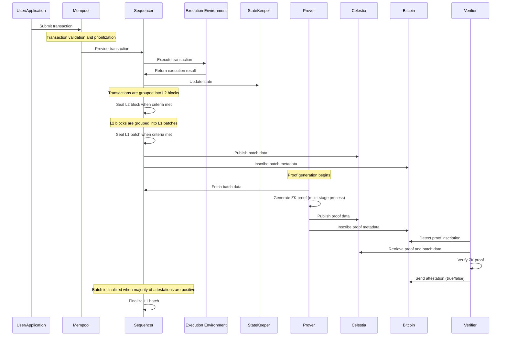
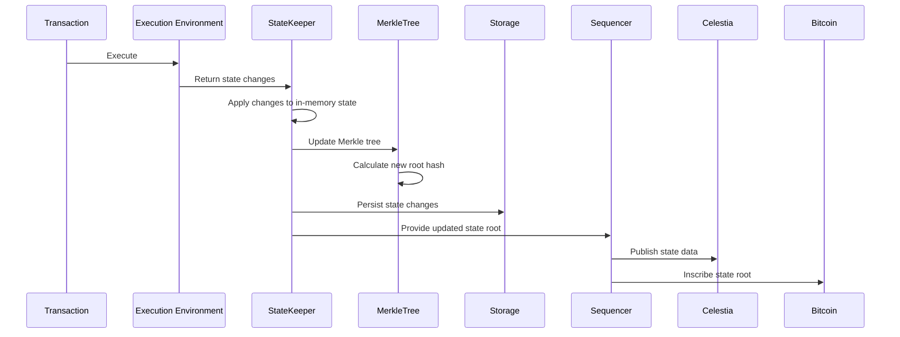
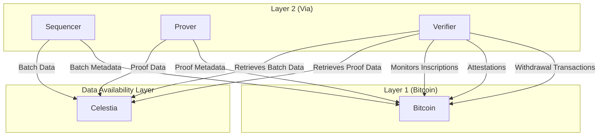
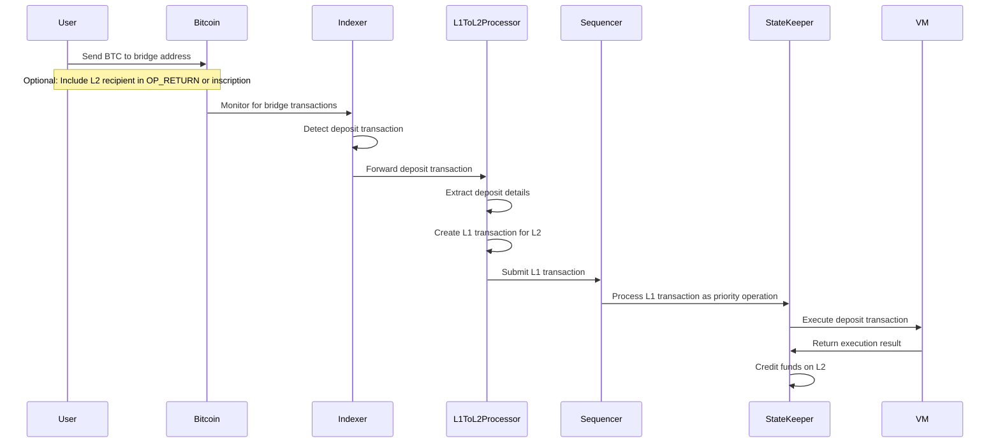
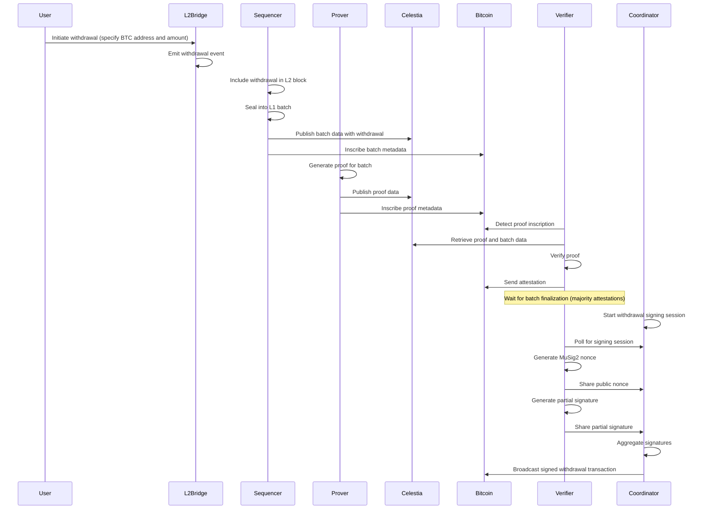
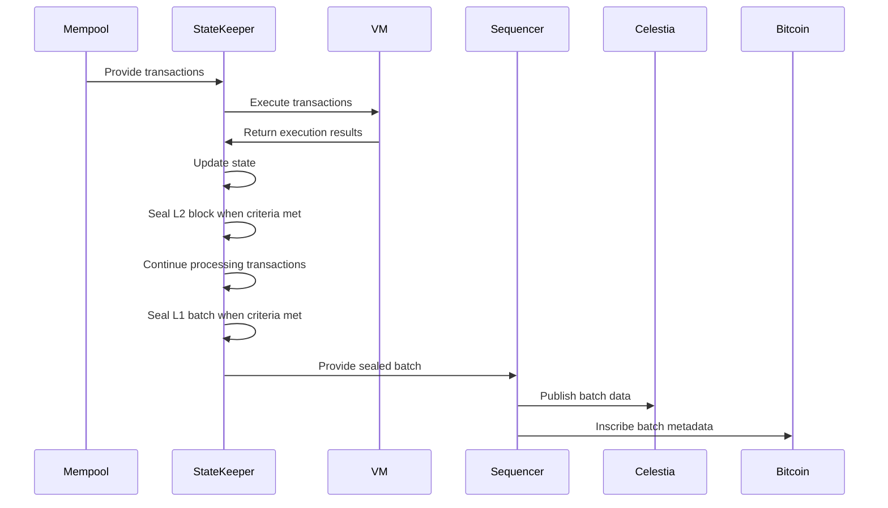
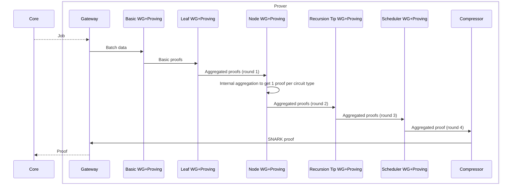

# Via L2 Bitcoin ZK-Rollup: Workflow Analysis

This document provides a detailed analysis of the key workflows and processes in the Via L2 Bitcoin ZK-Rollup system, including transaction lifecycle, state updates, data flow between layers, and deposit/withdrawal processes.

## 1. Transaction Lifecycle

The transaction lifecycle in Via L2 encompasses the complete journey of a transaction from submission to finality on both L2 and L1.

### 1.1 End-to-End Transaction Flow



### 1.2 Transaction Submission and Mempool

1. **Transaction Creation**: Users create and sign transactions
2. **Submission**: Transactions are submitted to the RPC API
3. **Mempool Ingestion**: The mempool validates and stores pending transactions
4. **Prioritization**: Transactions are ordered based on:
   - Priority (L1 transactions have higher priority than L2 transactions)
   - Gas price and other economic factors
   - Nonce ordering for transactions from the same account

### 1.3 Transaction Execution

1. **Transaction Selection**: The State Keeper requests transactions from the mempool
2. **VM Execution**: Transactions are executed in the VM:
   - The transaction is pushed to the bootloader memory
   - The bootloader executes the transaction
   - The VM tracks all state changes and events
3. **Execution Result**: The VM returns the execution result, including:
   - Success or failure status
   - Gas used
   - State changes
   - Events emitted
   - L2-to-L1 messages

### 1.4 Block and Batch Creation

1. **L2 Block Sealing**: L2 blocks are sealed based on criteria such as:
   - Time-based sealing (after a configurable time interval)
   - Size-based sealing (when reaching a maximum payload size)

2. **L1 Batch Sealing**: L1 batches (aggregating multiple L2 blocks) are sealed based on:
   - Slots criterion (maximum number of transactions)
   - Gas criterion (maximum gas used)
   - Pubdata bytes criterion (maximum pubdata size)
   - Circuits criterion (constraints related to proving circuit capacity)
   - Transaction encoding size criterion (maximum encoding size)
   - Time-based criterion (maximum time a batch can remain open)

### 1.5 Proof Generation

The proof generation is a multi-stage process:

1. **Job Acquisition**: The Prover Gateway polls the Core API to get a new batch to prove
2. **Basic Witness Generation**: Generates basic circuits (up to 2400 circuits) for the batch
3. **Leaf Aggregation**: Aggregates basic circuits into leaf aggregation circuits (up to 48 circuits)
4. **Node Aggregation**: Aggregates leaf circuits into node aggregation circuits
5. **Recursion Tip**: Further aggregates proofs
6. **Scheduler**: Produces the final aggregated proof
7. **Compression**: Compresses the proof for submission to L1
8. **Proof Submission**: The Prover Gateway submits the final proof back to the Core

### 1.6 Verification and Finalization

1. **Proof Detection**: Verifiers detect new proof inscriptions on Bitcoin
2. **Data Retrieval**: Verifiers retrieve proof and batch data from Celestia
3. **Proof Verification**: Verifiers perform batch ZK proof verification
4. **Attestation**: Verifiers send attestation inscriptions to Bitcoin (true/false)
5. **Finalization**: Once a majority of attestations indicate the proof is valid, the L1 batch is considered final

## 2. State Update Process

The state update process describes how the L2 state is maintained, updated, and committed to L1.

### 2.1 State Representation

The state in Via L2 is represented as a key-value store:
- **Keys**: Storage slots, consisting of an address (20 bytes) and a key (32 bytes)
- **Values**: 32-byte values stored in those slots

Each storage slot is uniquely identified by its hashed key, which is computed as the Keccak-256 hash of the address and key.

### 2.2 State Update Workflow



### 2.3 State Update Steps

1. **Transaction Execution**: The VM executes transactions and produces state changes
2. **State Diff Application**: The State Keeper applies these changes to the in-memory state
3. **Merkle Tree Update**: The Merkle tree is updated with the new state
4. **Root Calculation**: A new Merkle root is calculated, serving as a cryptographic commitment to the state
5. **Persistence**: State changes are persisted to the database
6. **L1 Commitment**: The state root is committed to L1 through batch inscriptions

### 2.4 State Versioning

The state is versioned by L1 batch number. Each L1 batch creates a new version of the state, which is committed to the Merkle tree. This allows for efficient verification of state transitions and generation of proofs.

## 3. Data Flow Between Layers

The Via L2 system involves data flow between three distinct layers: L1 (Bitcoin), L2 (Via), and the Data Availability (DA) layer (Celestia).

### 3.1 Data Flow Overview



### 3.2 L2 to DA Layer (Celestia)

1. **Batch Data Publication**:
   - The Sequencer publishes L2 batch data to Celestia
   - Data is wrapped in a Celestia `Blob` with the Via namespace
   - A commitment is generated from the blob
   - The blob is submitted to Celestia with a transaction configuration
   - A blob ID is created by concatenating the block height and commitment

2. **Proof Data Publication**:
   - The Prover publishes proof data to Celestia
   - The same process is followed as for batch data
   - The blob ID is stored in the database

3. **Data Retrieval**:
   - Verifiers retrieve batch and proof data from Celestia using blob IDs
   - The blob ID is decoded to extract the block height and commitment
   - The blob is retrieved from Celestia using these parameters

### 3.3 L2 to L1 (Bitcoin)

1. **Batch Metadata Inscription**:
   - The Sequencer inscribes batch metadata on Bitcoin
   - Metadata includes the batch number, state root, and blob ID
   - Inscriptions are created using the `ViaBtcInscriptionManager`

2. **Proof Metadata Inscription**:
   - The Prover inscribes proof metadata on Bitcoin
   - Metadata includes the batch number, proof hash, and blob ID
   - Inscriptions follow the same process as batch metadata

3. **Attestation Inscription**:
   - Verifiers inscribe attestations on Bitcoin
   - Attestations indicate whether a proof is valid or not
   - Once a majority of attestations indicate a proof is valid, the batch is finalized

4. **Withdrawal Transactions**:
   - The Verifier Network broadcasts signed withdrawal transactions to Bitcoin
   - Transactions include an OP_RETURN output with the proof transaction ID
   - Transactions are signed using MuSig2

### 3.4 L1 to L2 (Bitcoin to Via)

1. **Deposit Detection**:
   - The `BitcoinInscriptionIndexer` monitors the Bitcoin blockchain for transactions sent to the bridge address
   - Deposits are identified by checking if the transaction has an output to the bridge address and does not contain a withdrawal OP_RETURN

2. **Deposit Processing**:
   - The `L1ToL2MessageProcessor` extracts L1ToL2 messages from Bitcoin transactions
   - It creates L1 transactions for the L2 system
   - These transactions are inserted into the database for processing by the sequencer

## 4. Deposit Flow (L1→L2)

The deposit flow enables users to transfer assets from Bitcoin (L1) to the Via L2 rollup.

### 4.1 Deposit Process



### 4.2 Deposit Types

The system supports two types of deposits:

1. **Inscription-based deposits**: Using Bitcoin inscriptions to include additional metadata
2. **OP_RETURN-based deposits**: Using OP_RETURN outputs to specify the L2 recipient address

### 4.3 Deposit Detection and Processing

1. **Detection**:
   ```rust
   // Extract important transactions from a block
   fn extract_important_transactions(
       &self,
       transactions: &[BitcoinTransaction],
   ) -> (
       Option<Vec<BitcoinTransaction>>,
       Option<Vec<BitcoinTransaction>>,
   ) {
       // ...
       let bridge_txs: Vec<BitcoinTransaction> = transactions
           .iter()
           .filter(|tx| {
               // Check if bridge address is in outputs (deposit destination)
               tx.output.iter().any(|output| {
                   let script_pubkey = &output.script_pubkey;
                   script_pubkey == &self.bridge_address.script_pubkey()
               }) && !tx.output.iter().any(|output| {
                   if output.script_pubkey.is_op_return() {
                       // Extract OP_RETURN data
                       if let Some(op_return_data) = output.script_pubkey.as_bytes().get(2..) {
                           // Return true if it starts with withdrawal prefix (which will be negated)
                           op_return_data.starts_with(b"VIA_PROTOCOL:WITHDRAWAL")
                       } else {
                           false
                       }
                   } else {
                       false // Not an OP_RETURN output
                   }
               })
           })
           .cloned()
           .collect();
       // ...
   }
   ```

2. **Processing**:
   ```rust
   fn create_l1_tx_from_message(
       &self,
       tx_id: H256,
       serial_id: PriorityOpId,
       msg: &L1ToL2Message,
   ) -> Result<L1ToL2Transaction, MessageProcessorError> {
       let amount = msg.amount.to_sat() as i64;
       let eth_address_l2 = msg.input.receiver_l2_address;
       let calldata = msg.input.call_data.clone();

       let mantissa = U256::from(10_000_000_000u64); // Eth 18 decimals - BTC 8 decimals
       let value = U256::from(amount) * mantissa;
       // ...
       
       // Create L1 transaction for L2 processing
       let mut l1_tx = L1Tx {
           execute: Execute {
               contract_address: eth_address_l2,
               calldata: calldata.clone(),
               value: U256::zero(),
               factory_deps: vec![],
           },
           common_data: L1TxCommonData {
               sender: eth_address_l2,
               serial_id,
               // ...
               to_mint: value,
               refund_recipient: eth_address_l2,
               eth_block: msg.common.block_height as u64,
           },
           received_timestamp_ms: unix_timestamp_ms(),
       };
       // ...
   }
   ```

## 5. Withdrawal Flow (L2→L1)

The withdrawal flow enables users to transfer assets from the Via L2 rollup back to Bitcoin (L1).

### 5.1 Withdrawal Process



### 5.2 Withdrawal Initiation

1. **User Initiates Withdrawal**: The user calls the L2 bridge contract with:
   - The Bitcoin recipient address
   - The amount to withdraw

2. **Event Emission**: The L2 contract emits a log that is included in the L2 batch data

### 5.3 Withdrawal Detection and Processing

1. **Withdrawal Detection**:
   ```rust
   pub async fn get_withdrawals(&self, blob_id: &str) -> anyhow::Result<Vec<WithdrawalRequest>> {
       let pubdata_bytes = self.fetch_pubdata(blob_id).await?;
       let pubdata = Pubdata::decode_pubdata(pubdata_bytes)?;
       let l2_bridge_metadata = WithdrawalClient::list_l2_bridge_metadata(&pubdata);
       let withdrawals = WithdrawalClient::get_valid_withdrawals(self.network, l2_bridge_metadata);
       Ok(withdrawals)
   }
   ```

2. **Withdrawal Session Creation**:
   ```rust
   async fn session(&self) -> anyhow::Result<Option<SessionOperation>> {
       // Get the l1 batches finalized but withdrawals not yet processed
       let l1_batches = self
           .master_connection_pool
           .connection_tagged("withdrawal session")
           .await?
           .via_votes_dal()
           .list_finalized_blocks_and_non_processed_withdrawals()
           .await?;
       
       // ...
       
       // Create unsigned transaction for withdrawals
       let unsigned_tx = self
           .create_unsigned_tx(withdrawals_to_process, proof_txid)
           .await?;
       
       // ...
   }
   ```

### 5.4 MuSig2 Signing Process

1. **Session Initialization**: The Coordinator initiates a signing session
2. **Nonce Generation**: Verifiers generate and share their public nonces
3. **Partial Signature Generation**: Verifiers generate and share partial signatures
4. **Signature Aggregation**: The Coordinator aggregates partial signatures into a final signature
5. **Transaction Broadcasting**: The Coordinator broadcasts the signed transaction to Bitcoin

### 5.5 Bitcoin Transaction Structure

The final Bitcoin withdrawal transaction has the following structure:

1. **Inputs**: One or more UTXOs from the bridge address (MuSig2 multi-signature address)
2. **Outputs**:
   - **Withdrawal Outputs**: One output for each unique recipient address
   - **OP_RETURN Output**: Contains the prefix "VIA_PROTOCOL:WITHDRAWAL:" followed by the proof transaction ID
   - **Change Output** (optional): Returns any excess funds back to the bridge address
3. **Witness**: The aggregated MuSig2 signature with the SIGHASH_ALL flag

## 6. Batch Processing and Proof Generation

### 6.1 Batch Processing Flow



### 6.2 Proof Generation Flow



### 6.3 Witness Generation Process

1. **Basic Circuits Witness Generator**:
   - Generates basic circuits (circuits like `Main VM` - up to 50 * 48 = 2400 circuits)
   - Input table: `basic_circuit_witness_jobs`
   - Output table: `leaf_aggregation_jobs`
   - Aggregation round: 0

2. **Leaf Aggregation Witness Generator**:
   - Generates leaf aggregation circuits (up to 48 circuits of type `LeafAggregation`)
   - Input table: `leaf_aggregation_jobs`
   - Output table: `node_aggregation_jobs`
   - Aggregation round: 1

3. **Node Aggregation Witness Generator**:
   - Generates one circuit of type `NodeAggregation`
   - Input table: `leaf_aggregation_jobs`
   - Aggregation round: 2

4. **Scheduler Witness Generator**:
   - Generates one circuit of type `Scheduler`
   - Input table: `scheduler_witness_jobs`
   - Aggregation round: 3

### 6.4 Circuit Proving Process

For each witness generated, the following steps occur:
1. **Witness Vector Generation**: The witness vector generator builds a witness vector from the witness data
2. **Circuit Proving**: The circuit prover (GPU-accelerated) generates a proof using the witness vector
3. **Proof Storage**: The generated proof is stored for the next aggregation round

### 6.5 Proof Compression

The final step in the proving process is proof compression:
1. The proof compressor takes the final aggregated proof from the scheduler
2. It compresses the FRI proof to a Bellman proof that can be sent to L1 (Bitcoin)
3. The compressed proof is then sent back to the Core system via the Prover Gateway

## 7. Conclusion

The Via L2 Bitcoin ZK-Rollup system implements a comprehensive set of workflows that enable secure, efficient transaction processing, state management, and cross-chain asset transfers. The system's architecture separates concerns across different layers (L1, L2, and DA) while maintaining cryptographic guarantees through zero-knowledge proofs and multi-signature schemes.

Key workflows such as transaction processing, state updates, deposits, and withdrawals are carefully designed to leverage the strengths of each layer: Bitcoin's security, Celestia's data availability, and Via L2's execution capabilities. The proof generation and verification processes ensure that all state transitions are valid without requiring validators to re-execute all transactions.

These workflows collectively create a robust, scalable Layer 2 solution that extends Bitcoin's capabilities while inheriting its security guarantees.