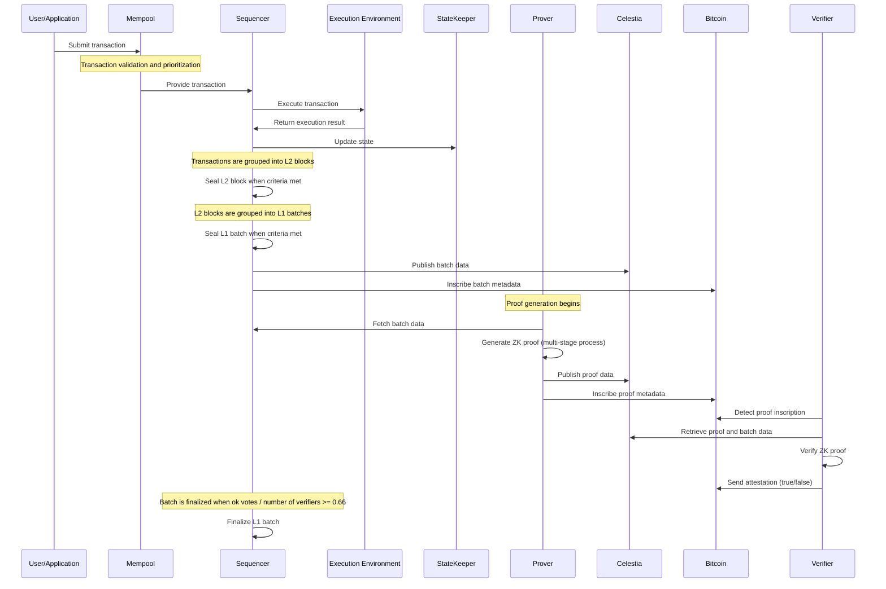
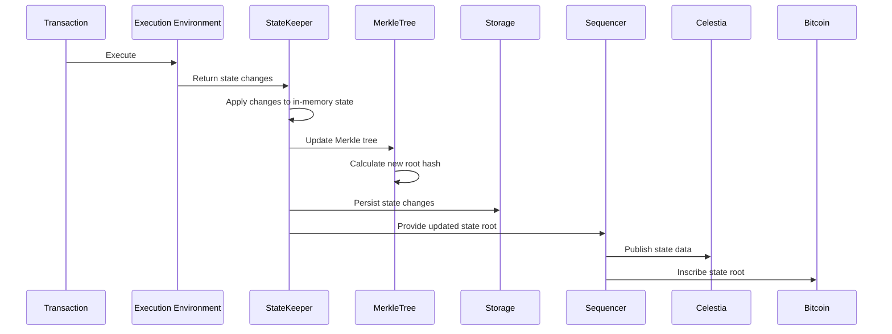
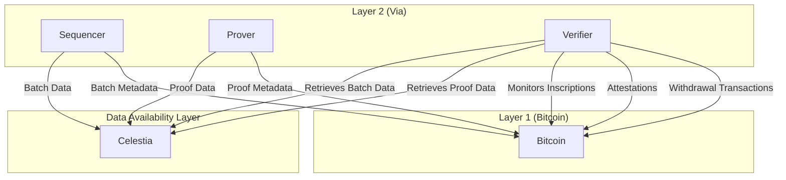
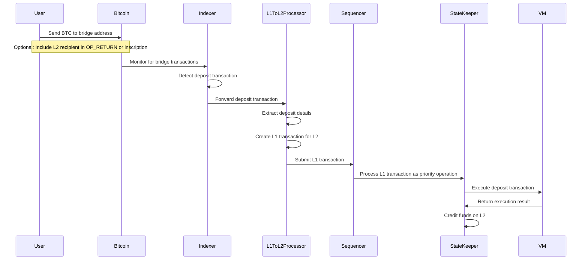
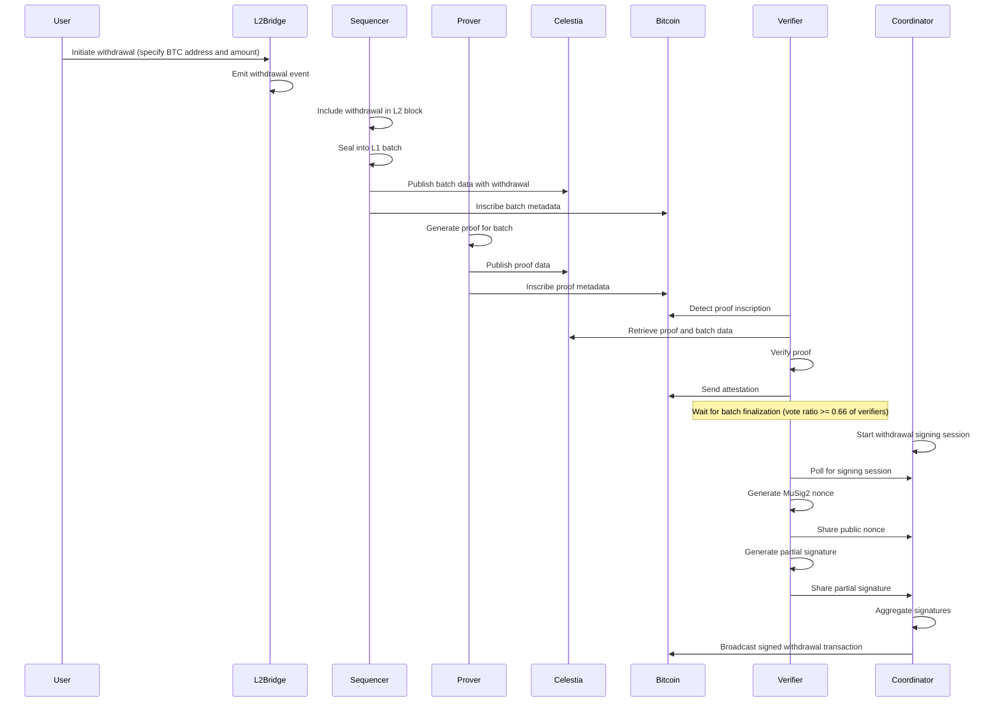
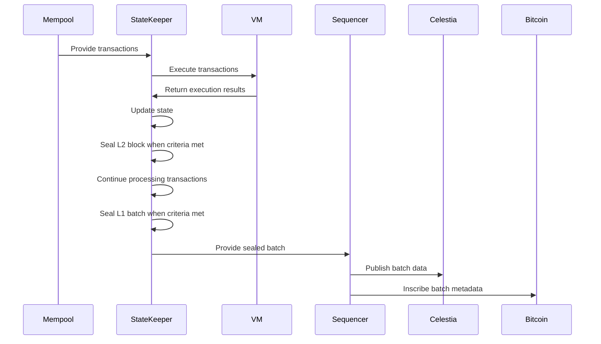
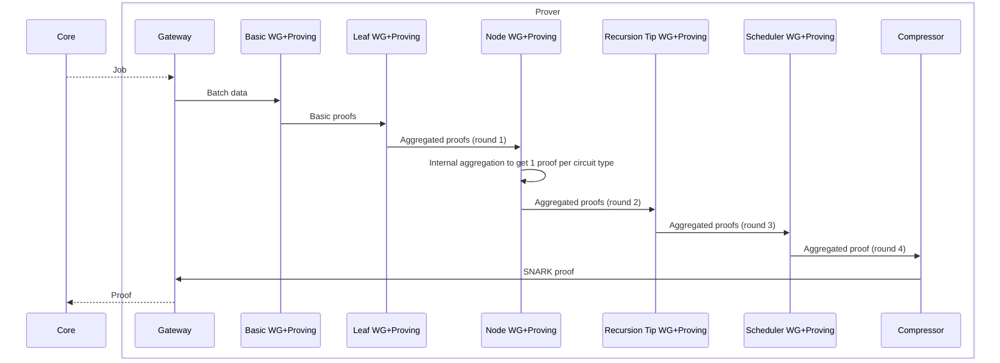

# Via L2 Bitcoin ZK-Rollup: Workflow Analysis

This document provides a detailed analysis of the key workflows and processes in the Via L2 Bitcoin ZK-Rollup system, including transaction lifecycle, state updates, data flow between layers, and deposit/withdrawal processes.

## 1. Transaction Lifecycle

The transaction lifecycle in Via L2 encompasses the complete journey of a transaction from submission to finality on both L2 and L1.

### 1.1 End-to-End Transaction Flow


```mermaid
sequenceDiagram
    participant User as User/Application
    participant Mempool
    participant Sequencer
    participant VM as Execution Environment
    participant StateKeeper
    participant Prover
    participant Celestia
    participant Bitcoin
    participant Verifier

    User->>Mempool: Submit transaction
    Note over Mempool: Transaction validation and prioritization
    Mempool->>Sequencer: Provide transaction
    Sequencer->>VM: Execute transaction
    VM->>Sequencer: Return execution result
    Sequencer->>StateKeeper: Update state
    Note over Sequencer: Transactions are grouped into L2 blocks
    Sequencer->>Sequencer: Seal L2 block when criteria met
    Note over Sequencer: L2 blocks are grouped into L1 batches
    Sequencer->>Sequencer: Seal L1 batch when criteria met
    Sequencer->>Celestia: Publish batch data
    Sequencer->>Bitcoin: Inscribe batch metadata
    Note over Prover: Proof generation begins
    Prover->>Sequencer: Fetch batch data
    Prover->>Prover: Generate ZK proof (multi-stage process)
    Prover->>Celestia: Publish proof data
    Prover->>Bitcoin: Inscribe proof metadata
    Verifier->>Bitcoin: Detect proof inscription
    Verifier->>Celestia: Retrieve proof and batch data
    Verifier->>Verifier: Verify ZK proof
    Verifier->>Bitcoin: Send attestation (true/false)
    Note over Sequencer: Batch is finalized when ok votes / number of verifiers >= 0.66
    Sequencer->>Sequencer: Finalize L1 batch
```

### 1.2 Transaction Submission and Mempool

1. **Transaction Creation**: Users create and sign transactions
2. **Submission**: Transactions are submitted to the RPC API
3. **Mempool Ingestion**: The mempool validates and stores pending transactions
4. **Prioritization**: Transactions are ordered based on:
   - Priority (L1 transactions have higher priority than L2 transactions)
   - Gas price and other economic factors
   - Nonce ordering for transactions from the same account

### 1.3 Transaction Execution

1. **Transaction Selection**: The State Keeper requests transactions from the mempool
2. **VM Execution**: Transactions are executed in the VM:
   - The transaction is pushed to the bootloader memory
   - The bootloader executes the transaction
   - The VM tracks all state changes and events
3. **Execution Result**: The VM returns the execution result, including:
   - Success or failure status
   - Gas used
   - State changes
   - Events emitted
   - L2-to-L1 messages

### 1.4 Block and Batch Creation

1. **L2 Block Sealing**: L2 blocks are sealed based on criteria such as:
   - Time-based sealing (after a configurable time interval)
   - Size-based sealing (when reaching a maximum payload size)

2. **L1 Batch Sealing**: L1 batches (aggregating multiple L2 blocks) are sealed by the `SequencerSealer` using seven unsealed-transaction criteria, plus a time-based `TimeoutSealer`. The exact list from the code:

   ```rust
   // core/node/via_state_keeper/src/seal_criteria/conditional_sealer.rs
   fn default_sealers(config: &StateKeeperConfig) -> Vec<Box<dyn SealCriterion>> {
       vec![
           Box::new(criteria::SlotsCriterion),
           Box::new(criteria::PubDataBytesCriterion {
               max_pubdata_per_batch: config.max_pubdata_per_batch,
           }),
           Box::new(criteria::CircuitsCriterion),
           Box::new(criteria::TxEncodingSizeCriterion),
           Box::new(criteria::GasForBatchTipCriterion),
           Box::new(criteria::L1L2TxsCriterion),
           Box::new(criteria::L2L1LogsCriterion),
       ]
   }
   ```

   That is: slots (max transactions), pubdata bytes, circuits (proving capacity), transaction encoding size, gas for batch tip, L1-L2 transaction count, and L2-to-L1 log count. `TimeoutSealer` (same module, `core/node/via_state_keeper/src/seal_criteria/mod.rs`) additionally seals a batch when `block_commit_deadline_ms` has elapsed. There is no standalone "maximum gas used" criterion.

### 1.5 Proof Generation

The proof generation is a multi-stage process (stage descriptions and circuit counts per `prover/crates/bin/witness_generator/README.md` in via-core):

1. **Job Acquisition**: The Prover Gateway polls the Core API to get a new batch to prove
2. **Basic Witness Generation**: Generates basic circuits (up to 2400 circuits) for the batch
3. **Leaf Aggregation**: Aggregates basic circuits into leaf aggregation circuits (up to 48 circuits)
4. **Node Aggregation**: Aggregates leaf circuits into node aggregation circuits
5. **Recursion Tip**: Further aggregates proofs
6. **Scheduler**: Produces the final aggregated proof
7. **Compression**: Compresses the proof for submission to L1
8. **Proof Submission**: The Prover Gateway submits the final proof back to the Core

### 1.6 Verification and Finalization

1. **Proof Detection**: Verifiers detect new proof inscriptions on Bitcoin
2. **Data Retrieval**: Verifiers retrieve proof and batch data from Celestia
3. **Proof Verification**: Verifiers perform batch ZK proof verification
4. **Attestation**: Each verifier inscribes a `ValidatorAttestation` message on Bitcoin (`Vote::Ok` or `Vote::NotOk`), built by `ViaVoteInscription` in `via_verifier/node/via_btc_sender/src/btc_vote_inscription.rs`:

   ```rust
   // via_verifier/node/via_btc_sender/src/btc_vote_inscription.rs
   pub fn construct_voting_inscription_message(
       &self,
       vote: bool,
       tx_id: Vec<u8>,
   ) -> anyhow::Result<InscriptionMessage> {
       let attestation = if vote { Vote::Ok } else { Vote::NotOk };

       // Convert H256 bytes to Txid
       let txid = Self::h256_to_txid(&tx_id)?;

       let input = ValidatorAttestationInput {
           reference_txid: txid,
           attestation,
       };
       Ok(InscriptionMessage::ValidatorAttestation(input))
   }
   ```

5. **Finalization**: The batch is finalized when the vote ratio over the total number of registered verifiers reaches `BATCH_FINALIZATION_THRESHOLD` (`pub const BATCH_FINALIZATION_THRESHOLD: f64 = 0.66;` in `core/lib/via_consensus/src/consensus.rs`), not a simple majority. The decision logic lives in the verifier DAL:

   ```rust
   // via_verifier/lib/verifier_dal/src/via_votes_dal.rs (finalize_transaction_if_needed, core logic)
   let (not_ok_votes, ok_votes, _total_votes) = self.get_vote_count(id).await?;

   let mut current_threshold = (ok_votes as f64) / (number_of_verifiers as f64);
   let mut is_finalized = true;
   if not_ok_votes > ok_votes {
       current_threshold = (not_ok_votes as f64) / (number_of_verifiers as f64);
       is_finalized = false;
   }
   let is_threshold_reached = current_threshold >= threshold;
   if !is_threshold_reached {
       return Ok(false);
   }
   ```

   `finalize_transaction_if_needed` is called with `BATCH_FINALIZATION_THRESHOLD` and `indexer.get_number_of_verifiers()` from two places: the verifier's own ZK verification loop (`via_verifier/node/via_zk_verifier/src/lib.rs`) and the verifier's btc_watch when it observes new attestation inscriptions (`via_verifier/node/via_btc_watch/src/message_processors/verifier.rs`). It also refuses to finalize before the local ZK verification has completed (`l1_batch_status` must be set).

## 2. State Update Process

The state update process describes how the L2 state is maintained, updated, and committed to L1.

### 2.1 State Representation

The state in Via L2 is represented as a key-value store:
- **Keys**: Storage slots, consisting of an address (20 bytes) and a key (32 bytes)
- **Values**: 32-byte values stored in those slots

Each storage slot is uniquely identified by its hashed key, which is computed as the Keccak-256 hash of the address and key.

### 2.2 State Update Workflow


```mermaid
sequenceDiagram
    participant Tx as Transaction
    participant VM as Execution Environment
    participant StateKeeper
    participant MerkleTree
    participant Storage
    participant Sequencer
    participant Celestia
    participant Bitcoin

    Tx->>VM: Execute
    VM->>StateKeeper: Return state changes
    StateKeeper->>StateKeeper: Apply changes to in-memory state
    StateKeeper->>MerkleTree: Update Merkle tree
    MerkleTree->>MerkleTree: Calculate new root hash
    StateKeeper->>Storage: Persist state changes
    StateKeeper->>Sequencer: Provide updated state root
    Sequencer->>Celestia: Publish state data
    Sequencer->>Bitcoin: Inscribe state root
```

### 2.3 State Update Steps

1. **Transaction Execution**: The VM executes transactions and produces state changes
2. **State Diff Application**: The State Keeper applies these changes to the in-memory state
3. **Merkle Tree Update**: The Merkle tree is updated with the new state
4. **Root Calculation**: A new Merkle root is calculated, serving as a cryptographic commitment to the state
5. **Persistence**: State changes are persisted to the database
6. **L1 Commitment**: The state root is committed to L1 through batch inscriptions

### 2.4 State Versioning

The state is versioned by L1 batch number. Each L1 batch creates a new version of the state, which is committed to the Merkle tree. This allows for efficient verification of state transitions and generation of proofs.

## 3. Data Flow Between Layers

The Via L2 system involves data flow between three distinct layers: L1 (Bitcoin), L2 (Via), and the Data Availability (DA) layer (Celestia).

### 3.1 Data Flow Overview


```mermaid
graph TD
    subgraph "Layer 2 (Via)"
        Sequencer
        Prover
        Verifier
    end
    
    subgraph "Data Availability Layer"
        Celestia
    end
    
    subgraph "Layer 1 (Bitcoin)"
        Bitcoin
    end
    
    Sequencer -->|Batch Data| Celestia
    Sequencer -->|Batch Metadata| Bitcoin
    Prover -->|Proof Data| Celestia
    Prover -->|Proof Metadata| Bitcoin
    Verifier -->|Retrieves Batch Data| Celestia
    Verifier -->|Retrieves Proof Data| Celestia
    Verifier -->|Monitors Inscriptions| Bitcoin
    Verifier -->|Attestations| Bitcoin
    Verifier -->|Withdrawal Transactions| Bitcoin
```

### 3.2 L2 to DA Layer (Celestia)

1. **Batch Data Publication**:
   - The `ViaDataAvailabilityDispatcher` (`core/node/via_da_dispatcher/src/da_dispatcher.rs`) publishes L1 batch pubdata to Celestia
   - Pubdata larger than 500 KiB is split into chunks before dispatch:

   ```rust
   // core/node/via_da_dispatcher/src/da_dispatcher.rs
   const BLOB_CHUNK_SIZE: usize = 500 * 1024;

   /// Dispatches the blobs to the data availability layer, and saves the blob_id in the database.
   async fn dispatch(&self) -> anyhow::Result<()> {
       let mut conn = self.pool.connection_tagged("via_da_dispatcher").await?;
       if self.is_rollback_required(&mut conn).await? {
           return Ok(());
       }

       let batches = conn
           .via_data_availability_dal()
           .get_ready_for_da_dispatch_l1_batches(self.config.max_rows_to_dispatch() as usize)
           .await?;
       drop(conn);

       for batch in batches {
           let chunks: Vec<Vec<u8>> = batch
               .pubdata
               .clone()
               .chunks(BLOB_CHUNK_SIZE)
               .map(|chunk| chunk.to_vec())
               .collect();

           self._dispatch_chunks(batch.l1_batch_number, chunks, false, "da_dispatcher")
               .await?;

           METRICS
               .last_dispatched_l1_batch
               .set(batch.l1_batch_number.0 as usize);
           METRICS.blob_size.observe(batch.pubdata.len());
       }

       Ok(())
   }
   ```

   - The blob ID is the hex encoding of `[8]byte block height ++ [32]byte commitment` (see `parse_blob_id` in `core/lib/via_da_clients/src/celestia/client.rs`)

2. **Proof Data Publication**:
   - The Prover publishes proof data to Celestia
   - The same process is followed as for batch data
   - The blob ID is stored in the database

3. **Data Retrieval**:
   - Verifiers retrieve batch and proof data from Celestia using blob IDs
   - The blob ID is decoded to extract the block height and commitment
   - The blob is retrieved from Celestia using these parameters

### 3.3 L2 to L1 (Bitcoin)

1. **Batch and Proof Metadata Inscriptions**:
   - The `via_btc_sender` component inscribes two message types on Bitcoin: `L1BatchDAReference` (batch commit) and `ProofDAReference` (proof commit). The `ViaAggregator` selects ready batches into a `ViaAggregatedOperation` (`CommitL1BatchOnchain` or `CommitProofOnchain`) and constructs the inscription payload; `ViaBtcInscriptionManager` (`core/node/via_btc_sender/src/btc_inscription_manager.rs`) then sends the commit/reveal transactions:

   ```rust
   // core/node/via_btc_sender/src/aggregator.rs
   pub fn construct_inscription_message(
       &self,
       inscription_request_type: &ViaBtcInscriptionRequestType,
       batch: &ViaBtcL1BlockDetails,
   ) -> anyhow::Result<InscriptionMessage> {
       match inscription_request_type {
           ViaBtcInscriptionRequestType::CommitL1BatchOnchain => {
               let input = L1BatchDAReferenceInput {
                   l1_batch_hash: H256::from_slice(
                       batch
                           .hash
                           .as_ref()
                           .ok_or_else(|| anyhow!("Via l1 batch hash is None"))?,
                   ),
                   l1_batch_index: batch.number,
                   da_identifier: self.config.da_identifier().to_string(),
                   blob_id: batch.blob_id.clone(),
                   prev_l1_batch_hash: H256::from_slice(
                       batch
                           .prev_l1_batch_hash
                           .as_ref()
                           .ok_or_else(|| anyhow!("Via previous l1 batch hash is None"))?,
                   ),
               };
               Ok(InscriptionMessage::L1BatchDAReference(input))
           }
           ViaBtcInscriptionRequestType::CommitProofOnchain => {
               let input = ProofDAReferenceInput {
                   l1_batch_reveal_txid: batch.reveal_tx_id,
                   da_identifier: self.config.da_identifier().to_string(),
                   blob_id: batch.blob_id.clone(),
               };
               Ok(InscriptionMessage::ProofDAReference(input))
           }
       }
   }
   ```

   - The batch inscription carries the L1 batch hash, batch index, previous batch hash, DA identifier, and blob ID; the proof inscription carries the batch reveal txid, DA identifier, and blob ID

3. **Attestation Inscription**:
   - Verifiers inscribe `ValidatorAttestation` messages on Bitcoin (`Vote::Ok` / `Vote::NotOk`), referencing the proof reveal txid
   - Once the vote ratio over the registered verifier set reaches `BATCH_FINALIZATION_THRESHOLD = 0.66`, the batch is finalized (see section 1.6)

4. **Withdrawal Transactions**:
   - The Verifier Network broadcasts signed withdrawal transactions to Bitcoin
   - Transactions include an OP_RETURN output starting with the prefix `VIA_WI` followed by a version byte and the withdrawal identifiers (see section 5.5)
   - Transactions are signed using MuSig2 (one signing session per taproot input)

### 3.4 L1 to L2 (Bitcoin to Via)

1. **Deposit Detection**:
   - The `BitcoinInscriptionIndexer` (`core/lib/via_btc_client/src/indexer/mod.rs`) monitors the Bitcoin blockchain and collects any transaction with an output paying the bridge address
   - The message parser then classifies each bridge transaction; a transaction whose OP_RETURN starts with a protocol prefix (`VIA_WI` withdrawal or a `VIA_PROTOCOL:*` governance prefix) is rejected as a deposit by `parse_op_return_deposit` in `core/lib/via_btc_client/src/indexer/parser.rs`

2. **Deposit Processing**:
   - The `L1ToL2MessageProcessor` (`core/node/via_btc_watch/src/message_processors/l1_to_l2.rs`) converts each `L1ToL2Message` into a `ViaL1Deposit` and then an `L1Tx`
   - These transactions are inserted into the database via `via_transactions_dal().insert_transaction_l1` for processing by the sequencer

## 4. Deposit Flow (L1→L2)

The deposit flow enables users to transfer assets from Bitcoin (L1) to the Via L2 rollup.

### 4.1 Deposit Process


```mermaid
sequenceDiagram
    participant User
    participant Bitcoin
    participant Indexer
    participant L1ToL2Processor
    participant Sequencer
    participant StateKeeper
    participant VM

    User->>Bitcoin: Send BTC to bridge address
    Note over User, Bitcoin: Optional: Include L2 recipient in OP_RETURN or inscription
    Bitcoin->>Indexer: Monitor for bridge transactions
    Indexer->>Indexer: Detect deposit transaction
    Indexer->>L1ToL2Processor: Forward deposit transaction
    L1ToL2Processor->>L1ToL2Processor: Extract deposit details
    L1ToL2Processor->>L1ToL2Processor: Create L1 transaction for L2
    L1ToL2Processor->>Sequencer: Submit L1 transaction
    Sequencer->>StateKeeper: Process L1 transaction as priority operation
    StateKeeper->>VM: Execute deposit transaction
    VM->>StateKeeper: Return execution result
    StateKeeper->>StateKeeper: Credit funds on L2
```

### 4.2 Deposit Types

The system supports two types of deposits:

1. **Inscription-based deposits**: Using Bitcoin inscriptions to include additional metadata
2. **OP_RETURN-based deposits**: Using OP_RETURN outputs to specify the L2 recipient address

### 4.3 Deposit Detection and Processing

1. **Detection**: `extract_important_transactions` splits each block's transactions into sequencer/verifier system transactions, bridge (deposit) transactions, and governance transactions. Note that the withdrawal-OP_RETURN exclusion happens later in the parser, not here:

   ```rust
   // core/lib/via_btc_client/src/indexer/mod.rs
   fn extract_important_transactions(
       &self,
       transactions: &[BitcoinTransaction],
   ) -> SystemTransactions {
       // We only care about the transactions that sequencer, verifiers are sending and the bridge is receiving
       let system_txs: Vec<TransactionWithMetadata> = transactions
           .iter()
           .enumerate()
           .filter_map(|(tx_index, tx)| {
               let is_valid = tx.input.iter().any(|input| {
                   if let Some(btc_address) = self.parser.parse_p2wpkh(&input.witness) {
                       btc_address == self.wallets.sequencer
                           || self.wallets.verifiers.contains(&btc_address)
                   } else {
                       false
                   }
               });

               if is_valid {
                   Some(TransactionWithMetadata::new(tx.clone(), tx_index))
               } else {
                   None
               }
           })
           .collect();

       let bridge_txs: Vec<TransactionWithMetadata> = transactions
           .iter()
           .enumerate()
           .filter_map(|(tx_index, tx)| {
               let is_bridge_output = tx
                   .output
                   .iter()
                   .any(|output| output.script_pubkey == self.wallets.bridge.script_pubkey());

               if is_bridge_output {
                   Some(TransactionWithMetadata::new(tx.clone(), tx_index))
               } else {
                   None
               }
           })
           .collect();

       let governance_txs: Vec<TransactionWithMetadata> = transactions
           .iter()
           .enumerate()
           .filter_map(|(tx_index, tx)| {
               let is_bridge_output = tx
                   .output
                   .iter()
                   .any(|output| output.script_pubkey == self.wallets.governance.script_pubkey());

               if is_bridge_output {
                   Some(TransactionWithMetadata::new(tx.clone(), tx_index))
               } else {
                   None
               }
           })
           .collect();

       SystemTransactions {
           system_txs,
           bridge_txs,
           governance_txs,
       }
   }
   ```

2. **Processing**: `L1ToL2MessageProcessor` first deduplicates by Bitcoin txid, then builds a `ViaL1Deposit` and asks it for an `L1Tx`:

   ```rust
   // core/node/via_btc_watch/src/message_processors/l1_to_l2.rs
   fn create_l1_tx_from_message(
       &self,
       msg: &L1ToL2Message,
   ) -> Result<Option<L1Tx>, MessageProcessorError> {
       let deposit = ViaL1Deposit {
           l2_receiver_address: msg.input.receiver_l2_address,
           amount: msg.amount.to_sat(),
           calldata: msg.input.call_data.clone(),
           l1_block_number: msg.common.block_height as u64,
           tx_index: msg.common.tx_index.ok_or_else(|| {
               MessageProcessorError::Internal(anyhow::anyhow!("deposit missing tx_index"))
           })?,
           output_vout: msg.common.output_vout.ok_or_else(|| {
               MessageProcessorError::Internal(anyhow::anyhow!("deposit missing output_vout"))
           })?,
       };

       if let Some(l1_tx) = deposit.l1_tx() {
           tracing::info!(
               "Created L1 transaction with serial id {:?} (block {}) with deposit amount {} and tx hash {}",
               l1_tx.common_data.serial_id,
               l1_tx.common_data.eth_block,
               deposit.amount,
               l1_tx.common_data.canonical_tx_hash,
           );
           return Ok(Some(l1_tx));
       }
       Ok(None)
   }
   ```

3. **Deposit validation and value conversion**: `ViaL1Deposit` rejects deposits to system-contract addresses and deposits too small to cover the fixed L2 gas cost, converts satoshis to 18-decimal units, and derives a deterministic priority id from the Bitcoin block number, transaction index, and output vout:

   ```rust
   // core/lib/types/src/l1/via_l1.rs
   /// Eth 18 decimals - BTC 8 decimals
   const MANTISSA: u64 = 10_000_000_000;

   /// Deposit default L2 gas price.
   const MAX_FEE_PER_GAS: u64 = 120_000_000;

   /// Gas limit to required to execute a deposit.
   const GAS_LIMIT: u64 = 300_000;

   /// Max system contracts kernel space address.
   const MAX_SYSTEM_CONTRACT_ADDRESS: &str = "0x000000000000000000000000000000000000ffff";

   impl ViaL1Deposit {
       pub fn is_valid_deposit(&self) -> bool {
           if self.l2_receiver_address <= H160::from_str(MAX_SYSTEM_CONTRACT_ADDRESS).unwrap() {
               return false;
           }

           // CHeck if the amount can cover the transaction cost.
           let gas_fee = U256::from(GAS_LIMIT) * U256::from(MAX_FEE_PER_GAS);
           self.value() >= gas_fee
       }

       pub fn l1_tx(&self) -> Option<L1Tx> {
           if !self.is_valid_deposit() {
               return None;
           }
           Some(L1Tx::from(self.clone()))
       }

       fn value(&self) -> U256 {
           U256::from(self.amount) * U256::from(MANTISSA)
       }

       pub fn priority_id(&self) -> PriorityOpId {
           PriorityOpId(
               ViaPriorityOpId::new(
                   self.l1_block_number,
                   self.tx_index as u64,
                   self.output_vout as u64,
               )
               .raw(),
           )
       }
   }
   ```

   The `From<ViaL1Deposit> for L1Tx` impl in the same file sets `serial_id: deposit.priority_id()`, `to_mint: value`, `refund_recipient: deposit.l2_receiver_address`, and `eth_block: deposit.l1_block_number`. The priority id bit layout is defined in `core/lib/types/src/l1/priority_id.rs`:

   ```rust
   // core/lib/types/src/l1/priority_id.rs
   /// VIA priorityId
   /// 28 bits for block (268M blocks = 5,100 years when block time = 10min)
   /// 20 bits for tx_index (1M transactions per block)
   /// 16 bits for vout (65k outputs per transaction)
   impl ViaPriorityOpId {
       // Constants for bit field sizes
       const BLOCK_BITS: u32 = 28;
       const TX_INDEX_BITS: u32 = 20;
       const VOUT_BITS: u32 = 16;
       // ...
   }
   ```

## 5. Withdrawal Flow (L2→L1)

The withdrawal flow enables users to transfer assets from the Via L2 rollup back to Bitcoin (L1).

### 5.1 Withdrawal Process


```mermaid
sequenceDiagram
    participant User
    participant L2Bridge
    participant Sequencer
    participant Prover
    participant Celestia
    participant Bitcoin
    participant Verifier
    participant Coordinator

    User->>L2Bridge: Initiate withdrawal (specify BTC address and amount)
    L2Bridge->>L2Bridge: Emit withdrawal event
    Sequencer->>Sequencer: Include withdrawal in L2 block
    Sequencer->>Sequencer: Seal into L1 batch
    Sequencer->>Celestia: Publish batch data with withdrawal
    Sequencer->>Bitcoin: Inscribe batch metadata
    Prover->>Prover: Generate proof for batch
    Prover->>Celestia: Publish proof data
    Prover->>Bitcoin: Inscribe proof metadata
    Verifier->>Bitcoin: Detect proof inscription
    Verifier->>Celestia: Retrieve proof and batch data
    Verifier->>Verifier: Verify proof
    Verifier->>Bitcoin: Send attestation
    Note over Verifier: Wait for batch finalization (vote ratio >= 0.66 of verifiers)
    Coordinator->>Coordinator: Start withdrawal signing session
    Verifier->>Coordinator: Poll for signing session
    Verifier->>Verifier: Generate MuSig2 nonce
    Verifier->>Coordinator: Share public nonce
    Verifier->>Verifier: Generate partial signature
    Verifier->>Coordinator: Share partial signature
    Coordinator->>Coordinator: Aggregate signatures
    Coordinator->>Bitcoin: Broadcast signed withdrawal transaction
```

### 5.2 Withdrawal Initiation

1. **User Initiates Withdrawal**: The user calls the L2 base token system contract (`L2_BASE_TOKEN_SYSTEM_CONTRACT_ADDR`) with:
   - The Bitcoin recipient address
   - The amount to withdraw

2. **Event Emission**: The contract emits a `Withdrawal(address,bytes,uint256)` event and an L2-to-L1 message, both of which end up in the batch pubdata. The withdrawal client filters node logs by exactly this topic:

   ```rust
   // via_verifier/lib/via_withdrawal_client/src/client.rs (get_withdrawal_logs_from_node, excerpt)
   let withdrawal_topic = H256::from_slice(&keccak256(b"Withdrawal(address,bytes,uint256)"));

   let filter = FilterBuilder::default()
       .set_from_block(BlockNumber::Number(start_block))
       .set_to_block(BlockNumber::Number(end_block))
       .set_address(vec![L2_BASE_TOKEN_SYSTEM_CONTRACT_ADDR
           .parse::<Address>()
           .unwrap()])
       .set_topics(Some(vec![withdrawal_topic]), None, None, None)
       .build();
   ```

### 5.3 Withdrawal Detection and Processing

1. **Withdrawal Detection**: `WithdrawalClient::get_withdrawals` cross-checks the pubdata fetched from the DA layer against the `Withdrawal` logs fetched from the L2 node for the same batch:

   ```rust
   // via_verifier/lib/via_withdrawal_client/src/client.rs
   pub async fn get_withdrawals(
       &self,
       blob_id: &str,
       l1_block_number: L1BatchNumber,
   ) -> anyhow::Result<Vec<WithdrawalRequest>> {
       let pubdata_bytes = self
           .fetch_pubdata(blob_id)
           .await
           .with_context(|| "Failed to fetch pubdata from DA")?;
       let pubdata = Pubdata::decode_pubdata(pubdata_bytes)?;
       let l2_bridge_metadata = WithdrawalClient::list_l2_bridge_metadata(&pubdata);
       let logs = self.get_withdrawal_logs_from_node(l1_block_number).await?;
       let withdrawals =
           WithdrawalClient::get_valid_withdrawals(self.network, l2_bridge_metadata, logs)?;
       Ok(withdrawals)
   }
   ```

2. **Withdrawal Indexing**: `WithdrawalSession::prepare_withdrawal_session` (`via_verifier/node/via_verifier_coordinator/src/sessions/withdrawal.rs`) walks the finalized L1 batches that have no bridge withdrawal yet and persists their withdrawal requests:

   ```rust
   // via_verifier/node/via_verifier_coordinator/src/sessions/withdrawal.rs
   pub async fn prepare_withdrawal_session(&self) -> anyhow::Result<()> {
       let mut storage = self
           .master_connection_pool
           .connection_tagged("verifier task")
           .await?;

       // Get the l1 batches finalized but withdrawals not yet processed
       let l1_batches = storage
           .via_withdrawal_dal()
           .list_finalized_blocks_with_no_bridge_withdrawal()
           .await?;

       if l1_batches.is_empty() {
           return Ok(());
       }

       tracing::info!(
           "Found {} finalized unprocessed L1 batch(es) with withdrawals waiting to be processed",
           l1_batches.len()
       );

       let mut transaction = storage.start_transaction().await?;

       for (batch_number, blob_id, proof_tx_id) in l1_batches.iter() {
           let withdrawals = self
               .withdrawal_client
               .get_withdrawals(blob_id, L1BatchNumber(batch_number.clone() as u32))
               .await?;

           transaction
               .via_withdrawal_dal()
               .insert_l1_batch_bridge_withdrawals(&proof_tx_id.clone())
               .await?;

           if !withdrawals.is_empty() {
               transaction
                   .via_withdrawal_dal()
                   .insert_withdrawals(&withdrawals)
                   .await?;
           }

           tracing::info!(
               "L1 batch number {} contains {} withdrawal requests",
               batch_number.clone(),
               withdrawals.len()
           );
       }

       transaction.commit().await?;

       Ok(())
   }
   ```

3. **Withdrawal Session Creation**: `WithdrawalSession::session` then picks up to `WITHDRAWAL_LIMIT = 7` unprocessed withdrawals of at least 660 sats and builds an unsigned bridge transaction with an OP_RETURN prefixed `VIA_WI` plus a version byte:

   ```rust
   // via_verifier/node/via_verifier_coordinator/src/sessions/withdrawal.rs
   const OP_RETURN_WITHDRAW_PREFIX: &[u8] = b"VIA_WI";
   const WITHDRAWAL_VERSION: WithdrawalVersion = WithdrawalVersion::Version0;
   const WITHDRAWAL_LIMIT: u32 = 7;

   async fn session(&self) -> anyhow::Result<Option<SessionOperation>> {
       let mut storage = self
           .master_connection_pool
           .connection_tagged("verifier task")
           .await?;

       // Set the minimum amount to withdraw + fee = 660 sats.
       let min_value = 660;

       let no_processed_withdrawals = storage
           .via_withdrawal_dal()
           .list_no_processed_withdrawals(min_value, WITHDRAWAL_LIMIT)
           .await?;

       if no_processed_withdrawals.is_empty() {
           tracing::debug!(
               "There are no withdrawal to process with a min_value {} sats",
               min_value
           );
           return Ok(None);
       }

       tracing::info!(
           "There are {} withdrawals not yet processed",
           no_processed_withdrawals.len()
       );

       let mut outputs = vec![];
       for w in no_processed_withdrawals {
           let mut op_return_data = Vec::new();
           op_return_data.extend_from_slice(&hex::decode(w.id)?);

           outputs.push(TransactionOutput {
               output: TxOut {
                   value: w.amount,
                   script_pubkey: w.receiver.script_pubkey(),
               },
               op_return_data: Some(op_return_data),
           });
       }

       let mut op_return_prefix = Vec::new();
       op_return_prefix.extend_from_slice(OP_RETURN_WITHDRAW_PREFIX);
       op_return_prefix.push(WITHDRAWAL_VERSION as u8);

       let config = TransactionBuilderConfig {
           fee_strategy: Arc::new(WithdrawalFeeStrategy::new()),
           max_tx_weight: MAX_STANDARD_TX_WEIGHT as u64,
           max_output_per_tx: WITHDRAWAL_LIMIT as usize,
           op_return_prefix,
           bridge_address: self.get_system_wallets().await?.bridge,
           default_fee_rate_opt: None,
           default_available_utxos_opt: None,
           op_return_data_input_opt: None,
       };

       let unsigned_txs = self
           .transaction_builder
           .build_transaction_with_op_return(outputs, config)
           .await?;

       if unsigned_txs.is_empty() {
           return Ok(None);
       }

       let sig_hashes = self
           .transaction_builder
           .get_tr_sighashes(&unsigned_txs[0])?;

       Ok(Some(SessionOperation::Withdrawal(
           unsigned_txs[0].clone(),
           sig_hashes,
       )))
   }
   ```

### 5.4 MuSig2 Signing Process

1. **Session Initialization**: The Coordinator initiates a signing session for the unsigned bridge transaction
2. **Per-Input Signers**: Each verifier keeps one MuSig2 `Signer` per taproot input (`signer_per_utxo_input: BTreeMap<usize, Signer>` in `via_verifier/node/via_verifier_coordinator/src/verifier/mod.rs`), because every input has its own sighash
3. **Nonce Generation**: Verifiers generate and share their public nonces (`start_signing_session` / `receive_nonce` in `via_verifier/lib/via_musig2/src/lib.rs`)
4. **Partial Signature Generation**: Verifiers generate and share partial signatures (`create_partial_signature` / `receive_partial_signature`)
5. **Signature Aggregation**: The Coordinator aggregates partial signatures into final signatures (`create_final_signature`)
6. **Transaction Broadcasting**: The Coordinator broadcasts the signed transaction to Bitcoin; `WithdrawalSession::after_broadcast_final_transaction` then records the bridge withdrawal txid and marks the included withdrawals as processed

### 5.5 Bitcoin Transaction Structure

The final Bitcoin withdrawal transaction has the following structure:

1. **Inputs**: One or more UTXOs from the bridge address (MuSig2 taproot address)
2. **Outputs**:
   - **Withdrawal Outputs**: One output per withdrawal request (capped at `WITHDRAWAL_LIMIT = 7` per transaction)
   - **OP_RETURN Output**: Contains the prefix `VIA_WI`, followed by a one-byte withdrawal version (`WithdrawalVersion::Version0`), followed by the withdrawal identifiers of the included withdrawals. The old `VIA_PROTOCOL:WITHDRAWAL:` + proof txid format only survives in an example binary (`via_verifier/lib/via_musig2/examples/coordinator.rs`); the production parser in `core/lib/via_btc_client/src/indexer/parser.rs` uses `const OP_RETURN_WITHDRAW_PREFIX: &[u8] = b"VIA_WI";`
   - **Change Output** (optional): Returns any excess funds back to the bridge address
3. **Witness**: One aggregated MuSig2 Schnorr signature per input, computed over the taproot key-spend sighash with `TapSighashType::All`:

   ```rust
   // via_verifier/lib/via_musig2/src/transaction_builder.rs
   pub fn get_tr_sighashes(&self, unsigned_tx: &UnsignedBridgeTx) -> Result<Vec<Vec<u8>>> {
       let mut sighash_cache = SighashCache::new(&unsigned_tx.tx);
       let sighash_type = TapSighashType::All;

       let txout_list: Vec<TxOut> = unsigned_tx
           .utxos
           .iter()
           .map(|(_, txout)| txout.clone())
           .collect();

       let mut sighashes = Vec::new();
       for (i, _) in txout_list.iter().enumerate() {
           let sighash = sighash_cache
               .taproot_key_spend_signature_hash(i, &Prevouts::All(&txout_list), sighash_type)
               .context("Error taproot_key_spend_signature_hash")?;
           sighashes.push(sighash.to_raw_hash().to_byte_array().to_vec());
       }

       Ok(sighashes)
   }
   ```

## 6. Batch Processing and Proof Generation

### 6.1 Batch Processing Flow


```mermaid
sequenceDiagram
    participant Mempool
    participant StateKeeper
    participant VM
    participant Sequencer
    participant Celestia
    participant Bitcoin

    Mempool->>StateKeeper: Provide transactions
    StateKeeper->>VM: Execute transactions
    VM->>StateKeeper: Return execution results
    StateKeeper->>StateKeeper: Update state
    StateKeeper->>StateKeeper: Seal L2 block when criteria met
    StateKeeper->>StateKeeper: Continue processing transactions
    StateKeeper->>StateKeeper: Seal L1 batch when criteria met
    StateKeeper->>Sequencer: Provide sealed batch
    Sequencer->>Celestia: Publish batch data
    Sequencer->>Bitcoin: Inscribe batch metadata
```

### 6.2 Proof Generation Flow


```mermaid
sequenceDiagram
    participant Core
    box Prover
    participant Gateway
    participant BasicWG as Basic WG+Proving
    participant LeafWG as Leaf WG+Proving
    participant NodeWG as Node WG+Proving
    participant RecursionTip as Recursion Tip WG+Proving
    participant Scheduler as Scheduler WG+Proving
    participant Compressor
    end
    
    Core-->>Gateway: Job
    Gateway->>BasicWG: Batch data
    BasicWG->>LeafWG: Basic proofs
    LeafWG->>NodeWG: Aggregated proofs (round 1)
    NodeWG->>NodeWG: Internal aggregation to get 1 proof per circuit type
    NodeWG->>RecursionTip: Aggregated proofs (round 2)
    RecursionTip->>Scheduler: Aggregated proofs (round 3)
    Scheduler->>Compressor: Aggregated proof (round 4)
    Compressor->>Gateway: SNARK proof
    Gateway-->>Core: Proof
```

### 6.3 Witness Generation Process

The witness generator rounds live in `prover/crates/bin/witness_generator/src/rounds/` (`basic_circuits`, `leaf_aggregation`, `node_aggregation`, `recursion_tip`, `scheduler`), and the job tables (managed by `prover/crates/lib/prover_dal/src/fri_witness_generator_dal.rs`) are the FRI tables:

1. **Basic Circuits Witness Generator**:
   - Generates basic circuits (circuits like `Main VM`)
   - Job table: `witness_inputs_fri`; creates jobs in `leaf_aggregation_witness_jobs_fri`, `node_aggregation_witness_jobs_fri`, `recursion_tip_witness_jobs_fri`, and `scheduler_witness_jobs_fri`
   - Aggregation round: 0

2. **Leaf Aggregation Witness Generator**:
   - Aggregates basic proofs per circuit type
   - Job table: `leaf_aggregation_witness_jobs_fri`
   - Aggregation round: 1

3. **Node Aggregation Witness Generator**:
   - Aggregates leaf proofs into node proofs (recursively, until one proof per circuit type remains)
   - Job table: `node_aggregation_witness_jobs_fri`
   - Aggregation round: 2

4. **Recursion Tip Witness Generator**:
   - Aggregates the per-circuit-type node proofs into a single recursion tip proof
   - Job table: `recursion_tip_witness_jobs_fri`
   - Aggregation round: 3

5. **Scheduler Witness Generator**:
   - Generates one circuit of type `Scheduler`, producing the final aggregated FRI proof
   - Job table: `scheduler_witness_jobs_fri`
   - Aggregation round: 4

### 6.4 Circuit Proving Process

For each witness generated, the following steps occur:
1. **Witness Vector Generation**: The witness vector generator builds a witness vector from the witness data
2. **Circuit Proving**: The circuit prover (GPU-accelerated) generates a proof using the witness vector
3. **Proof Storage**: The generated proof is stored for the next aggregation round

### 6.5 Proof Compression

The final step in the proving process is proof compression:
1. The proof compressor takes the final aggregated proof from the scheduler
2. It compresses the FRI proof to a Bellman proof that can be sent to L1 (Bitcoin)
3. The compressed proof is then sent back to the Core system via the Prover Gateway

## 7. Conclusion

The Via L2 Bitcoin ZK-Rollup system implements a comprehensive set of workflows that enable secure, efficient transaction processing, state management, and cross-chain asset transfers. The system's architecture separates concerns across different layers (L1, L2, and DA) while maintaining cryptographic guarantees through zero-knowledge proofs and multi-signature schemes.

Key workflows such as transaction processing, state updates, deposits, and withdrawals are carefully designed to leverage the strengths of each layer: Bitcoin's security, Celestia's data availability, and Via L2's execution capabilities. The proof generation and verification processes ensure that all state transitions are valid without requiring validators to re-execute all transactions.

These workflows collectively create a robust, scalable Layer 2 solution that extends Bitcoin's capabilities while inheriting its security guarantees.