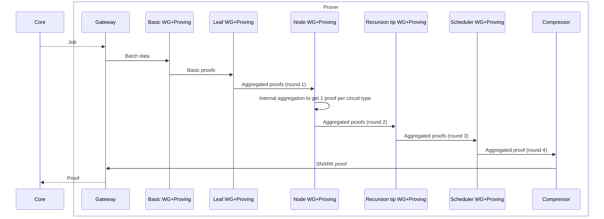
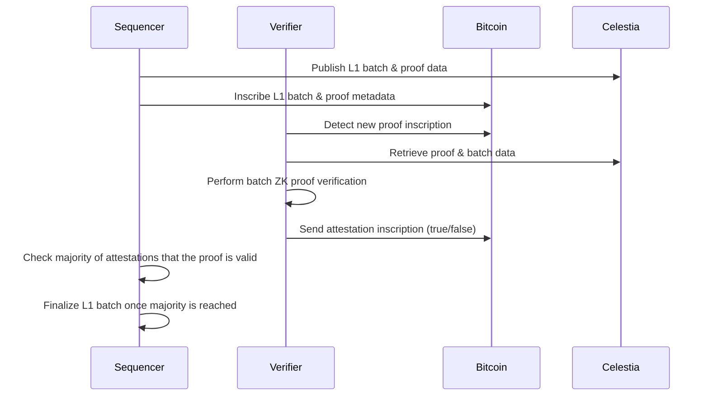

# Via L2 Bitcoin ZK-Rollup: ZKProof Handling Documentation

## 1. Introduction

Zero-Knowledge (ZK) proofs are a cornerstone of the Via L2 Bitcoin ZK-Rollup system, providing cryptographic guarantees that state transitions in the L2 system are valid without requiring validators to re-execute all transactions. This document provides a comprehensive overview of how ZK proofs are defined, generated, transmitted, and verified within the Via L2 system.

## 2. ZK Proof Structure and Types

### 2.1 Core Proof Types

The Via L2 system uses two primary types of proofs:

#### 2.1.1 ZK Proofs (`L1BatchProofForL1`)

```rust
// core/lib/prover_interface/src/outputs.rs
pub struct L1BatchProofForL1 {
    pub aggregation_result_coords: [[u8; 32]; 4],
    pub scheduler_proof: FinalProof,
    pub protocol_version: ProtocolSemanticVersion,
}
```

This is the standard ZK proof type that contains:
- `aggregation_result_coords`: Coordinates representing the aggregated proof result
- `scheduler_proof`: The final proof generated by the scheduler circuit
- `protocol_version`: The protocol version used for generating the proof

#### 2.1.2 TEE Proofs (`L1BatchTeeProofForL1`)

```rust
// core/lib/prover_interface/src/outputs.rs
pub struct L1BatchTeeProofForL1 {
    // signature generated within the TEE enclave, using the privkey corresponding to the pubkey
    pub signature: Vec<u8>,
    // pubkey used for signature verification; each key pair is attested by the TEE attestation
    pub pubkey: Vec<u8>,
    // data that was signed
    pub proof: Vec<u8>,
    // type of TEE used for attestation
    pub tee_type: TeeType,
}
```

This is an alternative proof type that uses Trusted Execution Environments (TEEs) for verification.

### 2.2 Circuit and Proof Wrappers

The system uses several wrapper types to handle different stages of the proving process:

#### 2.2.1 Circuit Wrappers

```rust
// prover/crates/lib/prover_fri_types/src/lib.rs
pub enum CircuitWrapper {
    Base(ZkSyncBaseLayerCircuit),
    Recursive(ZkSyncRecursiveLayerCircuit),
    BasePartial((ZkSyncBaseLayerCircuit, CircuitAuxData)),
}
```

This enum represents different types of circuits used in the proving process:
- `Base`: Basic circuits for initial proof generation
- `Recursive`: Circuits used for recursive proof aggregation
- `BasePartial`: Partial base circuits with auxiliary data

#### 2.2.2 Proof Wrappers

```rust
// prover/crates/lib/prover_fri_types/src/lib.rs
pub enum FriProofWrapper {
    Base(ZkSyncBaseLayerProof),
    Recursive(ZkSyncRecursionLayerProof),
}
```

This enum represents different types of proofs generated during the proving process:
- `Base`: Proofs generated by basic circuits
- `Recursive`: Proofs generated by recursive circuits

### 2.3 Verification Proof Structure

For verification, the system uses a specialized proof structure:

```rust
// via_verifier/lib/via_verification/src/proof.rs
pub struct ViaZKProof {
    pub proof: ZkSyncProof<Bn256, ZkSyncSnarkWrapperCircuit>,
}
```

This structure wraps the ZK proof for verification purposes, implementing the `ProofTrait` interface:

```rust
// via_verifier/lib/via_verification/src/proof.rs
pub trait ProofTrait {
    fn verify(
        &self,
        verification_key: VerificationKey<Bn256, ZkSyncSnarkWrapperCircuit>,
    ) -> Result<bool, VerificationError>;
    fn get_public_inputs(&self) -> &[Fr];
}
```

## 3. Proof Generation Inputs and Outputs

### 3.1 Proof Generation Inputs

The inputs for proof generation are defined in the `WitnessInputData` structure:

```rust
// core/lib/prover_interface/src/inputs.rs
pub struct WitnessInputData {
    pub vm_run_data: VMRunWitnessInputData,
    pub merkle_paths: WitnessInputMerklePaths,
    pub previous_batch_metadata: L1BatchMetadataHashes,
    pub eip_4844_blobs: Eip4844Blobs,
}
```

This structure contains:
- `vm_run_data`: Data related to VM execution
- `merkle_paths`: Merkle paths for storage proofs
- `previous_batch_metadata`: Metadata from the previous batch
- `eip_4844_blobs`: EIP-4844 blob data

The `VMRunWitnessInputData` structure contains more detailed VM execution data:

```rust
// core/lib/prover_interface/src/inputs.rs
pub struct VMRunWitnessInputData {
    pub l1_batch_number: L1BatchNumber,
    pub used_bytecodes: HashMap<U256, Vec<[u8; 32]>>,
    pub initial_heap_content: Vec<(usize, U256)>,
    pub protocol_version: ProtocolVersionId,
    pub bootloader_code: Vec<[u8; 32]>,
    pub default_account_code_hash: U256,
    pub storage_refunds: Vec<u32>,
    pub pubdata_costs: Vec<i32>,
    pub witness_block_state: WitnessStorageState,
}
```

### 3.2 Proof Generation Outputs

The output of the proof generation process is the `L1BatchProofForL1` structure described earlier, which contains the final aggregated proof that can be sent to L1 (Bitcoin).

### 3.3 Proof Generation Data Exchange

The API for exchanging proof generation data between the core system and the prover subsystem is defined in:

```rust
// core/lib/prover_interface/src/api.rs
pub struct ProofGenerationData {
    pub l1_batch_number: L1BatchNumber,
    pub witness_input_data: WitnessInputData,
    pub protocol_version: ProtocolSemanticVersion,
    pub l1_verifier_config: L1VerifierConfig,
}

pub enum SubmitProofRequest {
    Proof(Box<L1BatchProofForL1>),
    // The proof generation was skipped due to sampling
    SkippedProofGeneration,
}
```

## 4. Proof Generation Process

The proof generation is a multi-stage process that involves several components working together:

### 4.1 Proof Generation Stages

```
┌─────────────────┐     ┌─────────────────┐     ┌─────────────────┐
│  Prover Gateway │     │ Witness Generator│     │ Circuit Prover  │
│                 │◄───►│                 │◄───►│                 │
└────────┬────────┘     └────────┬────────┘     └────────┬────────┘
         │                       │                       │
         ▼                       ▼                       ▼
┌─────────────────┐     ┌─────────────────┐     ┌─────────────────┐
│ Core System     │     │ Witness Vector  │     │ Proof Compressor│
│ (API)           │     │ Generator       │     │                 │
└─────────────────┘     └─────────────────┘     └─────────────────┘
```

The proof generation process consists of the following stages:

1. **Basic Circuits**: Generates up to 2400 basic circuit proofs
   - Aggregation round: 0
   - Circuit types: Main VM, RAM Permutation, Storage Application, etc.

2. **Leaf Aggregation**: Aggregates basic circuit proofs into leaf aggregation proofs (up to 48 circuits)
   - Aggregation round: 1
   - Circuit type: LeafAggregation

3. **Node Aggregation**: Aggregates leaf aggregation proofs into node aggregation proofs
   - Aggregation round: 2
   - Circuit type: NodeAggregation

4. **Recursion Tip**: Further aggregates node aggregation proofs
   - Aggregation round: 3
   - Circuit type: RecursionTip

5. **Scheduler**: Produces the final aggregated proof
   - Aggregation round: 4
   - Circuit type: Scheduler

6. **Compression**: Compresses the final proof for submission to L1 (Bitcoin)
   - Converts the FRI proof to a Bellman proof

### 4.2 Aggregation Rounds

The system defines several aggregation rounds, each representing a stage in the proof generation process:

```rust
// core/lib/basic_types/src/basic_fri_types.rs
pub enum AggregationRound {
    BasicCircuits = 0,
    LeafAggregation = 1,
    NodeAggregation = 2,
    RecursionTip = 3,
    Scheduler = 4,
}
```

Each round has specific circuit types and inputs/outputs:

```rust
// prover/crates/lib/prover_fri_types/src/lib.rs
pub struct ProverServiceDataKey {
    pub circuit_id: u8,
    pub round: AggregationRound,
}
```

## 5. ZK Proof Data Flow

### 5.1 From Prover to Core System



1. The Prover Gateway polls the Core API to get a new batch to prove
2. The Prover Gateway fetches proof generation data and stores it in the object store and database
3. The Witness Generator processes the data and generates witness data for basic circuits
4. The Circuit Prover generates proofs for basic circuits
5. The proofs are aggregated through multiple rounds (Leaf → Node → Recursion Tip → Scheduler)
6. The Proof Compressor compresses the final proof
7. The Prover Gateway submits the proof back to the Core system

### 5.2 From Core System to Verifier Network



1. The Core system publishes the L1 batch and proof data to Celestia
2. The Core system inscribes the L1 batch and proof metadata on Bitcoin
3. The Verifier detects the new proof inscription on Bitcoin
4. The Verifier retrieves the proof and batch data from Celestia
5. The Verifier performs batch ZK proof verification
6. The Verifier sends an attestation inscription to Bitcoin (true/false)
7. Once a majority of attestations indicate the proof is valid, the L1 batch is considered final

### 5.3 Celestia Data Availability Integration

The system uses Celestia as a Data Availability (DA) layer to ensure that both L2 batch data and batch proofs are publicly available:

1. **Blob Submission**:
   - Data is wrapped in a Celestia `Blob` with the Via namespace
   - A commitment is generated from the blob
   - The blob is submitted to Celestia with a transaction configuration
   - A blob ID is created by concatenating the block height and commitment
   - The blob ID is stored in the database

2. **Inclusion Data Retrieval**:
   - The blob ID is decoded to extract the block height and commitment
   - The blob is retrieved from Celestia using these parameters
   - The inclusion data is stored in the database

## 6. Proof Verification

### 6.1 Verification Process

The verification process is implemented in the `ViaZKProof` class:

```rust
// via_verifier/lib/via_verification/src/proof.rs
fn verify(
    &self,
    vk: VerificationKey<Bn256, ZkSyncSnarkWrapperCircuit>,
) -> Result<bool, VerificationError> {
    // Ensure the proof's 'n' matches the verification key's 'n'
    let mut scheduler_proof = self.proof.clone();
    scheduler_proof.n = vk.n;
    
    // Verify the proof
    verify::<_, _, RollingKeccakTranscript<_>>(&vk, &scheduler_proof, None)
        .map_err(|_| VerificationError::ProofVerificationFailed)
}
```

The verification process involves:

1. Loading the verification key
2. Ensuring the proof's parameters match the verification key
3. Verifying the proof using the Bellman library
4. Extracting the public input from the proof

### 6.2 Verification Key Management

Verification keys are loaded based on the protocol version:

```rust
// via_verifier/lib/via_verification/src/verification.rs
pub async fn verify_snark<P: ProofTrait, F: L1DataFetcher>(
    l1_data_fetcher: &F,
    proof: P,
    batch_number: u64,
    l1_block_number: u64,
) -> Result<Fr, VerificationError> {
    let vk_inner = load_verification_key(l1_data_fetcher, batch_number, l1_block_number).await?;

    // Verify the proof.
    if !proof.verify(vk_inner)? {
        return Err(VerificationError::ProofVerificationFailed);
    }

    // Extract the public input from the proof.
    let public_inputs = proof.get_public_inputs();
    let public_input = public_inputs
        .first()
        .cloned()
        .ok_or_else(|| VerificationError::Other("No public inputs found in proof".to_string()))?;

    Ok(public_input)
}
```

## 7. Code Modules and Files

### 7.1 Core Modules

1. **Prover Interface** (`core/lib/prover_interface/`):
   - `api.rs`: Defines the API between the core and prover subsystems
   - `inputs.rs`: Defines input structures for proof generation
   - `outputs.rs`: Defines output structures for proofs

2. **Basic Types** (`core/lib/basic_types/`):
   - `basic_fri_types.rs`: Defines basic types for FRI prover

3. **Prover FRI Types** (`prover/crates/lib/prover_fri_types/`):
   - `lib.rs`: Defines circuit and proof wrapper types
   - `keys.rs`: Defines keys for proof storage

### 7.2 Prover Components

1. **Prover Gateway** (`prover/crates/bin/prover_fri_gateway/`):
   - Interface between core and prover subsystems
   - Fetches batch jobs from core and sends batch proofs back to core

2. **Witness Generator** (`prover/crates/bin/witness_generator/`):
   - Generates witness data for proof generation

3. **Circuit Prover** (`prover/crates/bin/prover_fri/`):
   - Generates circuit proofs using GPU acceleration

4. **Proof Compressor** (`prover/crates/bin/proof_fri_compressor/`):
   - Compresses the final proof for submission to L1

### 7.3 Verifier Components

1. **Verification Library** (`via_verifier/lib/via_verification/`):
   - `proof.rs`: Defines the proof verification interface
   - `verification.rs`: Implements the verification process

2. **ZK Verifier** (`via_verifier/node/via_zk_verifier/`):
   - Handles the verification of ZK proofs

3. **Bitcoin Watch** (`via_verifier/node/via_btc_watch/`):
   - Monitors the Bitcoin blockchain for relevant inscriptions

4. **Data Availability Client** (`via_verifier/lib/via_da_client/`):
   - Interfaces with the Celestia network to retrieve batch data

## 8. Conclusion

The ZK proof handling in the Via L2 Bitcoin ZK-Rollup system is a sophisticated multi-stage process that ensures the integrity and security of L2 state transitions. The system uses a combination of ZK proofs, data availability layers, and Bitcoin inscriptions to create a secure and scalable L2 solution on top of Bitcoin.

Key features of the ZK proof handling include:

1. **Multi-stage Proof Generation**: A hierarchical approach to proof generation that enables efficient aggregation of thousands of circuit proofs into a single final proof
2. **Celestia Integration**: Using Celestia as a data availability layer for storing proof data
3. **Bitcoin Attestations**: Using Bitcoin inscriptions for proof metadata and verifier attestations
4. **Distributed Verification**: A network of verifiers that independently verify proofs and attest to their validity

This architecture enables Via L2 to achieve high throughput while maintaining the security guarantees of the underlying Bitcoin blockchain.